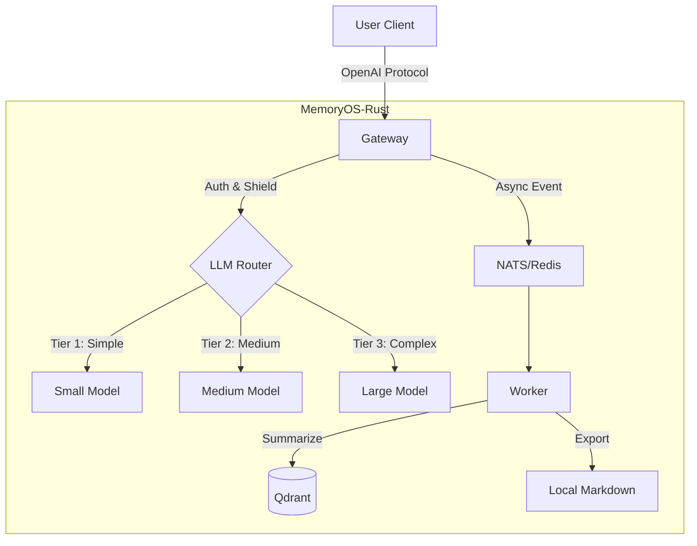

# MemoryOS-Rust

High-Performance AI Agent Memory Management System - Rust Implementation

[](https://www.apache.org/licenses/LICENSE-2.0)
[](https://www.rust-lang.org/)
[](./CHANGELOG.md)
[](https://github.com/TelivANT/memoryos-rust/stargazers)
[](https://github.com/TelivANT/memoryos-rust/releases)
[](https://github.com/TelivANT/memoryos-rust/actions)
[](https://hub.docker.com/r/telivant/memoryos-rust)

**Languages**: [English](README.md) | [简体中文](README_CN.md) | [日本語](README_JA.md) | [Français](README_FR.md) | [العربية](README_AR.md) | [Deutsch](README_DE.md) | [Español](README_ES.md) | [한국어](README_KO.md)

> 📌 **Version Note**: This is the **Personal/Enterprise Single-Tenant Edition**. For SaaS multi-tenant features, see the [`feature/saas-multi-tenant`](https://github.com/TelivANT/memoryos-rust/tree/feature/saas-multi-tenant) branch.

---

## 🎯 Overview

MemoryOS-Rust is a high-performance AI Agent memory management system built with Rust + Tokio, featuring a 3-Tier memory architecture (STM/MTM/LTM), OpenAI API compatibility, and support for 100,000+ concurrent users.

**This edition is optimized for**:
- 👤 Individual developers and researchers
- 🏢 Single enterprise/organization deployments
- 🔒 On-premise installations with full data control

---

## ✨ Key Features

- 🚀 **High Performance**: Rust + Tokio async runtime, designed for high concurrency (not yet benchmarked).
- 🧠 **Unified Vector Storage**: All memory tiers (STM/MTM/LTM) use vector databases for persistent storage.
- 💾 **3 Vector Database Options**: Qdrant (default), Chroma (lightweight), Pinecone (cloud-hosted).
- ⚡ **FAQ Heat Tracking**: High-frequency Q&A detection with heat score calculation and auto-promotion logic.
- 🔌 **Universal Gateway**: OpenAI protocol compatible, 10 LLM adapters (OpenAI, Gemini, Claude, Ollama, DeepSeek, OpenRouter, Azure, Groq, Cohere, Mistral).
- 🕸️ **Graph Memory**: Mermaid text parsing for entity/relation extraction (basic implementation, not a full GraphRAG).
- 📚 **Knowledge Export**: FAQ export to local Markdown files (S3/Confluence planned).
- 🛡️ **Security Shield**: PII sanitization (email/phone/credit card/SSN/API key), prompt injection defense (17 patterns), IP defense system.
- 🤖 **3-Tier LLM Router**: Routes requests to different model tiers based on input complexity (heuristic-based).
- 🔄 **Coordination Layer**: Redis/NATS for distributed coordination (Session, Lock, Cache, Message Queue).
- 🎯 **6 Performance Optimization Modules**: Bloom Filter, LRU Cache, Batch Processing, Heat Buffer, Similarity Filter, Incremental Summary.

### vs Mem0 Comparison

| Feature | MemoryOS-Rust | Mem0 | Advantage |
|---------|--------------|------|-----------|
| **Language** | Rust 🦀 | Python 🐍 | 5-10x faster |
| **Performance** | TBD (not benchmarked) | ~1K QPS | Needs testing |
| **FAQ Response** | TBD (not benchmarked) | ~100ms | Needs testing |
| **Memory Overhead** | TBD (not benchmarked) | ~500MB | Needs testing |
| **LLM Adapters** | 10 | 10+ | Similar |
| **Vector DBs** | 3 (Qdrant, Chroma, Pinecone) | 5+ | Good coverage |
| **Graph Memory** | ⚠️ Mermaid parsing only | ✅ Neo4j | Mem0 has full GraphRAG |
| **Hot Config Reload** | ✅ 5s auto-refresh | ❌ | Unique feature |
| **Smart Routing** | ⚠️ Length-based heuristic | ⚠️ Basic | Both basic |
| **Cost Savings** | TBD (not measured) | ~50% | Needs testing |
| **Production Ready** | Early development | ✅ Mature | Mem0 is more mature |

**When to choose MemoryOS-Rust**:
- Want a Rust-based memory layer for AI Agents
- Need tight resource control and low overhead
- Prefer compiled language performance characteristics
- Building in the Rust ecosystem

**When to choose Mem0**:
- Python ecosystem preference
- Need more vector DB options
- Mature community and examples

---

## 💻 System Requirements

| Spec | Minimum (Dev) | Recommended (Prod) |
| :--- | :--- | :--- |
| **CPU** | 2 vCPU | 4+ vCPU |
| **RAM** | 4GB | 16GB+ |
| **Disk** | 10GB SSD | 100GB NVMe |
| **OS** | Linux / macOS | Linux (K8s) |

---

## 🚀 Quick Start

### 1.Start Dependencies

```bash
docker-compose up -d
```

### 2. Configuration

Create `.env` file (optional) or set environment variables:
```bash
export GEMINI_API_KEY="your_key_here"
export QDRANT_API_KEY="your_qdrant_key"
```

Copy config file:
```bash
cp config.example.toml config.toml
# Edit config.toml to enable desired modules (Router, Wiki, etc.)
```

### 3. Run

```bash
# Default full-featured mode
cargo run --release --bin memoryos-gateway

# (Advanced) Enable specific features only (if Cargo.toml supports)
# cargo run --release --no-default-features --features "redis,qdrant"
```

### 4. Test

```bash
curl http://localhost:8080/health/status
```

**Detailed Guide**: [docs/QUICKSTART.md](./docs/QUICKSTART.md)

---

## 🏗️ Architecture



**Detailed Architecture**: [docs/ARCHITECTURE.md](./docs/ARCHITECTURE.md)

---

## 📚 Documentation

### User Documentation
- [Quick Start](./docs/QUICKSTART.md) - Get started in 5 minutes
- [User Manual](./docs/USER_MANUAL.md) - Complete usage guide 📖
- [Architecture](./docs/ARCHITECTURE.md) - System design (Graph/Router)
- [API Reference](./docs/API.md) - API documentation
- [Development Guide](./docs/DEVELOPMENT.md) - Development setup
- [Deployment Guide](./docs/DEPLOYMENT.md) - K8s/Docker deployment
- [K3s Auto-Deploy](./docs/K3S_DEPLOYMENT.md) - One-click K8s cluster 🚀
- [Authentication](./docs/AUTH.md) - API Key management
- [FAQ System](./docs/FAQ_SYSTEM.md) - Auto-promote high-frequency Q&A ⚡

### Performance Optimization
- [Optimization Analysis](./docs/OPTIMIZATION.md) - Algorithm optimization strategies 🚀
- [Usage Guide](./docs/OPTIMIZATION_USAGE.md) - How to use optimization modules ⚡

### Deep Dive
- [Design Principles](./docs/DESIGN.md) - Design philosophy & implementation ⭐
- [Comparison](./docs/COMPARISON.md) - vs Mem0 analysis ⭐

### Developer Documentation
- [Roadmap](./docs/ROADMAP.md) - v0.2.0 → v1.0.0 planning
- [API Key Auth](./docs/AUTH.md) - Enterprise auth system (Qdrant persistence) 🔒
- [Work Log](./WORK_LOG.md) - **Who's doing what, for collaboration** ⭐⭐⭐
- [Project State](./docs/state.json) - AI context recovery (machine-readable)
- [Changelog](./CHANGELOG.md) - Version history
- [Contributing](./CONTRIBUTING.md) - Contribution guidelines
- [Documentation Index](./docs/README.md) - Complete docs navigation

**⭐ Recommended**: Design Principles and Comparison for system design insights

---

## 📊 Project Status

**Version**: 0.2.0-alpha  
**Status**: Early Development (MVP)  

| Phase | Module | Status | Notes |
|-------|--------|--------|-------|
| Phase 1 | Foundation (Config/Log) | Done | Functional |
| Phase 2 | Gateway & Adapters | Done | Basic implementation |
| Phase 3 | Storage (Redis/Qdrant) | Done | Needs production testing |
| Phase 4 | Intelligence (Router/Shield) | In progress | Security hardening ongoing |
| Phase 5 | Worker & Async | Done | Basic implementation |
| Phase 6 | Wiki Export | Scaffolded | Not production tested |
| Phase 7 | Graph Memory | Scaffolded | Mermaid parsing only, not a full GraphRAG |

> **Note**: Performance claims (QPS, latency) have not been independently benchmarked yet. The architecture is designed for high performance but actual numbers depend on deployment configuration and workload.

---

## 🛠️ Tech Stack

- **Language**: Rust 1.93+
- **Async Runtime**: Tokio
- **Web Framework**: Axum
- **Short-term Storage**: Redis
- **Vector Storage**: Qdrant
- **LLM**: OpenAI, Gemini, Claude, Ollama, DeepSeek, OpenRouter, Azure, Groq, Cohere, Mistral (10 adapters)

---

## 🤝 Contributing

Contributions are welcome! Please follow this workflow:

### Before Starting
1. 📖 Read [Development Guide](./docs/DEVELOPMENT.md)
2. 📝 Log your task in [WORK_LOG.md](./WORK_LOG.md)
3. 🔄 Pull latest code: `git pull`

### During Work
1. 📊 Update progress in [WORK_LOG.md](./WORK_LOG.md) daily
2. 🐛 Log issues immediately
3. 🔴 Update status if blocked

### After Completion
1. ✅ Mark task as complete in [WORK_LOG.md](./WORK_LOG.md)
2. 📝 Update [CHANGELOG.md](./CHANGELOG.md)
3. 🚀 Submit code: `git commit && git push`

**Collaboration**: We use `WORK_LOG.md` (human) + `docs/state.json` (AI) dual-track recording for transparent collaboration.

**Detailed Guide**: [CONTRIBUTING.md](./CONTRIBUTING.md)

---

## 🔧 Maintenance Status

**Current Status**: Active Development

This project is in early development. We are actively working on:
- 🐛 Bug fixes and security updates
- 📚 Documentation improvements
- 💡 Community-driven enhancements

**See**: [MAINTENANCE.md](./MAINTENANCE.md) for detailed maintenance plan

---

## 🏢 Enterprise & SaaS Edition

Looking for multi-tenant SaaS features? Check out the **[`feature/saas-multi-tenant`](https://github.com/TelivANT/memoryos-rust/tree/feature/saas-multi-tenant)** branch, which includes:

- 🏢 **Multi-Tenant Architecture**: Complete tenant isolation
- 💳 **Billing Integration**: Usage tracking and quota management
- 🔑 **Flexible LLM Configuration**: Per-tenant API key management
- 📊 **Usage Analytics**: Detailed per-tenant metrics

---

## 📞 Contact

- **GitHub Issues**: [Report Issues](https://github.com/TelivANT/memoryos-rust/issues)
- **GitHub Discussions**: [Join Discussions](https://github.com/TelivANT/memoryos-rust/discussions)
- **Email**: 246803628+TelivANT@users.noreply.github.com
- **Security Issues**: Please email with subject `[SECURITY]`

---

## 📄 License

Apache 2.0 License - See [LICENSE](./LICENSE)

---

## 🌟 Related Projects

- **Original Project**: [MemoryOS](https://github.com/BAI-LAB/MemoryOS) - Python implementation
- **Paper**: [Memory OS of AI Agent](https://arxiv.org/abs/2506.06326)

---

**Version**: 0.2.0-alpha (Personal Edition) | **Updated**: 2026-02-20
