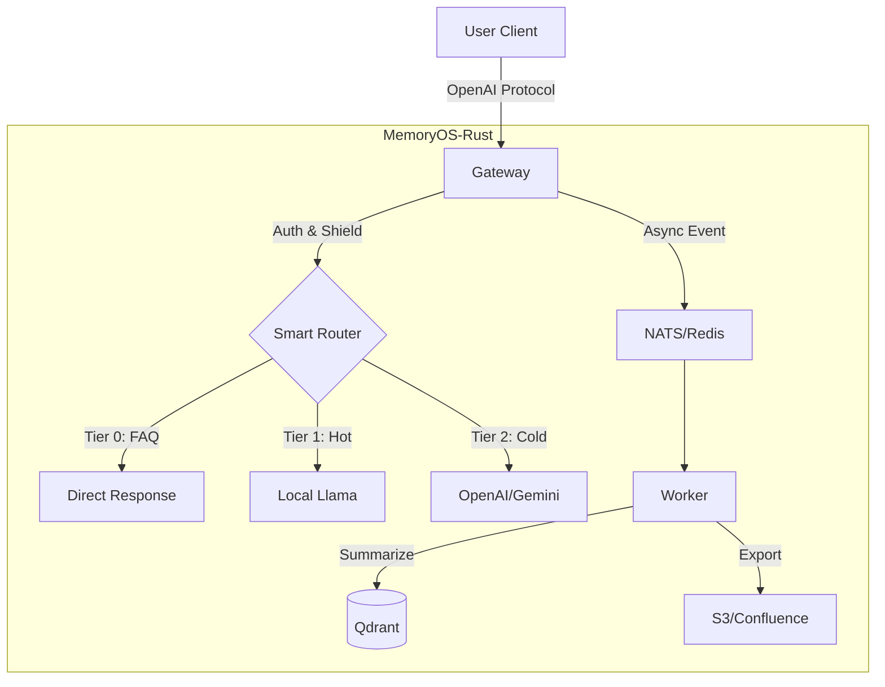

# MemoryOS-Rust

نظام إدارة ذاكرة عالي الأداء لوكلاء الذكاء الاصطناعي - تطبيق Rust

[](https://www.apache.org/licenses/LICENSE-2.0)
[](https://www.rust-lang.org/)
[](./CHANGELOG.md)
[](./CHANGELOG.md)

**اللغات**: [English](README.md) | [简体中文](README_CN.md) | [日本語](README_JA.md) | [Français](README_FR.md) | [العربية](README_AR.md) | [Deutsch](README_DE.md) | [Español](README_ES.md) | [한국어](README_KO.md)

---

## 🎯 نظرة عامة

MemoryOS-Rust هو نظام إدارة ذاكرة عالي الأداء لوكلاء الذكاء الاصطناعي مبني باستخدام Rust + Tokio، يتميز ببنية ذاكرة من 3 مستويات (STM/MTM/LTM)، متوافق مع OpenAI API، ويدعم أكثر من 100,000 مستخدم متزامن.

---

## ✨ الميزات الرئيسية

- 🚀 **أداء عالي**: Rust + Tokio، يدعم التزامن العالي مع أكثر من 10K QPS لكل نسخة.
- 🧠 **ذاكرة 3 مستويات**: STM (Redis) → MTM (Qdrant) → LTM (Qdrant).
- 🔌 **بوابة عالمية**: متوافق مع بروتوكول OpenAI، يدعم Gemini و Claude و Ollama و DeepSeek و Azure.
- 🕸️ **ذاكرة الرسم البياني**: **Qdrant-Native GraphRAG** مع تصور Mermaid.
- 📚 **تصدير المعرفة**: تصدير تلقائي للأسئلة الشائعة إلى Wiki (S3/Confluence)، يدعم **Agent Playbook**.
- 🛡️ **أمان المؤسسات**: RBAC، تنظيف PII، دفاع ضد حقن الأوامر، حق النسيان GDPR.
- 🤖 **توجيه ذكي**: توجيه تلقائي بين Llama المحلي (ساخن/خاص) و GPT-4 السحابي (معقد/بارد).

---

## 💻 متطلبات النظام

| المواصفات | الحد الأدنى (التطوير) | الموصى به (الإنتاج) |
| :--- | :--- | :--- |
| **CPU** | 2 vCPU | 4+ vCPU |
| **RAM** | 4GB | 16GB+ |
| **القرص** | 10GB SSD | 100GB NVMe |
| **OS** | Linux / macOS | Linux (K8s) |

---

## 🚀 البدء السريع

### 1. تشغيل التبعيات

```bash
docker-compose up -d
```

### 2. التكوين

إنشاء ملف `.env` (اختياري) أو تعيين متغيرات البيئة:
```bash
export GEMINI_API_KEY="your_key_here"
export QDRANT_API_KEY="your_qdrant_key"
```

نسخ ملف التكوين:
```bash
cp config.example.toml config.toml
# تحرير config.toml لتمكين الوحدات المطلوبة (Router، Wiki، إلخ)
```

### 3. التشغيل

```bash
# الوضع الكامل الافتراضي
cargo run --release --bin memoryos-gateway

# (متقدم) تمكين ميزات محددة فقط (إذا كان Cargo.toml يدعم ذلك)
# cargo run --release --no-default-features --features "redis,qdrant"
```

### 4. الاختبار

```bash
curl http://localhost:8080/health/status
```

**دليل مفصل**: [docs/QUICKSTART.md](./docs/QUICKSTART.md)

---

## 🏗️ البنية المعمارية



**البنية المعمارية التفصيلية**: [docs/ARCHITECTURE.md](./docs/ARCHITECTURE.md)

---

## 📚 التوثيق

### توثيق المستخدم
- [البدء السريع](./docs/QUICKSTART.md) - ابدأ في 5 دقائق
- [دليل المستخدم](./docs/USER_MANUAL.md) - دليل الاستخدام الكامل 📖
- [البنية المعمارية](./docs/ARCHITECTURE.md) - تصميم النظام (Graph/Router)
- [مرجع API](./docs/API.md) - توثيق API
- [دليل التطوير](./docs/DEVELOPMENT.md) - إعداد التطوير
- [دليل النشر](./docs/DEPLOYMENT.md) - نشر K8s/Docker
- [النشر التلقائي K3s](./docs/K3S_DEPLOYMENT.md) - مجموعة K8s بنقرة واحدة 🚀
- [المصادقة](./docs/AUTH.md) - إدارة مفاتيح API

### القراءة المتعمقة
- [مبادئ التصميم](./docs/DESIGN.md) - فلسفة التصميم والتنفيذ ⭐
- [المقارنة](./docs/COMPARISON.md) - تحليل مقابل Mem0 ⭐

### توثيق المطور
- [خارطة الطريق](./docs/ROADMAP.md) - تخطيط v0.2.0 → v1.0.0
- [مصادقة مفتاح API](./docs/AUTH.md) - نظام مصادقة المؤسسات (استمرارية Qdrant) 🔒
- [سجل العمل](./WORK_LOG.md) - **من يفعل ماذا، للتعاون** ⭐⭐⭐
- [حالة المشروع](./docs/state.json) - استعادة سياق AI (قابل للقراءة آليًا)
- [سجل التغييرات](./CHANGELOG.md) - تاريخ الإصدارات
- [المساهمة](./CONTRIBUTING.md) - إرشادات المساهمة
- [فهرس التوثيق](./docs/README.md) - التنقل الكامل في المستندات

**⭐ موصى به**: مبادئ التصميم والمقارنة لفهم رؤى تصميم النظام

---

## 📊 حالة المشروع

**الإصدار**: 0.2.0  
**الحالة**: ✅ جاهز للإنتاج  
**الاكتمال**: 100%  

| المرحلة | الوحدة | الحالة |
|-------|--------|--------|
| Phase 1 | Foundation (Config/Log) | ✅ |
| Phase 2 | Gateway & Adapters | ✅ |
| Phase 3 | Storage (Redis/Qdrant) | ✅ |
| Phase 4 | Intelligence (Router/Shield) | ✅ |
| Phase 5 | Worker & Async | ✅ |
| Phase 6 | Wiki Export | ✅ |
| Phase 7 | Graph Memory | ✅ |

---

## 🛠️ المجموعة التقنية

- **اللغة**: Rust 1.93+
- **وقت التشغيل غير المتزامن**: Tokio
- **إطار الويب**: Axum
- **التخزين قصير المدى**: Redis
- **التخزين المتجه**: Qdrant
- **LLM**: OpenAI, Gemini, Claude, Ollama, DeepSeek, OpenRouter, Azure

---

## 🤝 المساهمة

المساهمات مرحب بها! يرجى اتباع سير العمل هذا:

### قبل البدء
1. 📖 اقرأ [دليل التطوير](./docs/DEVELOPMENT.md)
2. 📝 سجل مهمتك في [WORK_LOG.md](./WORK_LOG.md)
3. 🔄 اسحب أحدث كود: `git pull`

### أثناء العمل
1. 📊 حدّث التقدم في [WORK_LOG.md](./WORK_LOG.md) يوميًا
2. 🐛 سجل المشاكل فورًا
3. 🔴 حدّث الحالة إذا كنت محظورًا

### بعد الانتهاء
1. ✅ ضع علامة على المهمة كمكتملة في [WORK_LOG.md](./WORK_LOG.md)
2. 📝 حدّث [CHANGELOG.md](./CHANGELOG.md)
3. 🚀 أرسل الكود: `git commit && git push`

**التعاون**: نستخدم تسجيل مزدوج المسار `WORK_LOG.md` (بشري) + `docs/state.json` (AI) للتعاون الشفاف.

**دليل مفصل**: [CONTRIBUTING.md](./CONTRIBUTING.md)

---

## 🔧 حالة الصيانة

**الحالة الحالية**: ✅ جاهز للإنتاج ويتم صيانته بنشاط

هذا المشروع **مكتمل** (100%) وفي وضع الصيانة. نركز على:
- 🐛 إصلاحات الأخطاء وتحديثات الأمان
- 📚 تحسينات التوثيق
- 💡 التحسينات المدفوعة من المجتمع

**انظر**: [MAINTENANCE.md](./MAINTENANCE.md) لخطة الصيانة التفصيلية

---

## 📞 الاتصال

- **GitHub Issues**: [الإبلاغ عن المشاكل](https://github.com/TelivANT/memoryos-rust/issues)
- **GitHub Discussions**: [الانضمام إلى المناقشات](https://github.com/TelivANT/memoryos-rust/discussions)
- **البريد الإلكتروني**: 246803628+TelivANT@users.noreply.github.com
- **مشاكل الأمان**: يرجى إرسال بريد إلكتروني مع الموضوع `[SECURITY]`

---

## 📄 الترخيص

ترخيص Apache 2.0 - انظر [LICENSE](./LICENSE)

---

## 🌟 المشاريع ذات الصلة

- **المشروع الأصلي**: [MemoryOS](https://github.com/BAI-LAB/MemoryOS) - تطبيق Python
- **الورقة البحثية**: [Memory OS of AI Agent](https://arxiv.org/abs/2506.06326)

---

**الإصدار**: 0.2.0 | **التحديث**: 2026-02-18
