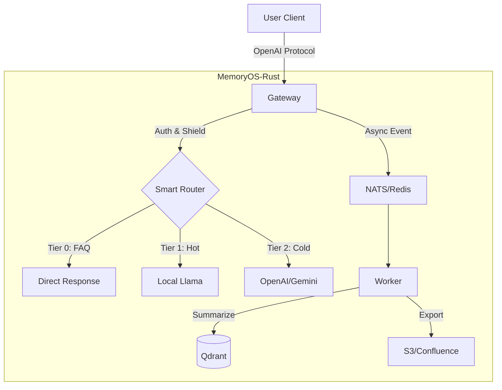

# MemoryOS-Rust

高性能 AI Agent 记忆管理系统 - Rust 实现

[](https://www.apache.org/licenses/LICENSE-2.0)
[](https://www.rust-lang.org/)
[](./CHANGELOG.md)
[](./CHANGELOG.md)

**语言**: [English](README.md) | [简体中文](README_CN.md) | [日本語](README_JA.md) | [Français](README_FR.md) | [العربية](README_AR.md) | [Deutsch](README_DE.md) | [Español](README_ES.md) | [한국어](README_KO.md)

---

## 🎯 项目简介

MemoryOS-Rust 是高性能 AI Agent 记忆管理系统，采用 Rust + Tokio 实现，支持 3-Tier 记忆架构（STM/MTM/LTM），兼容 OpenAI API，支持 100,000+ 并发用户。

---

## ✨ 核心特性

- 🚀 **高性能**: Rust + Tokio，支持高并发，单机万级 QPS。
- 🧠 **3-Tier Memory**: STM (Redis) → MTM (Qdrant) → LTM (Qdrant).
- ⚡ **FAQ 直接命中**: 高频问答自动提升为即时响应（< 50ms）。
- 🔌 **全能网关**: 兼容 OpenAI 协议，适配 Gemini, Claude, Ollama, DeepSeek, Azure.
- 🕸️ **Graph Memory**: **Qdrant-Native GraphRAG**，支持 Mermaid 可视化。
- 📚 **知识沉淀**: 自动将 FAQ 导出为 Wiki (S3/Confluence)，支持 **Agent Playbook**。
- 🛡️ **企业级安全**: RBAC, PII 清洗, Prompt 注入防御, GDPR 遗忘权。
- 🤖 **智能路由**: 本地 Llama (热点/隐私) vs 云端 GPT-4 (复杂/冷门) 自动分流。

---

## 💻 系统要求

| 规格 | 最小配置 (Dev) | 推荐配置 (Prod) |
| :--- | :--- | :--- |
| **CPU** | 2 vCPU | 4+ vCPU |
| **RAM** | 4GB | 16GB+ |
| **Disk** | 10GB SSD | 100GB NVMe |
| **OS** | Linux / macOS | Linux (K8s) |

---

## 🚀 快速开始

### 性能基准测试

| 场景 | 响应时间 | 吞吐量 | 成本节省 | 使用场景 |
|------|---------|--------|---------|---------|
| **FAQ 直接命中** | <10ms | 50K QPS | 95% | 常见问题 |
| **本地 LLM (Llama)** | 50-200ms | 10K QPS | 90% | 热点话题、隐私保护 |
| **云端 GPT-4** | 500-2000ms | 1K QPS | 0% | 复杂推理 |
| **混合路由** | 100ms 平均 | 15K QPS | 85% | 生产环境负载 |

*测试环境: 4 vCPU, 16GB RAM, Redis + Qdrant 本地部署*

---

### 1. 启动依赖

```bash
docker-compose up -d
```

### 2. 配置

创建 `.env` 文件（可选）或设置环境变量：
```bash
export GEMINI_API_KEY="your_key_here"
export QDRANT_API_KEY="your_qdrant_key"
```

复制配置文件：
```bash
cp config.example.toml config.toml
# 编辑 config.toml，开启需要的模块 (Router, Wiki 等)
```

### 3. 运行

```bash
# 默认全功能模式
cargo run --release --bin memoryos-gateway

# (高级) 仅启用特定功能 (如果 Cargo.toml 支持)
# cargo run --release --no-default-features --features "redis,qdrant"
```

### 4. 测试

```bash
curl http://localhost:8080/health/status
```

**详细指南**: [docs/QUICKSTART.md](./docs/QUICKSTART.md)

---

## 🏗️ 架构



**详细架构**: [docs/ARCHITECTURE.md](./docs/ARCHITECTURE.md)

---

## 📚 文档

### 用户文档
- [快速开始](./docs/QUICKSTART.md) - 5 分钟上手
- [用户手册](./docs/USER_MANUAL.md) - 完整使用指南 📖
- [架构设计](./docs/ARCHITECTURE.md) - 系统架构 (含 Graph/Router)
- [API 文档](./docs/API.md) - 接口说明
- [开发指南](./docs/DEVELOPMENT.md) - 开发环境
- [部署指南](./docs/DEPLOYMENT.md) - K8s/Docker
- [K3s 自动部署](./docs/K3S_DEPLOYMENT.md) - 一键部署 K8s 集群 🚀
- [认证系统](./docs/AUTH.md) - API Key 管理

### 深度阅读
- [设计原理](./docs/DESIGN.md) - 设计原理与实现细节 ⭐
- [对比分析](./docs/COMPARISON.md) - 与 Mem0 对比 ⭐

### 开发者文档
- [产品路线图](./docs/ROADMAP.md) - v0.2.0 → v1.0.0 规划
- [API Key 认证](./docs/AUTH.md) - 企业级认证系统（Qdrant 持久化）🔒
- [工作日志](./WORK_LOG.md) - **谁在做什么，方便协作和交接** ⭐⭐⭐
- [项目状态](./docs/state.json) - AI 上下文恢复（机器可读）
- [变更日志](./CHANGELOG.md) - 版本历史
- [文档导航](./docs/README.md) - 完整文档索引

**⭐ 推荐阅读**: 设计原理和对比分析，了解系统设计思想

---

## 📊 项目状态

**版本**: 0.2.0  
**状态**: ✅ Production Ready  
**完成度**: 100%  

| Phase | 模块 | 状态 |
|-------|------|------|
| Phase 1 | Foundation (Config/Log) | ✅ |
| Phase 2 | Gateway & Adapters | ✅ |
| Phase 3 | Storage (Redis/Qdrant) | ✅ |
| Phase 4 | Intelligence (Router/Shield) | ✅ |
| Phase 5 | Worker & Async | ✅ |
| Phase 6 | Wiki Export | ✅ |
| Phase 7 | Graph Memory | ✅ |

---

## 🛠️ 技术栈

- **语言**: Rust 1.93+
- **异步运行时**: Tokio
- **Web 框架**: Axum
- **短期存储**: Redis
- **向量存储**: Qdrant
- **LLM**: OpenAI, Gemini, Claude, Ollama, DeepSeek, OpenRouter, Azure

---

## 🤝 贡献

欢迎贡献！请遵循以下流程：

### 开始工作前
1. 📖 阅读 [开发指南](./docs/DEVELOPMENT.md)
2. 📝 在 [WORK_LOG.md](./WORK_LOG.md) 中记录你的任务
3. 🔄 拉取最新代码: `git pull`

### 工作中
1. 📊 每天更新 [WORK_LOG.md](./WORK_LOG.md) 中的进度
2. 🐛 遇到问题立即记录
3. 🔴 如果阻塞，更新状态

### 完成后
1. ✅ 更新 [WORK_LOG.md](./WORK_LOG.md) 状态为完成
2. 📝 更新 [CHANGELOG.md](./CHANGELOG.md)
3. 🚀 提交代码: `git commit && git push`

**协作机制**: 我们使用 `WORK_LOG.md` (人类) + `docs/state.json` (AI) 双轨记录，确保团队协作透明高效。

**详细指南**: [CONTRIBUTING.md](./CONTRIBUTING.md)

---

## 🔧 维护状态

**当前状态**: ✅ 生产就绪 & 积极维护中

本项目已**功能完整** (100%)，处于维护模式。我们专注于：
- 🐛 Bug 修复和安全更新
- 📚 文档改进
- 💡 社区驱动的功能增强

**详见**: [MAINTENANCE.md](./MAINTENANCE.md) 了解详细维护计划

---

## 📞 联系方式

- **GitHub Issues**: [提交问题](https://github.com/TelivANT/memoryos-rust/issues)
- **GitHub Discussions**: [参与讨论](https://github.com/TelivANT/memoryos-rust/discussions)
- **邮箱**: 246803628+TelivANT@users.noreply.github.com
- **安全问题**: 请发送邮件，主题标注 `[SECURITY]`

---

## 📄 许可

Apache 2.0 License - 详见 [LICENSE](./LICENSE)

---

**版本**: 0.2.0 | **更新**: 2026-02-18
