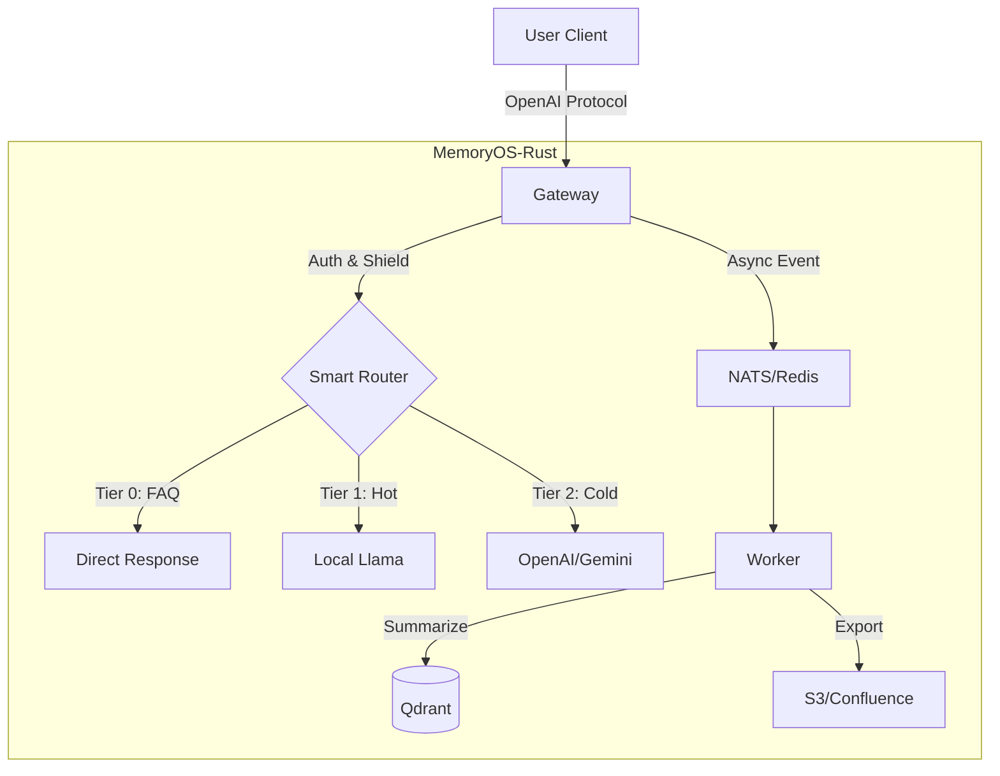

# MemoryOS-Rust

Hochleistungs-KI-Agent-Speicherverwaltungssystem - Rust-Implementierung

[](https://www.apache.org/licenses/LICENSE-2.0)
[](https://www.rust-lang.org/)
[](./CHANGELOG.md)
[](./CHANGELOG.md)

**Sprachen**: [English](README.md) | [简体中文](README_CN.md) | [日本語](README_JA.md) | [Français](README_FR.md) | [العربية](README_AR.md) | [Deutsch](README_DE.md) | [Español](README_ES.md) | [한국어](README_KO.md)

---

## 🎯 Überblick

MemoryOS-Rust ist ein Hochleistungs-KI-Agent-Speicherverwaltungssystem, das mit Rust + Tokio entwickelt wurde. Es verfügt über eine 3-stufige Speicherarchitektur (STM/MTM/LTM), OpenAI-API-Kompatibilität und unterstützt über 100.000 gleichzeitige Benutzer.

---

## ✨ Hauptmerkmale

- 🚀 **Hohe Leistung**: Rust + Tokio, unterstützt hohe Parallelität mit über 10K QPS pro Instanz.
- 🧠 **3-stufiger Speicher**: STM (Redis) → MTM (Qdrant) → LTM (SQLite).
- 🔌 **Universelles Gateway**: OpenAI-Protokoll-kompatibel, unterstützt Gemini, Claude, Ollama, DeepSeek, Azure.
- 🕸️ **Graph-Speicher**: **Qdrant-Native GraphRAG** mit Mermaid-Visualisierung.
- 📚 **Wissensexport**: Automatischer Export von FAQs ins Wiki (S3/Confluence), unterstützt **Agent Playbook**.
- 🛡️ **Unternehmenssicherheit**: RBAC, PII-Bereinigung, Prompt-Injection-Abwehr, DSGVO-Recht auf Vergessenwerden.
- 🤖 **Intelligentes Routing**: Automatisches Routing zwischen lokalem Llama (heiß/privat) und Cloud-GPT-4 (komplex/kalt).

---

## 💻 Systemanforderungen

| Spez. | Minimum (Dev) | Empfohlen (Prod) |
| :--- | :--- | :--- |
| **CPU** | 2 vCPU | 4+ vCPU |
| **RAM** | 4GB | 16GB+ |
| **Festplatte** | 10GB SSD | 100GB NVMe |
| **OS** | Linux / macOS | Linux (K8s) |

---

## 🚀 Schnellstart

### 1. Abhängigkeiten starten

```bash
docker-compose up -d
```

### 2. Konfiguration

`.env`-Datei erstellen (optional) oder Umgebungsvariablen setzen:
```bash
export GEMINI_API_KEY="your_key_here"
export QDRANT_API_KEY="your_qdrant_key"
```

Konfigurationsdatei kopieren:
```bash
cp config.example.toml config.toml
# config.toml bearbeiten, um gewünschte Module zu aktivieren (Router, Wiki, etc.)
```

### 3. Ausführen

```bash
# Standard-Vollmodus
cargo run --release --bin memoryos-gateway

# (Erweitert) Nur bestimmte Features aktivieren (falls Cargo.toml unterstützt)
# cargo run --release --no-default-features --features "redis,qdrant"
```

### 4. Test

```bash
curl http://localhost:8080/health/status
```

**Detaillierte Anleitung**: [docs/QUICKSTART.md](./docs/QUICKSTART.md)

---

## 🏗️ Architektur



**Detaillierte Architektur**: [docs/ARCHITECTURE.md](./docs/ARCHITECTURE.md)

---

## 📚 Dokumentation

### Benutzerdokumentation
- [Schnellstart](./docs/QUICKSTART.md) - In 5 Minuten loslegen
- [Benutzerhandbuch](./docs/USER_MANUAL.md) - Vollständige Bedienungsanleitung 📖
- [Architektur](./docs/ARCHITECTURE.md) - Systemdesign (Graph/Router)
- [API-Referenz](./docs/API.md) - API-Dokumentation
- [Entwicklungshandbuch](./docs/DEVELOPMENT.md) - Entwicklungsumgebung einrichten
- [Bereitstellungshandbuch](./docs/DEPLOYMENT.md) - K8s/Docker-Bereitstellung
- [K3s Auto-Deploy](./docs/K3S_DEPLOYMENT.md) - Ein-Klick-K8s-Cluster 🚀
- [Authentifizierung](./docs/AUTH.md) - API-Key-Verwaltung

### Vertiefung
- [Designprinzipien](./docs/DESIGN.md) - Designphilosophie & Implementierung ⭐
- [Vergleich](./docs/COMPARISON.md) - vs Mem0-Analyse ⭐

### Entwicklerdokumentation
- [Roadmap](./docs/ROADMAP.md) - v0.2.0 → v1.0.0 Planung
- [API-Key-Auth](./docs/AUTH.md) - Enterprise-Auth-System (Qdrant-Persistenz) 🔒
- [Arbeitsprotokoll](./WORK_LOG.md) - **Wer macht was, für Zusammenarbeit** ⭐⭐⭐
- [Projektstatus](./docs/state.json) - KI-Kontextwiederherstellung (maschinenlesbar)
- [Änderungsprotokoll](./CHANGELOG.md) - Versionshistorie
- [Mitwirken](./CONTRIBUTING.md) - Beitragsrichtlinien
- [Dokumentationsindex](./docs/README.md) - Vollständige Dokumentationsnavigation

**⭐ Empfohlen**: Designprinzipien und Vergleich für Systemdesign-Einblicke

---

## 📊 Projektstatus

**Version**: 0.2.0  
**Status**: ✅ Produktionsbereit  
**Fertigstellung**: 100%  

| Phase | Modul | Status |
|-------|-------|--------|
| Phase 1 | Foundation (Config/Log) | ✅ |
| Phase 2 | Gateway & Adapters | ✅ |
| Phase 3 | Storage (Redis/Qdrant) | ✅ |
| Phase 4 | Intelligence (Router/Shield) | ✅ |
| Phase 5 | Worker & Async | ✅ |
| Phase 6 | Wiki Export | ✅ |
| Phase 7 | Graph Memory | ✅ |

---

## 🛠️ Tech-Stack

- **Sprache**: Rust 1.93+
- **Async-Runtime**: Tokio
- **Web-Framework**: Axum
- **Kurzzeitspeicher**: Redis
- **Vektorspeicher**: Qdrant
- **LLM**: OpenAI, Gemini, Claude, Ollama, DeepSeek, OpenRouter, Azure

---

## 🤝 Mitwirken

Beiträge sind willkommen! Bitte folgen Sie diesem Workflow:

### Vor dem Start
1. 📖 [Entwicklungshandbuch](./docs/DEVELOPMENT.md) lesen
2. 📝 Aufgabe in [WORK_LOG.md](./WORK_LOG.md) protokollieren
3. 🔄 Neuesten Code pullen: `git pull`

### Während der Arbeit
1. 📊 Fortschritt täglich in [WORK_LOG.md](./WORK_LOG.md) aktualisieren
2. 🐛 Probleme sofort protokollieren
3. 🔴 Status aktualisieren, wenn blockiert

### Nach Fertigstellung
1. ✅ Aufgabe als abgeschlossen in [WORK_LOG.md](./WORK_LOG.md) markieren
2. 📝 [CHANGELOG.md](./CHANGELOG.md) aktualisieren
3. 🚀 Code einreichen: `git commit && git push`

**Zusammenarbeit**: Wir verwenden eine Dual-Track-Aufzeichnung `WORK_LOG.md` (menschlich) + `docs/state.json` (KI) für transparente Zusammenarbeit.

**Detaillierte Anleitung**: [CONTRIBUTING.md](./CONTRIBUTING.md)

---

## 📄 Lizenz

Apache 2.0 Lizenz - Siehe [LICENSE](./LICENSE)

---

## 🌟 Verwandte Projekte

- **Originalprojekt**: [MemoryOS](https://github.com/BAI-LAB/MemoryOS) - Python-Implementierung
- **Paper**: [Memory OS of AI Agent](https://arxiv.org/abs/2506.06326)

---

**Version**: 0.2.0 | **Aktualisiert**: 2026-02-18
