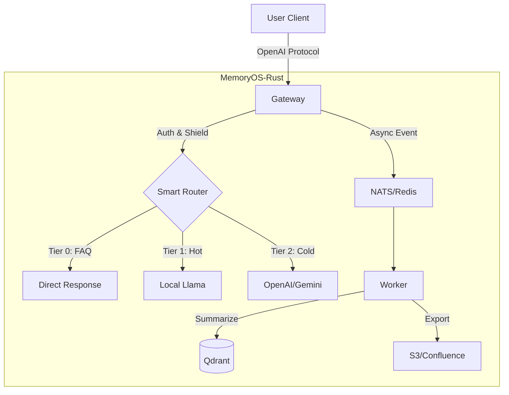

# MemoryOS-Rust

Sistema de Gestión de Memoria de Agente IA de Alto Rendimiento - Implementación Rust

[](https://www.apache.org/licenses/LICENSE-2.0)
[](https://www.rust-lang.org/)
[](./CHANGELOG.md)
[](./CHANGELOG.md)

**Idiomas**: [English](README.md) | [简体中文](README_CN.md) | [日本語](README_JA.md) | [Français](README_FR.md) | [العربية](README_AR.md) | [Deutsch](README_DE.md) | [Español](README_ES.md) | [한국어](README_KO.md)

---

## 🎯 Descripción General

MemoryOS-Rust es un sistema de gestión de memoria de agente IA de alto rendimiento construido con Rust + Tokio, con una arquitectura de memoria de 3 niveles (STM/MTM/LTM), compatibilidad con la API de OpenAI y soporte para más de 100,000 usuarios concurrentes.

---

## ✨ Características Principales

- 🚀 **Alto Rendimiento**: Rust + Tokio, soporta alta concurrencia con más de 10K QPS por instancia.
- 🧠 **Memoria de 3 Niveles**: STM (Redis) → MTM (Qdrant) → LTM (Qdrant).
- 🔌 **Gateway Universal**: Compatible con protocolo OpenAI, soporta Gemini, Claude, Ollama, DeepSeek, Azure.
- 🕸️ **Memoria de Grafos**: **Qdrant-Native GraphRAG** con visualización Mermaid.
- 📚 **Exportación de Conocimiento**: Exportación automática de FAQs a Wiki (S3/Confluence), soporta **Agent Playbook**.
- 🛡️ **Seguridad Empresarial**: RBAC, limpieza de PII, defensa contra inyección de prompts, derecho al olvido GDPR.
- 🤖 **Enrutamiento Inteligente**: Enrutamiento automático entre Llama local (caliente/privado) y GPT-4 en la nube (complejo/frío).

---

## 💻 Requisitos del Sistema

| Espec. | Mínimo (Dev) | Recomendado (Prod) |
| :--- | :--- | :--- |
| **CPU** | 2 vCPU | 4+ vCPU |
| **RAM** | 4GB | 16GB+ |
| **Disco** | 10GB SSD | 100GB NVMe |
| **OS** | Linux / macOS | Linux (K8s) |

---

## 🚀 Inicio Rápido

### 1. Iniciar Dependencias

```bash
docker-compose up -d
```

### 2. Configuración

Crear archivo `.env` (opcional) o establecer variables de entorno:
```bash
export GEMINI_API_KEY="your_key_here"
export QDRANT_API_KEY="your_qdrant_key"
```

Copiar archivo de configuración:
```bash
cp config.example.toml config.toml
# Editar config.toml para habilitar los módulos deseados (Router, Wiki, etc.)
```

### 3. Ejecutar

```bash
# Modo completo por defecto
cargo run --release --bin memoryos-gateway

# (Avanzado) Habilitar solo características específicas (si Cargo.toml lo soporta)
# cargo run --release --no-default-features --features "redis,qdrant"
```

### 4. Prueba

```bash
curl http://localhost:8080/health/status
```

**Guía Detallada**: [docs/QUICKSTART.md](./docs/QUICKSTART.md)

---

## 🏗️ Arquitectura



**Arquitectura Detallada**: [docs/ARCHITECTURE.md](./docs/ARCHITECTURE.md)

---

## 📚 Documentación

### Documentación de Usuario
- [Inicio Rápido](./docs/QUICKSTART.md) - Comienza en 5 minutos
- [Manual de Usuario](./docs/USER_MANUAL.md) - Guía de uso completa 📖
- [Arquitectura](./docs/ARCHITECTURE.md) - Diseño del sistema (Graph/Router)
- [Referencia API](./docs/API.md) - Documentación de API
- [Guía de Desarrollo](./docs/DEVELOPMENT.md) - Configuración de desarrollo
- [Guía de Despliegue](./docs/DEPLOYMENT.md) - Despliegue K8s/Docker
- [Despliegue Auto K3s](./docs/K3S_DEPLOYMENT.md) - Cluster K8s con un clic 🚀
- [Autenticación](./docs/AUTH.md) - Gestión de claves API

### Lectura Profunda
- [Principios de Diseño](./docs/DESIGN.md) - Filosofía de diseño e implementación ⭐
- [Comparación](./docs/COMPARISON.md) - Análisis vs Mem0 ⭐

### Documentación de Desarrollador
- [Hoja de Ruta](./docs/ROADMAP.md) - Planificación v0.2.0 → v1.0.0
- [Auth Clave API](./docs/AUTH.md) - Sistema de auth empresarial (persistencia Qdrant) 🔒
- [Registro de Trabajo](./WORK_LOG.md) - **Quién hace qué, para colaboración** ⭐⭐⭐
- [Estado del Proyecto](./docs/state.json) - Recuperación de contexto IA (legible por máquina)
- [Registro de Cambios](./CHANGELOG.md) - Historial de versiones
- [Contribución](./CONTRIBUTING.md) - Guías de contribución
- [Índice de Documentación](./docs/README.md) - Navegación completa de docs

**⭐ Recomendado**: Principios de Diseño y Comparación para conocimientos sobre diseño del sistema

---

## 📊 Estado del Proyecto

**Versión**: 0.2.0  
**Estado**: ✅ Listo para Producción  
**Completitud**: 100%  

| Fase | Módulo | Estado |
|------|--------|--------|
| Phase 1 | Foundation (Config/Log) | ✅ |
| Phase 2 | Gateway & Adapters | ✅ |
| Phase 3 | Storage (Redis/Qdrant) | ✅ |
| Phase 4 | Intelligence (Router/Shield) | ✅ |
| Phase 5 | Worker & Async | ✅ |
| Phase 6 | Wiki Export | ✅ |
| Phase 7 | Graph Memory | ✅ |

---

## 🛠️ Stack Tecnológico

- **Lenguaje**: Rust 1.93+
- **Runtime Async**: Tokio
- **Framework Web**: Axum
- **Almacenamiento a Corto Plazo**: Redis
- **Almacenamiento Vectorial**: Qdrant
- **LLM**: OpenAI, Gemini, Claude, Ollama, DeepSeek, OpenRouter, Azure

---

## 🤝 Contribución

¡Las contribuciones son bienvenidas! Por favor, sigue este flujo de trabajo:

### Antes de Comenzar
1. 📖 Leer la [Guía de Desarrollo](./docs/DEVELOPMENT.md)
2. 📝 Registrar tu tarea en [WORK_LOG.md](./WORK_LOG.md)
3. 🔄 Obtener el último código: `git pull`

### Durante el Trabajo
1. 📊 Actualizar el progreso en [WORK_LOG.md](./WORK_LOG.md) diariamente
2. 🐛 Registrar problemas inmediatamente
3. 🔴 Actualizar el estado si está bloqueado

### Después de Completar
1. ✅ Marcar la tarea como completada en [WORK_LOG.md](./WORK_LOG.md)
2. 📝 Actualizar [CHANGELOG.md](./CHANGELOG.md)
3. 🚀 Enviar código: `git commit && git push`

**Colaboración**: Usamos un registro de doble vía `WORK_LOG.md` (humano) + `docs/state.json` (IA) para colaboración transparente.

**Guía Detallada**: [CONTRIBUTING.md](./CONTRIBUTING.md)

---

## 🔧 Estado de Mantenimiento

**Estado Actual**: ✅ Listo para Producción y Mantenido Activamente

Este proyecto está **completo** (100%) y en modo mantenimiento. Nos enfocamos en:
- 🐛 Correcciones de errores y actualizaciones de seguridad
- 📚 Mejoras de documentación
- 💡 Mejoras impulsadas por la comunidad

**Ver**: [MAINTENANCE.md](./MAINTENANCE.md) para el plan de mantenimiento detallado

---

## 📞 Contacto

- **GitHub Issues**: [Reportar Problemas](https://github.com/TelivANT/memoryos-rust/issues)
- **GitHub Discussions**: [Unirse a Discusiones](https://github.com/TelivANT/memoryos-rust/discussions)
- **Email**: 246803628+TelivANT@users.noreply.github.com
- **Problemas de Seguridad**: Por favor envíe un email con asunto `[SECURITY]`

---

## 📄 Licencia

Licencia Apache 2.0 - Ver [LICENSE](./LICENSE)

---

## 🌟 Proyectos Relacionados

- **Proyecto Original**: [MemoryOS](https://github.com/BAI-LAB/MemoryOS) - Implementación Python
- **Paper**: [Memory OS of AI Agent](https://arxiv.org/abs/2506.06326)

---

**Versión**: 0.2.0 | **Actualizado**: 2026-02-18
