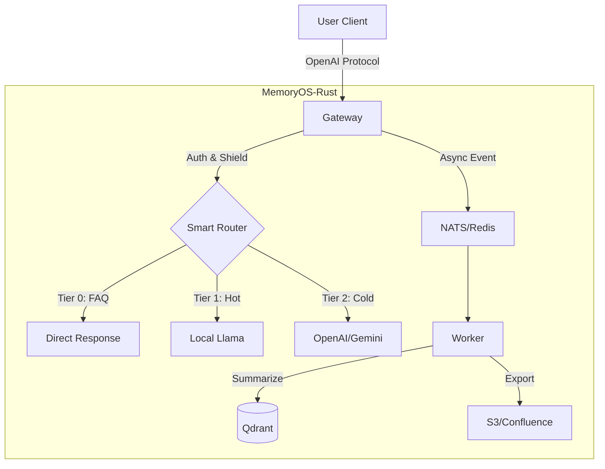

# MemoryOS-Rust

> ⚠️ Cette traduction peut être en retard par rapport au [README en anglais](README.md). En cas de doute, veuillez vous référer à la version anglaise.

Système de Gestion de Mémoire d'Agent IA Haute Performance - Implémentation Rust

[](https://www.apache.org/licenses/LICENSE-2.0)
[](https://www.rust-lang.org/)
[](./CHANGELOG.md)
[](./CHANGELOG.md)

**Langues**: [English](README.md) | [简体中文](README_CN.md) | [日本語](README_JA.md) | [Français](README_FR.md) | [العربية](README_AR.md) | [Deutsch](README_DE.md) | [Español](README_ES.md) | [한국어](README_KO.md)

---

## 🎯 Aperçu

MemoryOS-Rust est un système de gestion de mémoire d'agent IA haute performance construit avec Rust + Tokio, doté d'une architecture mémoire à 3 niveaux (STM/MTM/LTM), compatible avec l'API OpenAI et supportant plus de 100 000 utilisateurs simultanés.

---

## ✨ Fonctionnalités Clés

- 🚀 **Haute Performance**: Rust + Tokio, supportant une haute concurrence avec plus de 10K QPS par instance.
- 🧠 **Mémoire à 3 Niveaux**: STM (Redis) → MTM (Qdrant) → LTM (Qdrant).
- 🔌 **Passerelle Universelle**: Compatible avec le protocole OpenAI, supporte Gemini, Claude, Ollama, DeepSeek, Azure.
- 🕸️ **Mémoire Graphique**: **Qdrant-Native GraphRAG** avec visualisation Mermaid.
- 📚 **Export de Connaissances**: Export automatique des FAQ vers Wiki (S3/Confluence), supporte **Agent Playbook**.
- 🛡️ **Sécurité Entreprise**: RBAC, nettoyage PII, défense contre l'injection de prompt, droit à l'oubli RGPD.
- 🤖 **Routage Intelligent**: Routage automatique entre Llama local (chaud/privé) et GPT-4 cloud (complexe/froid).

---

## 💻 Configuration Système Requise

| Spéc | Minimum (Dev) | Recommandé (Prod) |
| :--- | :--- | :--- |
| **CPU** | 2 vCPU | 4+ vCPU |
| **RAM** | 4GB | 16GB+ |
| **Disque** | 10GB SSD | 100GB NVMe |
| **OS** | Linux / macOS | Linux (K8s) |

---

## 🚀 Démarrage Rapide

### 1. Démarrer les Dépendances

```bash
docker-compose up -d
```

### 2. Configuration

Créer un fichier `.env` (optionnel) ou définir les variables d'environnement:
```bash
export GEMINI_API_KEY="your_key_here"
export QDRANT_API_KEY="your_qdrant_key"
```

Copier le fichier de configuration:
```bash
cp config.example.toml config.toml
# Éditer config.toml pour activer les modules souhaités (Router, Wiki, etc.)
```

### 3. Exécution

```bash
# Mode complet par défaut
cargo run --release --bin memoryos-gateway

# (Avancé) Activer uniquement des fonctionnalités spécifiques (si Cargo.toml le supporte)
# cargo run --release --no-default-features --features "redis,qdrant"
```

### 4. Test

```bash
curl http://localhost:8080/health/status
```

**Guide Détaillé**: [docs/QUICKSTART.md](./docs/QUICKSTART.md)

---

## 🏗️ Architecture



**Architecture Détaillée**: [docs/ARCHITECTURE.md](./docs/ARCHITECTURE.md)

---

## 📚 Documentation

### Documentation Utilisateur
- [Démarrage Rapide](./docs/QUICKSTART.md) - Commencer en 5 minutes
- [Manuel Utilisateur](./docs/USER_MANUAL.md) - Guide d'utilisation complet 📖
- [Architecture](./docs/ARCHITECTURE.md) - Conception système (Graph/Router)
- [Référence API](./docs/API.md) - Documentation API
- [Guide de Développement](./docs/DEVELOPMENT.md) - Configuration de développement
- [Guide de Déploiement](./docs/DEPLOYMENT.md) - Déploiement K8s/Docker
- [Déploiement Auto K3s](./docs/K3S_DEPLOYMENT.md) - Cluster K8s en un clic 🚀
- [Authentification](./docs/AUTH.md) - Gestion des clés API

### Approfondissement
- [Principes de Conception](./docs/DESIGN.md) - Philosophie de conception et implémentation ⭐
- [Comparaison](./docs/COMPARISON.md) - Analyse vs Mem0 ⭐

### Documentation Développeur
- [Feuille de Route](./docs/ROADMAP.md) - Planification v0.2.0 → v1.0.0
- [Auth Clé API](./docs/AUTH.md) - Système d'auth entreprise (persistance Qdrant) 🔒
- [Journal de Travail](./WORK_LOG.md) - **Qui fait quoi, pour la collaboration** ⭐⭐⭐
- [État du Projet](./docs/state.json) - Récupération contexte IA (lisible machine)
- [Journal des Modifications](./CHANGELOG.md) - Historique des versions
- [Contribution](./CONTRIBUTING.md) - Guide de contribution
- [Index Documentation](./docs/README.md) - Navigation complète docs

**⭐ Recommandé**: Principes de Conception et Comparaison pour comprendre la conception système

---

## 📊 État du Projet

**Version**: 0.2.0  
**État**: ✅ Prêt pour Production  
**Achèvement**: 100%  

| Phase | Module | État |
|-------|--------|------|
| Phase 1 | Foundation (Config/Log) | ✅ |
| Phase 2 | Gateway & Adapters | ✅ |
| Phase 3 | Storage (Redis/Qdrant) | ✅ |
| Phase 4 | Intelligence (Router/Shield) | ✅ |
| Phase 5 | Worker & Async | ✅ |
| Phase 6 | Wiki Export | ✅ |
| Phase 7 | Graph Memory | ✅ |

---

## 🛠️ Stack Technique

- **Langage**: Rust 1.93+
- **Runtime Async**: Tokio
- **Framework Web**: Axum
- **Stockage Court Terme**: Redis
- **Stockage Vectoriel**: Qdrant
- **LLM**: OpenAI, Gemini, Claude, Ollama, DeepSeek, OpenRouter, Azure

---

## 🤝 Contribution

Les contributions sont les bienvenues! Veuillez suivre ce workflow:

### Avant de Commencer
1. 📖 Lire le [Guide de Développement](./docs/DEVELOPMENT.md)
2. 📝 Enregistrer votre tâche dans [WORK_LOG.md](./WORK_LOG.md)
3. 🔄 Récupérer le dernier code: `git pull`

### Pendant le Travail
1. 📊 Mettre à jour la progression dans [WORK_LOG.md](./WORK_LOG.md) quotidiennement
2. 🐛 Enregistrer les problèmes immédiatement
3. 🔴 Mettre à jour le statut si bloqué

### Après Achèvement
1. ✅ Marquer la tâche comme terminée dans [WORK_LOG.md](./WORK_LOG.md)
2. 📝 Mettre à jour [CHANGELOG.md](./CHANGELOG.md)
3. 🚀 Soumettre le code: `git commit && git push`

**Collaboration**: Nous utilisons un enregistrement double piste `WORK_LOG.md` (humain) + `docs/state.json` (IA) pour une collaboration transparente.

**Guide Détaillé**: [CONTRIBUTING.md](./CONTRIBUTING.md)

---

## 🔧 État de Maintenance

**État Actuel**: ✅ Prêt pour Production & Activement Maintenu

Ce projet est **complet** (100%) et en mode maintenance. Nous nous concentrons sur :
- 🐛 Corrections de bugs et mises à jour de sécurité
- 📚 Améliorations de la documentation
- 💡 Améliorations pilotées par la communauté

**Voir**: [MAINTENANCE.md](./MAINTENANCE.md) pour le plan de maintenance détaillé

---

## 📞 Contact

- **GitHub Issues**: [Signaler des Problèmes](https://github.com/TelivANT/memoryos-rust/issues)
- **GitHub Discussions**: [Rejoindre les Discussions](https://github.com/TelivANT/memoryos-rust/discussions)
- **Email**: 246803628+TelivANT@users.noreply.github.com
- **Problèmes de Sécurité**: Veuillez envoyer un email avec le sujet `[SECURITY]`

---

## 📄 Licence

Licence Apache 2.0 - Voir [LICENSE](./LICENSE)

---

## 🌟 Projets Associés

- **Projet Original**: [MemoryOS](https://github.com/BAI-LAB/MemoryOS) - Implémentation Python
- **Article**: [Memory OS of AI Agent](https://arxiv.org/abs/2506.06326)

---

**Version**: 0.2.0 | **Mis à jour**: 2026-02-18
