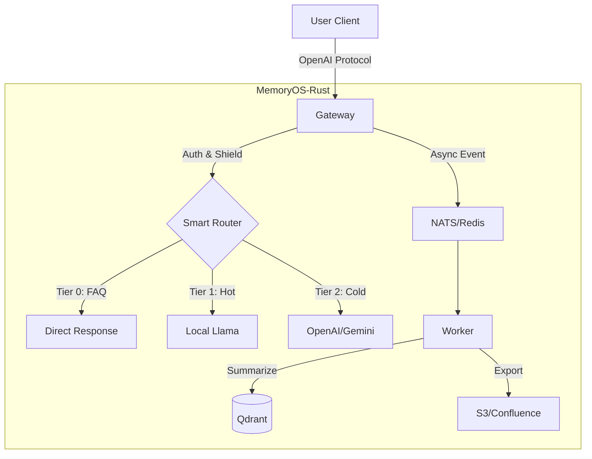

# MemoryOS-Rust

高性能AIエージェントメモリ管理システム - Rust実装

[](https://www.apache.org/licenses/LICENSE-2.0)
[](https://www.rust-lang.org/)
[](./CHANGELOG.md)
[](./CHANGELOG.md)

**言語**: [English](README.md) | [简体中文](README_CN.md) | [日本語](README_JA.md) | [Français](README_FR.md) | [العربية](README_AR.md) | [Deutsch](README_DE.md) | [Español](README_ES.md) | [한국어](README_KO.md)

---

## 🎯 概要

MemoryOS-Rustは、Rust + Tokioで構築された高性能AIエージェントメモリ管理システムです。3層メモリアーキテクチャ（STM/MTM/LTM）を特徴とし、OpenAI API互換性を持ち、100,000以上の同時ユーザーをサポートします。

---

## ✨ 主な機能

- 🚀 **高性能**: Rust + Tokio、高並行性をサポート、インスタンスあたり10K+ QPS。
- 🧠 **3層メモリ**: STM (Redis) → MTM (Qdrant) → LTM (Qdrant)。
- 🔌 **ユニバーサルゲートウェイ**: OpenAIプロトコル互換、Gemini、Claude、Ollama、DeepSeek、Azureをサポート。
- 🕸️ **グラフメモリ**: **Qdrant-Native GraphRAG**、Mermaid可視化対応。
- 📚 **ナレッジエクスポート**: FAQを自動的にWiki（S3/Confluence）にエクスポート、**Agent Playbook**をサポート。
- 🛡️ **エンタープライズセキュリティ**: RBAC、PII除去、プロンプトインジェクション防御、GDPR忘れられる権利。
- 🤖 **スマートルーティング**: ローカルLlama（ホット/プライベート）とクラウドGPT-4（複雑/コールド）間の自動ルーティング。

---

## 💻 システム要件

| 仕様 | 最小構成（開発） | 推奨構成（本番） |
| :--- | :--- | :--- |
| **CPU** | 2 vCPU | 4+ vCPU |
| **RAM** | 4GB | 16GB+ |
| **Disk** | 10GB SSD | 100GB NVMe |
| **OS** | Linux / macOS | Linux (K8s) |

---

## 🚀 クイックスタート

### 1. 依存関係の起動

```bash
docker-compose up -d
```

### 2. 設定

`.env`ファイルを作成（オプション）または環境変数を設定：
```bash
export GEMINI_API_KEY="your_key_here"
export QDRANT_API_KEY="your_qdrant_key"
```

設定ファイルをコピー：
```bash
cp config.example.toml config.toml
# config.tomlを編集して必要なモジュール（Router、Wikiなど）を有効化
```

### 3. 実行

```bash
# デフォルトのフル機能モード
cargo run --release --bin memoryos-gateway

# （上級）特定の機能のみを有効化（Cargo.tomlがサポートしている場合）
# cargo run --release --no-default-features --features "redis,qdrant"
```

### 4. テスト

```bash
curl http://localhost:8080/health/status
```

**詳細ガイド**: [docs/QUICKSTART.md](./docs/QUICKSTART.md)

---

## 🏗️ アーキテクチャ



**詳細アーキテクチャ**: [docs/ARCHITECTURE.md](./docs/ARCHITECTURE.md)

---

## 📚 ドキュメント

### ユーザードキュメント
- [クイックスタート](./docs/QUICKSTART.md) - 5分で始める
- [ユーザーマニュアル](./docs/USER_MANUAL.md) - 完全な使用ガイド 📖
- [アーキテクチャ](./docs/ARCHITECTURE.md) - システム設計（Graph/Router）
- [APIリファレンス](./docs/API.md) - APIドキュメント
- [開発ガイド](./docs/DEVELOPMENT.md) - 開発環境のセットアップ
- [デプロイガイド](./docs/DEPLOYMENT.md) - K8s/Dockerデプロイ
- [K3s自動デプロイ](./docs/K3S_DEPLOYMENT.md) - ワンクリックK8sクラスター 🚀
- [認証](./docs/AUTH.md) - APIキー管理

### 詳細解説
- [設計原則](./docs/DESIGN.md) - 設計思想と実装 ⭐
- [比較分析](./docs/COMPARISON.md) - vs Mem0分析 ⭐

### 開発者ドキュメント
- [ロードマップ](./docs/ROADMAP.md) - v0.2.0 → v1.0.0計画
- [APIキー認証](./docs/AUTH.md) - エンタープライズ認証システム（Qdrant永続化）🔒
- [作業ログ](./WORK_LOG.md) - **誰が何をしているか、コラボレーション用** ⭐⭐⭐
- [プロジェクト状態](./docs/state.json) - AIコンテキスト復元（機械可読）
- [変更履歴](./CHANGELOG.md) - バージョン履歴
- [貢献ガイド](./CONTRIBUTING.md) - 貢献ガイドライン
- [ドキュメント索引](./docs/README.md) - 完全なドキュメントナビゲーション

**⭐ 推奨**: システム設計の洞察については、設計原則と比較分析をご覧ください

---

## 📊 プロジェクトステータス

**バージョン**: 0.2.0  
**ステータス**: ✅ 本番環境対応  
**完成度**: 100%  

| フェーズ | モジュール | ステータス |
|-------|--------|--------|
| Phase 1 | Foundation (Config/Log) | ✅ |
| Phase 2 | Gateway & Adapters | ✅ |
| Phase 3 | Storage (Redis/Qdrant) | ✅ |
| Phase 4 | Intelligence (Router/Shield) | ✅ |
| Phase 5 | Worker & Async | ✅ |
| Phase 6 | Wiki Export | ✅ |
| Phase 7 | Graph Memory | ✅ |

---

## 🛠️ 技術スタック

- **言語**: Rust 1.93+
- **非同期ランタイム**: Tokio
- **Webフレームワーク**: Axum
- **短期ストレージ**: Redis
- **ベクトルストレージ**: Qdrant
- **LLM**: OpenAI, Gemini, Claude, Ollama, DeepSeek, OpenRouter, Azure

---

## 🤝 貢献

貢献を歓迎します！以下のワークフローに従ってください：

### 開始前
1. 📖 [開発ガイド](./docs/DEVELOPMENT.md)を読む
2. 📝 [WORK_LOG.md](./WORK_LOG.md)にタスクを記録
3. 🔄 最新のコードをプル: `git pull`

### 作業中
1. 📊 [WORK_LOG.md](./WORK_LOG.md)で毎日進捗を更新
2. 🐛 問題を即座に記録
3. 🔴 ブロックされた場合はステータスを更新

### 完了後
1. ✅ [WORK_LOG.md](./WORK_LOG.md)でタスクを完了としてマーク
2. 📝 [CHANGELOG.md](./CHANGELOG.md)を更新
3. 🚀 コードを提出: `git commit && git push`

**コラボレーション**: 透明なコラボレーションのために、`WORK_LOG.md`（人間用）+ `docs/state.json`（AI用）のデュアルトラック記録を使用しています。

**詳細ガイド**: [CONTRIBUTING.md](./CONTRIBUTING.md)

---

## 🔧 メンテナンス状況

**現在の状況**: ✅ 本番環境対応 & 積極的にメンテナンス中

このプロジェクトは**機能完全** (100%)で、メンテナンスモードです。以下に注力しています：
- 🐛 バグ修正とセキュリティ更新
- 📚 ドキュメント改善
- 💡 コミュニティ主導の機能強化

**詳細**: [MAINTENANCE.md](./MAINTENANCE.md) で詳細なメンテナンス計画を確認

---

## 📞 連絡先

- **GitHub Issues**: [問題を報告](https://github.com/TelivANT/memoryos-rust/issues)
- **GitHub Discussions**: [ディスカッションに参加](https://github.com/TelivANT/memoryos-rust/discussions)
- **メール**: 246803628+TelivANT@users.noreply.github.com
- **セキュリティ問題**: 件名に `[SECURITY]` を付けてメールしてください

---

## 📄 ライセンス

Apache 2.0 License - [LICENSE](./LICENSE)を参照

---

## 🌟 関連プロジェクト

- **オリジナルプロジェクト**: [MemoryOS](https://github.com/BAI-LAB/MemoryOS) - Python実装
- **論文**: [Memory OS of AI Agent](https://arxiv.org/abs/2506.06326)

---

**バージョン**: 0.2.0 | **更新日**: 2026-02-18
