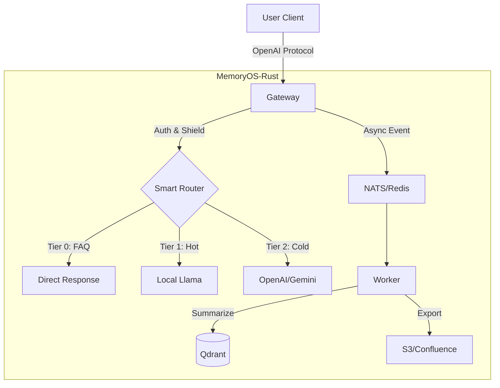

# MemoryOS-Rust

고성능 AI 에이전트 메모리 관리 시스템 - Rust 구현

[](https://www.apache.org/licenses/LICENSE-2.0)
[](https://www.rust-lang.org/)
[](./CHANGELOG.md)
[](./CHANGELOG.md)

**언어**: [English](README.md) | [简体中文](README_CN.md) | [日本語](README_JA.md) | [Français](README_FR.md) | [العربية](README_AR.md) | [Deutsch](README_DE.md) | [Español](README_ES.md) | [한국어](README_KO.md)

---

## 🎯 개요

MemoryOS-Rust는 Rust + Tokio로 구축된 고성능 AI 에이전트 메모리 관리 시스템으로, 3계층 메모리 아키텍처(STM/MTM/LTM)를 특징으로 하며, OpenAI API 호환성을 갖추고 100,000명 이상의 동시 사용자를 지원합니다.

---

## ✨ 주요 기능

- 🚀 **고성능**: Rust + Tokio, 인스턴스당 10K+ QPS의 높은 동시성 지원.
- 🧠 **3계층 메모리**: STM (Redis) → MTM (Qdrant) → LTM (Qdrant).
- 🔌 **범용 게이트웨이**: OpenAI 프로토콜 호환, Gemini, Claude, Ollama, DeepSeek, Azure 지원.
- 🕸️ **그래프 메모리**: **Qdrant-Native GraphRAG** 및 Mermaid 시각화.
- 📚 **지식 내보내기**: FAQ를 Wiki(S3/Confluence)로 자동 내보내기, **Agent Playbook** 지원.
- 🛡️ **엔터프라이즈 보안**: RBAC, PII 정제, 프롬프트 주입 방어, GDPR 잊혀질 권리.
- 🤖 **스마트 라우팅**: 로컬 Llama(핫/프라이빗)와 클라우드 GPT-4(복잡/콜드) 간 자동 라우팅.

---

## 💻 시스템 요구사항

| 사양 | 최소 (개발) | 권장 (프로덕션) |
| :--- | :--- | :--- |
| **CPU** | 2 vCPU | 4+ vCPU |
| **RAM** | 4GB | 16GB+ |
| **디스크** | 10GB SSD | 100GB NVMe |
| **OS** | Linux / macOS | Linux (K8s) |

---

## 🚀 빠른 시작

### 1. 의존성 시작

```bash
docker-compose up -d
```

### 2. 구성

`.env` 파일 생성(선택 사항) 또는 환경 변수 설정:
```bash
export GEMINI_API_KEY="your_key_here"
export QDRANT_API_KEY="your_qdrant_key"
```

구성 파일 복사:
```bash
cp config.example.toml config.toml
# config.toml을 편집하여 원하는 모듈(Router, Wiki 등) 활성화
```

### 3. 실행

```bash
# 기본 전체 기능 모드
cargo run --release --bin memoryos-gateway

# (고급) 특정 기능만 활성화 (Cargo.toml이 지원하는 경우)
# cargo run --release --no-default-features --features "redis,qdrant"
```

### 4. 테스트

```bash
curl http://localhost:8080/health/status
```

**상세 가이드**: [docs/QUICKSTART.md](./docs/QUICKSTART.md)

---

## 🏗️ 아키텍처



**상세 아키텍처**: [docs/ARCHITECTURE.md](./docs/ARCHITECTURE.md)

---

## 📚 문서

### 사용자 문서
- [빠른 시작](./docs/QUICKSTART.md) - 5분 안에 시작하기
- [사용자 매뉴얼](./docs/USER_MANUAL.md) - 완전한 사용 가이드 📖
- [아키텍처](./docs/ARCHITECTURE.md) - 시스템 설계 (Graph/Router)
- [API 참조](./docs/API.md) - API 문서
- [개발 가이드](./docs/DEVELOPMENT.md) - 개발 환경 설정
- [배포 가이드](./docs/DEPLOYMENT.md) - K8s/Docker 배포
- [K3s 자동 배포](./docs/K3S_DEPLOYMENT.md) - 원클릭 K8s 클러스터 🚀
- [인증](./docs/AUTH.md) - API 키 관리

### 심화 학습
- [설계 원칙](./docs/DESIGN.md) - 설계 철학 및 구현 ⭐
- [비교](./docs/COMPARISON.md) - vs Mem0 분석 ⭐

### 개발자 문서
- [로드맵](./docs/ROADMAP.md) - v0.2.0 → v1.0.0 계획
- [API 키 인증](./docs/AUTH.md) - 엔터프라이즈 인증 시스템 (Qdrant 영속성) 🔒
- [작업 로그](./WORK_LOG.md) - **누가 무엇을 하는지, 협업용** ⭐⭐⭐
- [프로젝트 상태](./docs/state.json) - AI 컨텍스트 복구 (기계 판독 가능)
- [변경 로그](./CHANGELOG.md) - 버전 히스토리
- [기여](./CONTRIBUTING.md) - 기여 가이드라인
- [문서 색인](./docs/README.md) - 완전한 문서 탐색

**⭐ 추천**: 시스템 설계 통찰력을 위한 설계 원칙 및 비교

---

## 📊 프로젝트 상태

**버전**: 0.2.0  
**상태**: ✅ 프로덕션 준비 완료  
**완성도**: 100%  

| 단계 | 모듈 | 상태 |
|------|------|------|
| Phase 1 | Foundation (Config/Log) | ✅ |
| Phase 2 | Gateway & Adapters | ✅ |
| Phase 3 | Storage (Redis/Qdrant) | ✅ |
| Phase 4 | Intelligence (Router/Shield) | ✅ |
| Phase 5 | Worker & Async | ✅ |
| Phase 6 | Wiki Export | ✅ |
| Phase 7 | Graph Memory | ✅ |

---

## 🛠️ 기술 스택

- **언어**: Rust 1.93+
- **비동기 런타임**: Tokio
- **웹 프레임워크**: Axum
- **단기 저장소**: Redis
- **벡터 저장소**: Qdrant
- **LLM**: OpenAI, Gemini, Claude, Ollama, DeepSeek, OpenRouter, Azure

---

## 🤝 기여

기여를 환영합니다! 다음 워크플로우를 따라주세요:

### 시작하기 전에
1. 📖 [개발 가이드](./docs/DEVELOPMENT.md) 읽기
2. 📝 [WORK_LOG.md](./WORK_LOG.md)에 작업 기록
3. 🔄 최신 코드 가져오기: `git pull`

### 작업 중
1. 📊 [WORK_LOG.md](./WORK_LOG.md)에서 매일 진행 상황 업데이트
2. 🐛 문제를 즉시 기록
3. 🔴 차단된 경우 상태 업데이트

### 완료 후
1. ✅ [WORK_LOG.md](./WORK_LOG.md)에서 작업을 완료로 표시
2. 📝 [CHANGELOG.md](./CHANGELOG.md) 업데이트
3. 🚀 코드 제출: `git commit && git push`

**협업**: 투명한 협업을 위해 `WORK_LOG.md`(사람용) + `docs/state.json`(AI용) 이중 트랙 기록을 사용합니다.

**상세 가이드**: [CONTRIBUTING.md](./CONTRIBUTING.md)

---

## 🔧 유지보수 상태

**현재 상태**: ✅ 프로덕션 준비 완료 & 적극 유지보수 중

이 프로젝트는 **기능 완성** (100%)되었으며 유지보수 모드입니다. 다음에 집중합니다:
- 🐛 버그 수정 및 보안 업데이트
- 📚 문서 개선
- 💡 커뮤니티 주도 기능 향상

**참조**: [MAINTENANCE.md](./MAINTENANCE.md)에서 상세한 유지보수 계획 확인

---

## 📞 연락처

- **GitHub Issues**: [문제 보고](https://github.com/TelivANT/memoryos-rust/issues)
- **GitHub Discussions**: [토론 참여](https://github.com/TelivANT/memoryos-rust/discussions)
- **이메일**: 246803628+TelivANT@users.noreply.github.com
- **보안 문제**: 제목에 `[SECURITY]`를 포함하여 이메일을 보내주세요

---

## 📄 라이선스

Apache 2.0 License - [LICENSE](./LICENSE) 참조

---

## 🌟 관련 프로젝트

- **원본 프로젝트**: [MemoryOS](https://github.com/BAI-LAB/MemoryOS) - Python 구현
- **논문**: [Memory OS of AI Agent](https://arxiv.org/abs/2506.06326)

---

**버전**: 0.2.0 | **업데이트**: 2026-02-18
