# MemoryOS-Rust 架构设计

**版本**: v1.0.0-rc
**仓库**: [TelivANT/memoryos-rust](https://github.com/TelivANT/memoryos-rust)

## 系统架构概览

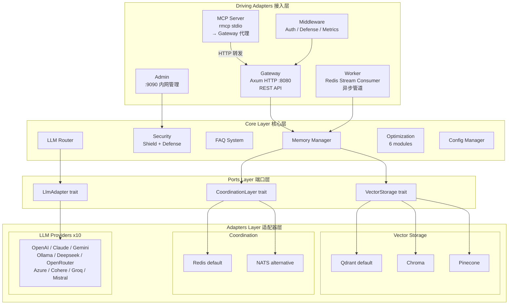

## 存储架构详解

### 统一向量存储架构

所有记忆层统一使用向量数据库，Redis/NATS 仅负责分布式协调。

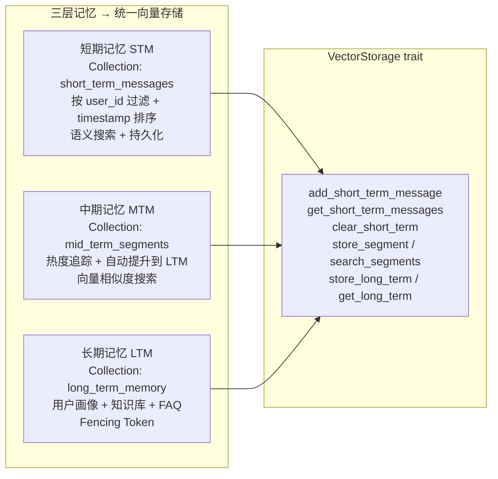

### 向量数据库选项 (3 选 1)

| 选项 | 特点 | 适用场景 |
|------|------|----------|
| **Qdrant** (默认) | 开源、高性能搜索、Fencing Token、完整过滤和元数据 | 生产环境，自托管 |
| **Chroma** | 轻量级、REST API、易于部署 | 开发测试，快速原型 |
| **Pinecone** | 云托管、自动扩展、全球分布 | 生产环境，无需运维 |

### 分布式协调层 (Redis/NATS)

Redis/NATS 专注于分布式协调，不存储记忆数据。

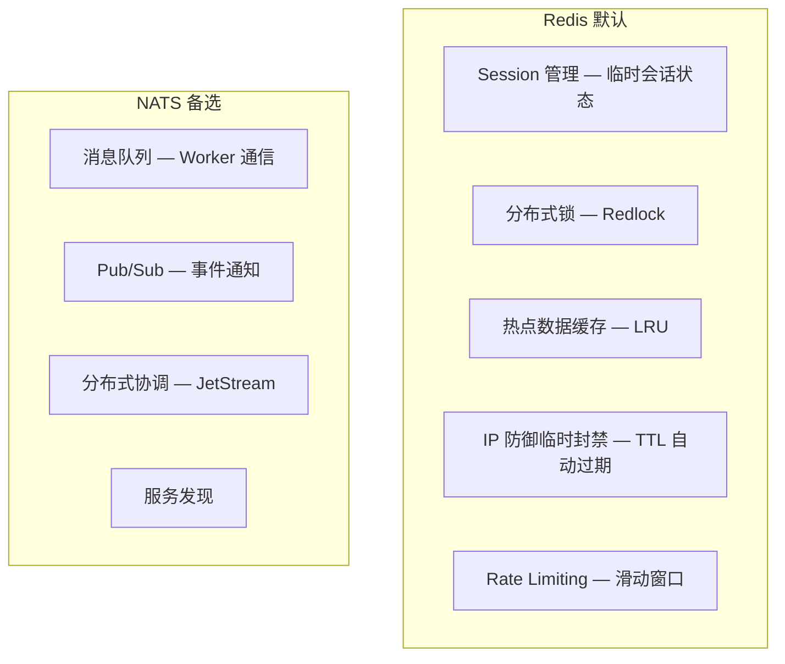

## 数据流架构

### 请求处理流程

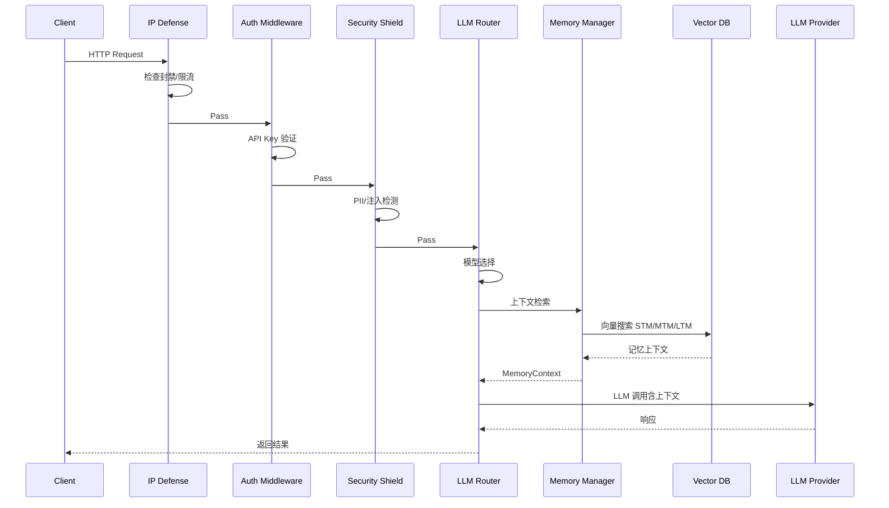

### 内存层次架构

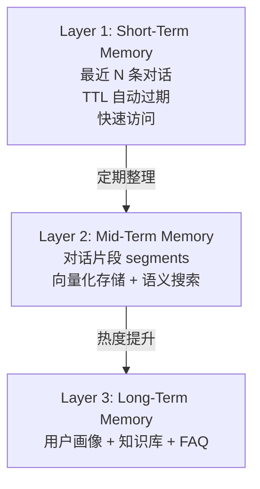

## 性能优化架构

| # | 模块 | 功能 | 说明 |
|---|------|------|------|
| 1 | Bloom Filter | FAQ 快速匹配 | 性能提升待验证 |
| 2 | Embedding Cache | LRU 缓存 | 减少 LLM 调用 |
| 3 | Batch Embedder | 批量生成 | 减少 API 调用次数 |
| 4 | Heat Buffer | 批量更新 | 减少 DB 写入 |
| 5 | Similarity Filter | 分层过滤 | 减少无关结果 |
| 6 | Incremental Summary | 增量合并 | 减少重复计算 |

> 以上优化模块代码已实现，具体性能提升数字尚未基准测试。

## 安全架构

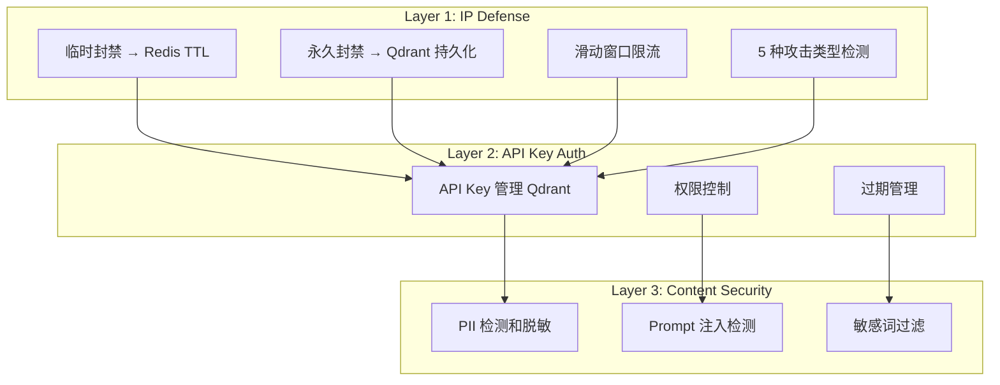

## 部署架构

### 单机部署

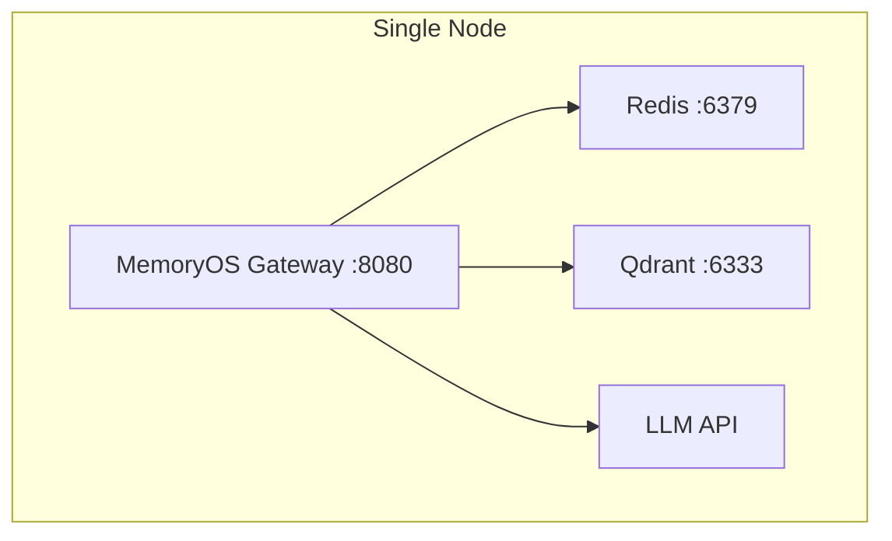

### K8s 集群部署

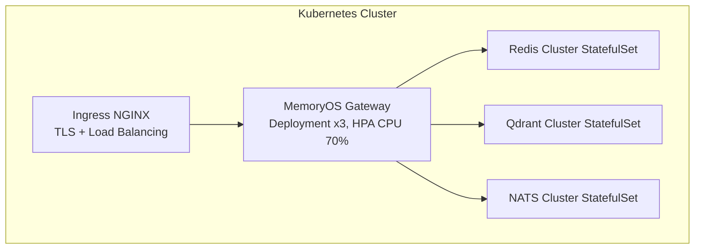

## 技术栈

| 分类 | 技术 |
|------|------|
| 语言 | Rust 2021 Edition |
| Web 框架 | Axum 0.7 |
| 异步运行时 | Tokio |
| 协调层 | Redis / NATS |
| 向量存储 | Qdrant / Chroma / Pinecone |
| LLM | 10 Providers: OpenAI, Claude, Gemini, Ollama, Deepseek, OpenRouter, Azure, Cohere, Groq, Mistral |
| 安全 | IP Defense + API Key Auth + Content Shield + AES-256-GCM |
| Wiki 生成 | Tree-sitter + LLM 混合 |
| 存储连接器 | Local, Git, S3, OSS, COS, OBS, WebDAV, SFTP, GCS, Azure Blob, SMB, NFS, OneDrive, Google Drive, Dropbox, Baidu Pan, Aliyun Drive (17 种) |

## 特性开关 (Feature Flags)

```toml
[features]
default = []
nats = ["async-nats"]
monitoring = ["prometheus"]
tracing = ["opentelemetry"]
```

## 配置示例

以下配置与 `config.example.toml` 保持一致：

```toml
[server]
host = "0.0.0.0"
port = 8080
worker_threads = 4
timeout_seconds = 60

[llm]
default_provider = "openai"
default_model = "gpt-4o-mini"

[llm.providers.openai]
type = "openai"
base_url = "https://api.openai.com/v1"
api_key = "sk-your-openai-key"

[storage.redis]
url = "redis://localhost:6379"
ttl_seconds = 3600
max_messages = 20

[storage.vector]
url = "http://localhost:6334"

[auth]
enabled = false
```

## 版本历程

| 版本 | 功能 |
|------|------|
| v0.3.0 | Wiki 导出: Local Markdown + S3 (OpenDAL) + Confluence |
| v0.4.0 | Graph Memory: 实体提取 + 关系提取 (10 种模式) + 图查询 + DFS 路径 |
| v0.5.0 | 多模态: QdrantMultiModalStorage + /v1/multimodal |
| v0.6.0 | 记忆增强: 版本控制 + 标签分类 + 搜索/导出/导入 |
| v0.7.0 | 性能基准测试: 3 套 Criterion 基准 |
| v0.8.0-v0.9.0 | 安全增强: AES-256-GCM + 审计日志 + GDPR |
| v0.10.0 | Prometheus /metrics + LLM FAQ 分类 |
| v0.11.0 | Tag 搜索 Qdrant filter + Memory History + Redis 0.32 + 审计/GDPR 可插拔 |
| v0.12.0 | 企业级: Admin 服务 + RBAC + 多租户 |
| v0.13.0 | Wiki-gen (Tree-sitter + LLM) + Storage Connectors + MCP 设计 |
| v1.0.0-rc | MCP Server 实现 + 配置验证 + 错误处理 + Embedding 集成 + 测试覆盖 |

**待完善**:
- CLIP/Whisper 实际模型集成（当前多模态使用 embedding 向量输入）
- OpenTelemetry 分布式链路追踪（当前仅 Prometheus 指标）
- 端到端性能数字（QPS/延迟）待生产验证

---

## Wiki 生成系统 (memoryos-wiki-gen)

> 详细设计见 [Wiki Generation Spec](specs/wiki_gen_spec.md)

### 系统定位

独立 crate `memoryos-wiki-gen`，支持 CLI 工具 + Gateway API 双路访问。从多语言代码仓库自动生成结构化 Markdown Wiki，同时整合 FAQ 知识库导出。

### Pipeline 架构

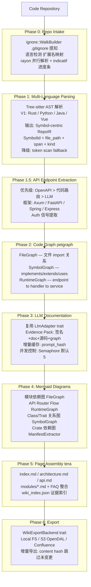

### Wiki-gen 技术栈

| 分类 | 技术 |
|------|------|
| Parsing | tree-sitter + language grammars (Rust/Python/Java/TS/HTML) |
| Dependency | cargo_metadata / quick-xml / serde_json / toml |
| Graph | petgraph (3-layer DiGraph) |
| LLM | LlmAdapter trait (10 providers, 复用) |
| Template | tera (Jinja2-style) |
| CLI | clap + indicatif |
| File Walk | ignore (gitignore-aware) |
| Parallel | rayon |
| Cache | sha2 (content/prompt hashing) |
| Export | WikiExportBackend (S3/Confluence/Local) |

---

## MCP Server 接入层 (memoryos-mcp)

> ✅ 已实现 (PR #48)。Gateway 代理模式，7 个 MCP Tools。

### 系统定位

独立 crate `memoryos-mcp`，作为 MemoryOS 的 MCP (Model Context Protocol) 接入层。让 AI 助手（Claude Desktop、Cursor、自定义 Agent）通过标准化 MCP 协议直接调用 MemoryOS 的记忆管理能力。

### 架构模式：Gateway 代理

MCP Server 采用**薄代理 (Thin Proxy)** 模式：接收 MCP tool call → 转发到 Gateway HTTP API → 返回结果。不直接访问 Core/Ports/Adapters，所有业务逻辑复用 Gateway。

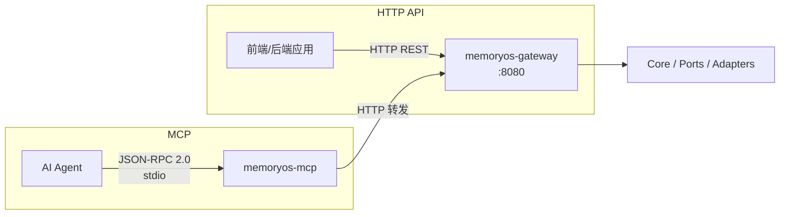

### MCP Tools (7 个)

| 分类 | 工具名 | Gateway 端点 | 功能 |
|------|--------|-------------|------|
| 记忆管理 | `add_memory` | `POST /v1/memory/add` | 存储消息到 STM |
| | `search_memories` | `POST /v1/memory/retrieve` | 语义搜索记忆 |
| | `get_memories` | `POST /v1/memory/retrieve` | 获取用户全部记忆 |
| | `delete_memory` | `POST /v1/security/gdpr/delete` | 删除用户数据 (GDPR) |
| 知识查询 | `query_graph` | `POST /v1/graph/query` | 知识图谱查询 |
| 对话 | `chat` | `POST /v1/chat` | 记忆增强对话 |
| 运维 | `health_check` | `GET /v1/health` | 系统健康检查 |

### MCP 技术栈

| 分类 | 技术 |
|------|------|
| Protocol | rmcp v0.3 (官方 Rust MCP SDK) |
| Transport | stdio (已实现) + SSE (预留) |
| Schema | schemars (JSON Schema 自动生成) |
| HTTP Client | reqwest (转发到 Gateway) |
| CLI | clap (`--gateway-url`, `--api-key`, `--transport`) |

### 传输方式

| 方式 | 场景 | 状态 |
|------|------|------|
| **stdio** (推荐) | 本地部署，Claude Desktop / Cursor 直接接入 | ✅ 已实现 |
| **SSE** | 远程部署，多客户端共享 | 📋 预留 |

### 客户端配置示例

**Claude Desktop** (`claude_desktop_config.json`):
```json
{
  "mcpServers": {
    "memoryos": {
      "command": "./memoryos-mcp",
      "args": ["--gateway-url", "http://127.0.0.1:8080"],
      "env": {
        "MEMORYOS_API_KEY": "your-api-key"
      }
    }
  }
}
```

**Cursor** (`.cursor/mcp.json`):
```json
{
  "mcpServers": {
    "memoryos": {
      "command": "./memoryos-mcp",
      "args": ["--gateway-url", "http://127.0.0.1:8080"]
    }
  }
}
```

---

## 企业级架构 (v0.12.0)

### 服务分离架构

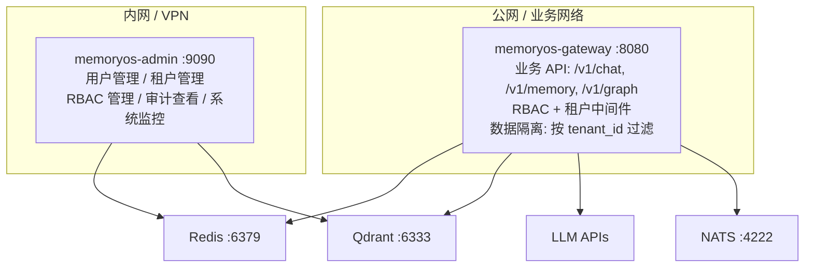

### RBAC 权限模型

| Permission | SuperAdmin | Admin | User | ReadOnly |
|-----------|:---------:|:-----:|:----:|:--------:|
| ReadMemory | Y | Y | Y | Y |
| WriteMemory | Y | Y | Y | - |
| ManageUsers | Y | Y | - | - |
| ManageTenants | Y | - | - | - |
| ViewAudit | Y | Y | - | - |
| ManageConfig | Y | - | - | - |

### 多租户数据隔离

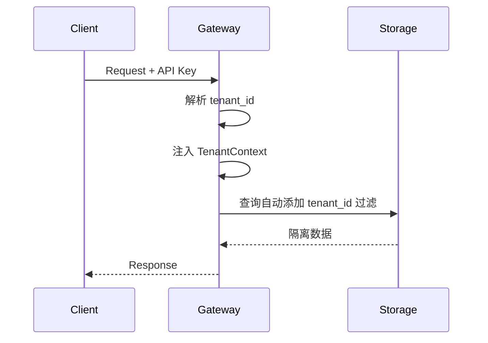

租户配置项: 名称/描述、最大用户数、存储配额、API 调用限制、启用/禁用状态。
