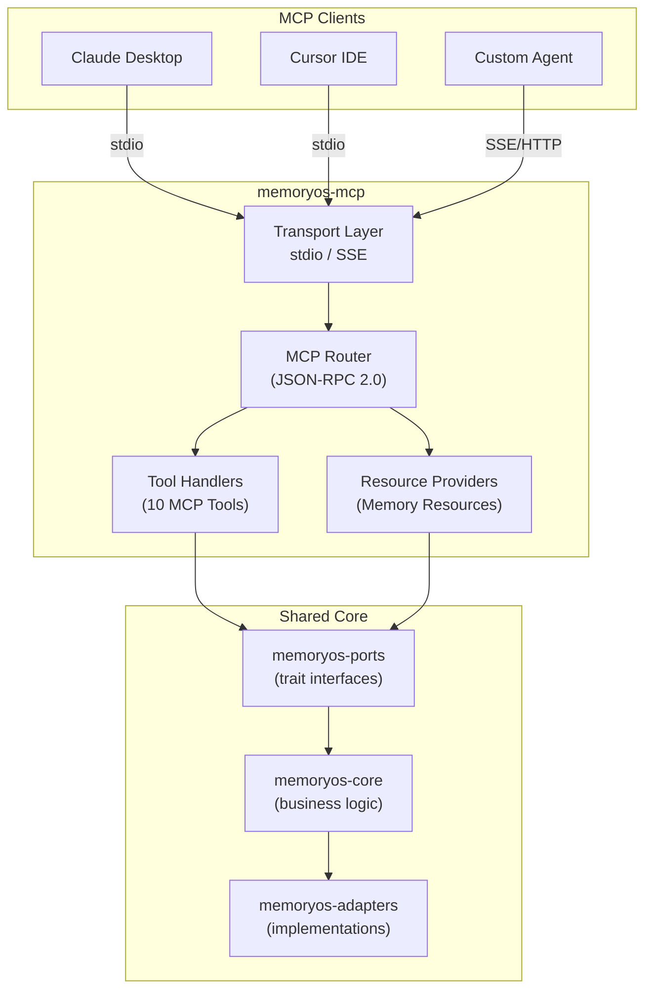

# MemoryOS-Rust 架构设计

## 系统架构概览

```
┌─────────────────────────────────────────────────────────────────┐
│                        MemoryOS-Rust                             │
│                     Hexagonal Architecture                       │
└─────────────────────────────────────────────────────────────────┘

┌─────────────────────────────────────────────────────────────────┐
│                       Driving Adapters (接入层)                  │
│  ┌──────────────┐  ┌──────────────┐  ┌──────────────┐          │
│  │   Gateway    │  │   MCP Server │  │    Worker    │          │
│  │  Axum HTTP   │  │  rmcp (stdio │  │  Redis Stream│          │
│  │  port 8080   │  │   + SSE)     │  │  Consumer    │          │
│  │  REST API    │  │  AI Agent 接入│  │  异步管道    │          │
│  └──────────────┘  └──────────────┘  └──────────────┘          │
│  ┌──────────────┐  ┌──────────────┐                            │
│  │  Middleware   │  │    Admin     │                            │
│  │  - Auth      │  │  port 9090   │                            │
│  │  - Defense   │  │  内网管理     │                            │
│  │  - Metrics   │  │              │                            │
│  └──────────────┘  └──────────────┘                            │
└─────────────────────────────────────────────────────────────────┘
                              │
                              ▼
┌─────────────────────────────────────────────────────────────────┐
│                          Core Layer                              │
│  ┌──────────────┐  ┌──────────────┐  ┌──────────────┐          │
│  │   Memory     │  │   Security   │  │     FAQ      │          │
│  │   Manager    │  │   - Shield   │  │   System     │          │
│  │              │  │   - Defense  │  │              │          │
│  └──────────────┘  └──────────────┘  └──────────────┘          │
│  ┌──────────────┐  ┌──────────────┐  ┌──────────────┐          │
│  │     LLM      │  │Optimization  │  │    Config    │          │
│  │   Router     │  │  (6 modules) │  │   Manager    │          │
│  └──────────────┘  └──────────────┘  └──────────────┘          │
└─────────────────────────────────────────────────────────────────┘
                              │
                              ▼
┌─────────────────────────────────────────────────────────────────┐
│                         Ports Layer                              │
│  ┌──────────────┐  ┌──────────────┐  ┌──────────────┐          │
│  │ VectorStore  │  │Coordination  │  │  LLM Adapter │          │
│  │   (trait)    │  │    Layer     │  │   (trait)    │          │
│  │              │  │   (trait)    │  │              │          │
│  └──────────────┘  └──────────────┘  └──────────────┘          │
└─────────────────────────────────────────────────────────────────┘
                              │
                              ▼
┌─────────────────────────────────────────────────────────────────┐
│                        Adapters Layer                            │
│  ┌──────────────────────────────────────────────────────────┐   │
│  │         Vector Storage (统一存储所有记忆层)               │   │
│  │  ┌──────────────┐  ┌──────────────┐  ┌──────────────┐   │   │
│  │  │   Qdrant     │  │    Chroma    │  │  Pinecone    │   │   │
│  │  │  (default)   │  │ (lightweight)│  │ (cloud-hosted)│  │   │
│  │  └──────────────┘  └──────────────┘  └──────────────┘   │   │
│  └──────────────────────────────────────────────────────────┘   │
│  ┌──────────────────────────────────────────────────────────┐   │
│  │         Coordination Layer (分布式协调)                   │   │
│  │  ┌──────────────┐              ┌──────────────┐          │   │
│  │  │    Redis     │              │     NATS     │          │   │
│  │  │  (default)   │              │ (alternative)│          │   │
│  │  │  ~1ms 延迟   │              │  ~2ms 延迟   │          │   │
│  │  │  有警告      │              │  无警告      │          │   │
│  │  └──────────────┘              └──────────────┘          │   │
│  └──────────────────────────────────────────────────────────┘   │
│  ┌──────────────────────────────────────────────────────────┐   │
│  │              Vector Storage (多选)                        │   │
│  │  ┌──────────┐  ┌──────────┐  ┌──────────┐               │   │
│  │  │ Qdrant   │  │ Pinecone │  │  Chroma  │               │   │
│  │  │(primary) │  │          │  │          │               │   │
│  │  └──────────┘  └──────────┘  └──────────┘               │   │
│  └──────────────────────────────────────────────────────────┘   │
│  ┌──────────────────────────────────────────────────────────┐   │
│  │              LLM Providers (10 个)                        │   │
│  │  OpenAI │ Claude │ Gemini │ Ollama │ Deepseek │ ...     │   │
│  └──────────────────────────────────────────────────────────┘   │
└─────────────────────────────────────────────────────────────────┘
```

## 存储架构详解

### 统一向量存储架构 (NEW)

**所有记忆层现在统一使用向量数据库**:

```
┌─────────────────────────────────────────────────────────────┐
│              Unified Vector Storage Architecture             │
├─────────────────────────────────────────────────────────────┤
│                                                              │
│  短期记忆 (STM) → 向量数据库 (Qdrant/Chroma/Pinecone)        │
│  • Collection: short_term_messages                           │
│  • 按 user_id 过滤                                           │
│  • 按 timestamp 排序                                         │
│  • 支持语义搜索                                              │
│  • 持久化存储                                                │
│                                                              │
│  中期记忆 (MTM) → 向量数据库 (Qdrant/Chroma/Pinecone)        │
│  • Collection: mid_term_segments                             │
│  • 热度追踪                                                  │
│  • 自动提升到长期记忆                                        │
│  • 向量相似度搜索                                            │
│                                                              │
│  长期记忆 (LTM) → 向量数据库 (Qdrant/Chroma/Pinecone)        │
│  • Collection: long_term_memory                              │
│  • 用户画像                                                  │
│  • 知识库                                                    │
│  • Fencing Token (Qdrant)                                    │
│                                                              │
└─────────────────────────────────────────────────────────────┘
```

### 向量数据库选项 (3 选 1)

```
┌─────────────────────────────────────────────────────────────┐
│                   Vector Storage Options                     │
├─────────────────────────────────────────────────────────────┤
│                                                              │
│  Option 1: Qdrant (默认，推荐)                               │
│  ┌────────────────────────────────────────────────────┐     │
│  │  • 开源向量数据库                                   │     │
│  │  • 高性能搜索                                       │     │
│  │  • 支持 Fencing Token                               │     │
│  │  • 完整的过滤和元数据支持                           │     │
│  │  • 适用: 生产环境，自托管                           │     │
│  └────────────────────────────────────────────────────┘     │
│                                                              │
│  Option 2: Chroma (轻量级)                                   │
│  ┌────────────────────────────────────────────────────┐     │
│  │  • 轻量级向量数据库                                 │     │
│  │  • REST API                                         │     │
│  │  • 易于部署                                         │     │
│  │  • 适用: 开发测试，快速原型                         │     │
│  └────────────────────────────────────────────────────┘     │
│                                                              │
│  Option 3: Pinecone (云托管)                                 │
│  ┌────────────────────────────────────────────────────┐     │
│  │  • 云托管向量数据库                                 │     │
│  │  • 自动扩展                                         │     │
│  │  • 全球分布                                         │     │
│  │  • 适用: 生产环境，无需运维                         │     │
│  └────────────────────────────────────────────────────┘     │
│                                                              │
│  统一接口: VectorStorage trait                               │
│  • add_short_term_message()                                  │
│  • get_short_term_messages()                                 │
│  • clear_short_term()                                        │
│  • store_segment()                                           │
│  • search_segments()                                         │
│  • store_long_term()                                         │
│  • get_long_term()                                           │
│                                                              │
└─────────────────────────────────────────────────────────────┘
```

### 分布式协调层 (Redis/NATS)

**Redis/NATS 现在专注于分布式协调，不再存储记忆数据**:

```
┌─────────────────────────────────────────────────────────────┐
│              Coordination Layer (Redis/NATS)                 │
├─────────────────────────────────────────────────────────────┤
│                                                              │
│  Option 1: Redis (默认)                                      │
│  ┌────────────────────────────────────────────────────┐     │
│  │  用途:                                              │     │
│  │  • Session 管理 (临时会话状态)                      │     │
│  │  • 分布式锁 (Redlock)                               │     │
│  │  • 热点数据缓存 (LRU)                               │     │
│  │  • IP 防御临时封禁 (TTL 自动过期)                   │     │
│  │  • Rate Limiting (滑动窗口)                         │     │
│  └────────────────────────────────────────────────────┘     │
│                                                              │
│  Option 2: NATS (备选)                                       │
│  ┌────────────────────────────────────────────────────┐     │
│  │  用途:                                              │     │
│  │  • 消息队列 (Worker 通信)                           │     │
│  │  • Pub/Sub (事件通知)                               │     │
│  │  • 分布式协调 (JetStream)                           │     │
│  │  • 服务发现                                         │     │
│  └────────────────────────────────────────────────────┘     │
│                                                              │
└─────────────────────────────────────────────────────────────┘
```
│  • 按需选择                                                  │
│                                                              │
└─────────────────────────────────────────────────────────────┘
```

## 数据流架构

### 请求处理流程

```
User Request
     │
     ▼
┌─────────────────┐
│  IP Defense     │  ← 检查封禁/限流
│  Middleware     │
└─────────────────┘
     │
     ▼
┌─────────────────┐
│  Auth           │  ← API Key 验证
│  Middleware     │
└─────────────────┘
     │
     ▼
┌─────────────────┐
│  Security       │  ← PII/注入检测
│  Shield         │
└─────────────────┘
     │
     ▼
┌─────────────────┐
│  LLM Router     │  ← 模型选择
└─────────────────┘
     │
     ▼
┌─────────────────┐
│  Memory         │  ← 上下文检索
│  Manager        │
└─────────────────┘
     │
     ├─→ Short-Term ─→ Redis/NATS
     │
     └─→ Vector     ─→ Qdrant
```

### 内存层次架构

```
┌─────────────────────────────────────────────────────────────┐
│                      Memory Hierarchy                        │
├─────────────────────────────────────────────────────────────┤
│                                                              │
│  Layer 1: Short-Term Memory (Redis/NATS)                     │
│  ┌────────────────────────────────────────────────────┐     │
│  │  • 最近 N 条对话                                    │     │
│  │  • TTL 自动过期                                     │     │
│  │  • 快速访问 (~1-2ms)                               │     │
│  └────────────────────────────────────────────────────┘     │
│                      │                                       │
│                      ▼ (定期整理)                            │
│  Layer 2: Mid-Term Memory (Qdrant)                           │
│  ┌────────────────────────────────────────────────────┐     │
│  │  • 对话片段 (segments)                              │     │
│  │  • 向量化存储                                       │     │
│  │  • 语义搜索                                         │     │
│  └────────────────────────────────────────────────────┘     │
│                      │                                       │
│                      ▼ (热度提升)                            │
│  Layer 3: Long-Term Memory (Qdrant)                          │
│  ┌────────────────────────────────────────────────────┐     │
│  │  • 用户画像                                         │     │
│  │  • 知识库                                           │     │
│  │  • FAQ                                              │     │
│  └────────────────────────────────────────────────────┘     │
│                                                              │
└─────────────────────────────────────────────────────────────┘
```

## 性能优化架构

```
┌─────────────────────────────────────────────────────────────┐
│                  6 Performance Optimization Modules          │
├─────────────────────────────────────────────────────────────┤
│                                                              │
│  1. Bloom Filter        → FAQ 快速匹配 (性能提升待验证)      │
│  2. Embedding Cache     → LRU 缓存 (减少 LLM 调用)          │
│  3. Batch Embedder      → 批量生成 (减少 API 调用次数)       │
│  4. Heat Buffer         → 批量更新 (减少 DB 写入)            │
│  5. Similarity Filter   → 分层过滤 (减少无关结果)            │
│  6. Incremental Summary → 增量合并 (减少重复计算)            │
│                                                              │
│  注：以上优化模块代码已实现，但具体性能提升数字尚未基准测试  │
│                                                              │
└─────────────────────────────────────────────────────────────┘
```

## 安全架构

```
┌─────────────────────────────────────────────────────────────┐
│                      Security Layers                         │
├─────────────────────────────────────────────────────────────┤
│                                                              │
│  Layer 1: IP Defense (Redis + Qdrant)                        │
│  ┌────────────────────────────────────────────────────┐     │
│  │  • 临时封禁 → Redis (TTL)                           │     │
│  │  • 永久封禁 → Qdrant (持久化)                       │     │
│  │  • 滑动窗口限流                                     │     │
│  │  • 5 种攻击类型检测                                 │     │
│  └────────────────────────────────────────────────────┘     │
│                                                              │
│  Layer 2: API Key Auth (Qdrant)                              │
│  ┌────────────────────────────────────────────────────┐     │
│  │  • API Key 管理                                     │     │
│  │  • 权限控制                                         │     │
│  │  • 过期管理                                         │     │
│  └────────────────────────────────────────────────────┘     │
│                                                              │
│  Layer 3: Content Security                                   │
│  ┌────────────────────────────────────────────────────┐     │
│  │  • PII 检测和脱敏                                   │     │
│  │  • Prompt 注入检测                                  │     │
│  │  • 敏感词过滤                                       │     │
│  └────────────────────────────────────────────────────┘     │
│                                                              │
└─────────────────────────────────────────────────────────────┘
```

## 部署架构

### 单机部署

```
┌─────────────────────────────────────────────────────────────┐
│                      Single Node Deployment                  │
├─────────────────────────────────────────────────────────────┤
│                                                              │
│  ┌──────────────────────────────────────────────────┐       │
│  │  MemoryOS Gateway (Rust Binary)                  │       │
│  │  • Port: 8080                                     │       │
│  │  • Workers: 4                                     │       │
│  └──────────────────────────────────────────────────┘       │
│                      │                                       │
│         ┌────────────┼────────────┐                         │
│         ▼            ▼            ▼                         │
│  ┌──────────┐ ┌──────────┐ ┌──────────┐                    │
│  │  Redis   │ │  Qdrant  │ │   LLM    │                    │
│  │  :6379   │ │  :6333   │ │  API     │                    │
│  └──────────┘ └──────────┘ └──────────┘                    │
│                                                              │
│  或使用 NATS 替代 Redis:                                     │
│  ┌──────────┐                                               │
│  │  NATS    │                                               │
│  │  :4222   │                                               │
│  └──────────┘                                               │
│                                                              │
└─────────────────────────────────────────────────────────────┘
```

### K8s 集群部署

```
┌─────────────────────────────────────────────────────────────┐
│                    Kubernetes Cluster                        │
├─────────────────────────────────────────────────────────────┤
│                                                              │
│  ┌────────────────────────────────────────────────────┐     │
│  │  Ingress (NGINX)                                   │     │
│  │  • TLS Termination                                 │     │
│  │  • Load Balancing                                  │     │
│  └────────────────────────────────────────────────────┘     │
│                      │                                       │
│                      ▼                                       │
│  ┌────────────────────────────────────────────────────┐     │
│  │  MemoryOS Gateway (Deployment)                     │     │
│  │  • Replicas: 3                                     │     │
│  │  • HPA: CPU 70%                                    │     │
│  └────────────────────────────────────────────────────┘     │
│                      │                                       │
│         ┌────────────┼────────────┐                         │
│         ▼            ▼            ▼                         │
│  ┌──────────┐ ┌──────────┐ ┌──────────┐                    │
│  │  Redis   │ │  Qdrant  │ │  NATS    │                    │
│  │ Cluster  │ │ Cluster  │ │ Cluster  │                    │
│  │(StatefulSet)│(StatefulSet)│(StatefulSet)│               │
│  └──────────┘ └──────────┘ └──────────┘                    │
│                                                              │
└─────────────────────────────────────────────────────────────┘
```

## 技术栈

```
┌─────────────────────────────────────────────────────────────┐
│                        Tech Stack                            │
├─────────────────────────────────────────────────────────────┤
│                                                              │
│  Language:     Rust 2021 Edition                             │
│  Web Framework: Axum 0.7                                     │
│  Async Runtime: Tokio                                        │
│                                                              │
│  Storage:                                                    │
│  • Short-Term:  Redis 0.24 / NATS 0.37                       │
│  • Vector:      Qdrant 1.7                                   │
│  • Wiki:        OpenDAL (FS; S3 planned)                     │
│                                                              │
│  LLM:                                                        │
│  • 10 Providers (OpenAI, Claude, Gemini, ...)               │
│  • Unified Interface                                         │
│                                                              │
│  Security:                                                   │
│  • IP Defense (Redis + Qdrant)                               │
│  • API Key Auth (Qdrant)                                     │
│  • Content Shield                                            │
│                                                              │
└─────────────────────────────────────────────────────────────┘
```

## 特性开关 (Feature Flags)

```toml
[features]
default = []

# 存储选项
nats = ["async-nats"]  # 启用 NATS 支持

# 未来扩展
monitoring = ["prometheus"]
tracing = ["opentelemetry"]
```

## 配置示例

```toml
# config.toml

[storage]
# 短期存储选择
short_term_type = "redis"  # 或 "nats"

[storage.redis]
url = "redis://localhost:6379"
ttl_seconds = 3600
max_messages = 20

[storage.nats]
url = "nats://localhost:4222"
ttl_seconds = 3600
max_messages = 20

[storage.vector]
type = "qdrant"
url = "http://localhost:6333"
```

## 总结

MemoryOS-Rust 采用 **Hexagonal Architecture** 设计，通过 **Ports & Adapters** 模式实现了高度的灵活性和可扩展性。

**核心优势**:
- ✅ 双存储选项 (Redis + NATS 并存)
- ✅ 3 种向量数据库 (Qdrant, Chroma, Pinecone)
- ✅ 10 个 LLM 适配器
- ✅ 6 个性能优化模块（待基准测试）
- ✅ 安全防御体系（PII 脱敏 + 注入检测 + IP 防御）
- ✅ K8s/Docker 部署方案

**已完善 (v0.3.0~v0.9.0)**:
- ✅ Graph Memory: 实体自动提取 + 关系提取(10种模式) + 图查询 API + DFS 路径查询 (v0.4.0)
- ✅ Wiki 导出: 本地 Markdown + S3 (OpenDAL) + Confluence (REST API) (v0.3.0)
- ✅ 多模态: QdrantMultiModalStorage + HTTP 端点 /v1/multimodal (v0.5.0)
- ✅ 记忆增强: 版本控制 + 标签分类 + 搜索/导出/导入 (v0.6.0)
- ✅ 安全增强: AES-256-GCM 加密 + 审计日志持久化 + GDPR 合规 (v0.8.0~v0.9.0)
- ✅ 性能基准测试: 3 套 Criterion 基准 (optimization/graph/security) (v0.7.0)

- ✅ Prometheus 可观测性: /metrics 端点 + HTTP/Router/FAQ/LLM 全链路指标 (v0.10.0)
- ✅ LLM FAQ 分类: LlmFaqClassifier + /v1/admin/faq/classify API (v0.10.0)

**待完善**:
- ⚠️ CLIP/Whisper 实际模型集成（当前多模态使用 embedding 向量输入）
- ⚠️ OpenTelemetry 分布式链路追踪（当前仅 Prometheus 指标）
- ⚠️ 端到端性能数字（QPS/延迟）待生产验证

- ✅ v0.11.0 修复: Tag 搜索 Qdrant payload filter + Memory History 接入 + Redis 0.32 + Graph LLM + 审计/GDPR 可插拔后端

**待完善**:
- ⚠️ CLIP/Whisper 实际模型集成（当前多模态使用 embedding 向量输入）
- ⚠️ OpenTelemetry 分布式链路追踪（当前仅 Prometheus 指标）

**备选功能 (Backlog)**:
- 📋 跨模态检索（text→image / image→text，依赖 CLIP）
- 📋 视频帧提取与摘要
- 📋 多语言 FAQ 自动翻译
- 📋 FAQ 提升阈值 A/B 测试
- 📋 分布式增强（多区域、数据同步、灾难恢复）

## Wiki 生成系统 (memoryos-wiki-gen)

> 详细设计见 [Wiki Generation Spec](specs/wiki_gen_spec.md)

### 系统定位

独立 crate `memoryos-wiki-gen`，支持 CLI 工具 + Gateway API 双路访问。从多语言代码仓库自动生成结构化 Markdown Wiki，同时整合 FAQ 知识库导出。

### Pipeline 架构

```
Code Repository
     │
     ▼
┌─────────────────────────────────────────────────────────────┐
│  Phase 0: Repo Intake                                        │
│  • ignore::WalkBuilder (.gitignore 感知)                     │
│  • 语言检测 (扩展名映射)                                     │
│  • rayon 并行解析                                            │
│  • indicatif 进度条                                          │
└─────────────────────────────────────────────────────────────┘
     │
     ▼
┌─────────────────────────────────────────────────────────────┐
│  Phase 1: Multi-Language Parsing (Tree-sitter)               │
│  • V1 语言: Rust / Python / Java / Vue (TS + HTML)          │
│  • 输出: Symbol-centric RepoIR                               │
│  • SymbolId = file_path + span + kind (稳定跨语言ID)         │
│  • 降级策略: 解析失败 → token scan fallback                   │
└─────────────────────────────────────────────────────────────┘
     │
     ▼
┌─────────────────────────────────────────────────────────────┐
│  Phase 1.5: API Endpoint Extraction                          │
│  • 优先级: OpenAPI/Swagger/Proto > 代码路由 > LLM           │
│  • 框架: Axum / FastAPI / Spring / Express                   │
│  • Auth 信号提取 (80% 规则: 输出信号不输出结论)              │
└─────────────────────────────────────────────────────────────┘
     │
     ▼
┌─────────────────────────────────────────────────────────────┐
│  Phase 2: Code Graph (petgraph)                              │
│  三层图:                                                     │
│  • FileGraph — 文件 import 关系 (粗粒度)                     │
│  • SymbolGraph — 符号级 implements/extends/uses (细粒度)     │
│  • RuntimeGraph — endpoint→handler→service (API 级)          │
└─────────────────────────────────────────────────────────────┘
     │
     ▼
┌─────────────────────────────────────────────────────────────┐
│  Phase 3: LLM Documentation Generation                       │
│  • 复用 LlmAdapter trait (10 adapters)                       │
│  • Evidence Pack: 签名 + doc + 源码片段 + graph 邻居         │
│  • 增量缓存: prompt_hash → 跳过未变更符号                    │
│  • 并发控制: tokio::sync::Semaphore (默认 5)                 │
└─────────────────────────────────────────────────────────────┘
     │
     ▼
┌─────────────────────────────────────────────────────────────┐
│  Phase 4: Mermaid Diagram Generation                         │
│  • 模块依赖图 (FileGraph 聚合)                               │
│  • API Router Flow (RuntimeGraph 子图)                       │
│  • Class/Trait 关系图 (SymbolGraph 子图)                     │
│  • Crate 依赖图 (ManifestExtractor)                          │
└─────────────────────────────────────────────────────────────┘
     │
     ▼
┌─────────────────────────────────────────────────────────────┐
│  Phase 5: Page Assembly (tera 模板)                          │
│  • index.md / architecture.md / api.md / modules/*.md       │
│  • FAQ 整合: faq/*.md (LlmClassifier 替代硬编码分类)         │
│  • wiki_index.json 证据索引 (文档→源码可追溯)               │
└─────────────────────────────────────────────────────────────┘
     │
     ▼
┌─────────────────────────────────────────────────────────────┐
│  Phase 6: Export (WikiExportBackend)                          │
│  • Local FS / S3 (OpenDAL) / Confluence (REST)              │
│  • 增量导出: content hash 跳过未变更页面                     │
│  • V2 计划: GitHub Wiki backend                              │
└─────────────────────────────────────────────────────────────┘
```

### 技术栈 (Wiki Gen)

```
┌─────────────────────────────────────────────────────────────┐
│  Wiki Gen Tech Stack                                         │
├─────────────────────────────────────────────────────────────┤
│                                                              │
│  Parsing:    tree-sitter + language grammars (Rust/Py/Java/TS/HTML)
│  Dependency: cargo_metadata (Rust) / quick-xml (Maven) /    │
│              serde_json (npm) / toml (Python)               │
│  Graph:      petgraph (3-layer DiGraph)                     │
│  LLM:        LlmAdapter trait (10 providers, reused)        │
│  Template:   tera (Jinja2-style)                            │
│  CLI:        clap + indicatif                               │
│  File Walk:  ignore (gitignore-aware)                       │
│  Parallel:   rayon (file-level CPU parallelism)             │
│  Cache:      sha2 (content/prompt hashing)                  │
│  Export:     WikiExportBackend (S3/Confluence/Local, reused) │
│                                                              │
└─────────────────────────────────────────────────────────────┘
```

## MCP Server 接入层 (memoryos-mcp)

### 系统定位

独立 crate `memoryos-mcp`，作为 MemoryOS 的 MCP (Model Context Protocol) 接入层。让 AI 助手（Claude Desktop、Cursor、自定义 Agent）通过标准化 MCP 协议直接调用 MemoryOS 的记忆管理能力，无需手写 HTTP 集成。

### 与 Gateway 的关系

```
┌─────────────────────────────────────────────────────────────┐
│                   MemoryOS 接入层对比                         │
├─────────────────────────────────────────────────────────────┤
│                                                              │
│  接入方式 1: HTTP API (Gateway)                              │
│  ┌────────────────────────────────────────────────────┐     │
│  │  前端/后端应用 → HTTP REST → memoryos-gateway      │     │
│  │  • OpenAI 兼容协议                                 │     │
│  │  • 适用: Web 应用、移动端、服务间调用              │     │
│  └────────────────────────────────────────────────────┘     │
│                                                              │
│  接入方式 2: MCP (memoryos-mcp)                              │
│  ┌────────────────────────────────────────────────────┐     │
│  │  AI Agent → MCP 协议 → memoryos-mcp               │     │
│  │  • JSON-RPC 2.0 over stdio / SSE                   │     │
│  │  • 适用: Claude Desktop, Cursor, 自定义 Agent      │     │
│  └────────────────────────────────────────────────────┘     │
│                                                              │
│  共享层: Core / Ports / Adapters (业务逻辑完全复用)          │
│                                                              │
└─────────────────────────────────────────────────────────────┘
```

### 架构设计



### MCP Tools 定义

```
┌─────────────────────────────────────────────────────────────┐
│                     MCP Tools (10 个)                        │
├─────────────────────────────────────────────────────────────┤
│                                                              │
│  记忆管理:                                                   │
│  ┌────────────────────────────────────────────────────┐     │
│  │  add_memory      — 存储对话/事实到 STM             │     │
│  │  search_memories — 语义搜索记忆 (向量相似度)        │     │
│  │  get_memories    — 列出记忆 (分页 + 过滤)           │     │
│  │  get_memory      — 按 ID 获取单条记忆              │     │
│  │  update_memory   — 修改记忆内容                     │     │
│  │  delete_memory   — 删除单条记忆 (GDPR 合规)        │     │
│  └────────────────────────────────────────────────────┘     │
│                                                              │
│  知识查询:                                                   │
│  ┌────────────────────────────────────────────────────┐     │
│  │  search_faq      — 搜索高频 Q&A (Tier 0 直接命中)  │     │
│  │  query_graph     — 知识图谱查询 (实体/关系/路径)    │     │
│  │  get_user_profile— 获取用户长期画像 (LTM)          │     │
│  └────────────────────────────────────────────────────┘     │
│                                                              │
│  代码文档:                                                   │
│  ┌────────────────────────────────────────────────────┐     │
│  │  generate_wiki   — 触发代码仓库 Wiki 生成          │     │
│  └────────────────────────────────────────────────────┘     │
│                                                              │
└─────────────────────────────────────────────────────────────┘
```

### MCP Resources 定义

```
┌─────────────────────────────────────────────────────────────┐
│                   MCP Resources (只读数据)                    │
├─────────────────────────────────────────────────────────────┤
│                                                              │
│  memory://{user_id}/profile    — 用户画像                    │
│  memory://{user_id}/recent     — 最近对话                    │
│  memory://{user_id}/knowledge  — 知识库                      │
│  faq://list                    — FAQ 列表                    │
│  graph://{entity_id}           — 图谱实体详情                │
│  health://status               — 系统健康状态                │
│                                                              │
└─────────────────────────────────────────────────────────────┘
```

### 技术栈 (MCP)

```
┌─────────────────────────────────────────────────────────────┐
│  MCP Server Tech Stack                                       │
├─────────────────────────────────────────────────────────────┤
│                                                              │
│  Protocol:   rmcp v0.16+ (官方 Rust MCP SDK)                │
│  Transport:  stdio (本地 CLI) + SSE (远程 HTTP)              │
│  Schema:     schemars (JSON Schema 自动生成)                 │
│  Serialization: serde + serde_json (已有)                    │
│  Async:      tokio (已有)                                    │
│  Logging:    tracing (已有)                                  │
│                                                              │
│  复用模块:                                                   │
│  • memoryos-ports (trait 接口)                               │
│  • memoryos-core (业务逻辑)                                  │
│  • memoryos-adapters (存储/LLM 适配器)                       │
│  • AppConfig (配置加载)                                      │
│                                                              │
└─────────────────────────────────────────────────────────────┘
```

### 传输方式

```
┌─────────────────────────────────────────────────────────────┐
│                    Transport Options                         │
├─────────────────────────────────────────────────────────────┤
│                                                              │
│  1. stdio (本地部署，推荐)                                   │
│  ┌────────────────────────────────────────────────────┐     │
│  │  AI Client → spawn memoryos-mcp → stdin/stdout     │     │
│  │  • 零网络延迟                                      │     │
│  │  • 适用: Claude Desktop, Cursor                     │     │
│  │  • 配置: claude_desktop_config.json / .cursor/mcp  │     │
│  └────────────────────────────────────────────────────┘     │
│                                                              │
│  2. SSE (远程部署)                                           │
│  ┌────────────────────────────────────────────────────┐     │
│  │  AI Client → HTTP SSE → memoryos-mcp server        │     │
│  │  • 支持远程访问                                     │     │
│  │  • 适用: 自定义 Agent, 多客户端共享                 │     │
│  │  • 端点: http://host:port/mcp                      │     │
│  └────────────────────────────────────────────────────┘     │
│                                                              │
└─────────────────────────────────────────────────────────────┘
```

### 客户端配置示例

**Claude Desktop** (`claude_desktop_config.json`):
```json
{
  "mcpServers": {
    "memoryos": {
      "command": "./memoryos-mcp",
      "args": ["--config", "config.toml"],
      "env": {
        "QDRANT_URL": "http://localhost:6333",
        "REDIS_URL": "redis://localhost:6379"
      }
    }
  }
}
```

**Cursor** (`.cursor/mcp.json`):
```json
{
  "mcpServers": {
    "memoryos": {
      "command": "./memoryos-mcp",
      "args": ["--config", "config.toml"]
    }
  }
}
```

## 企业级架构 (v0.12.0)

### 服务分离架构

```
┌─────────────────────────────────────────────────────────────┐
│                    Enterprise Deployment                      │
├─────────────────────────────────────────────────────────────┤
│                                                              │
│  ┌────────────────────────────────────────────────────┐     │
│  │  公网 / 业务网络                                    │     │
│  │                                                     │     │
│  │  memoryos-gateway (port 8080)                      │     │
│  │  • 业务 API: /v1/chat, /v1/memory, /v1/graph      │     │
│  │  • RBAC 中间件: 按角色检查权限                     │     │
│  │  • 租户中间件: 自动注入 tenant_id                  │     │
│  │  • 数据隔离: 所有查询按 tenant_id 过滤            │     │
│  └────────────────────────────────────────────────────┘     │
│                                                              │
│  ┌────────────────────────────────────────────────────┐     │
│  │  内网 / VPN                                         │     │
│  │                                                     │     │
│  │  memoryos-admin (port 9090)                        │     │
│  │  • 用户管理: CRUD 用户, 分配角色                   │     │
│  │  • 租户管理: CRUD 租户, 配额设置                   │     │
│  │  • RBAC 管理: 角色分配/撤销                        │     │
│  │  • 审计查看: 查询审计日志                          │     │
│  │  • 系统监控: 租户统计, 资源使用                    │     │
│  └────────────────────────────────────────────────────┘     │
│                                                              │
│         ┌────────────┬────────────┬────────────┐            │
│         ▼            ▼            ▼            ▼            │
│  ┌──────────┐ ┌──────────┐ ┌──────────┐ ┌──────────┐      │
│  │  Redis   │ │  Qdrant  │ │   LLM    │ │   NATS   │      │
│  │  :6379   │ │  :6333   │ │  APIs    │ │  :4222   │      │
│  └──────────┘ └──────────┘ └──────────┘ └──────────┘      │
│                                                              │
└─────────────────────────────────────────────────────────────┘
```

### RBAC 权限模型

```
┌─────────────────────────────────────────────────────────────┐
│                    RBAC Permission Model                      │
├─────────────────────────────────────────────────────────────┤
│                                                              │
│  角色层级:                                                   │
│  ┌──────────────────────────────────────────────────┐       │
│  │  SuperAdmin  → 所有权限 + 租户管理               │       │
│  │  Admin       → 用户管理 + 数据读写 + 审计查看    │       │
│  │  User        → 数据读写                           │       │
│  │  ReadOnly    → 仅读取                             │       │
│  └──────────────────────────────────────────────────┘       │
│                                                              │
│  权限矩阵:                                                   │
│  ┌──────────────┬───────┬───────┬──────┬──────────┐        │
│  │ Permission   │ Super │ Admin │ User │ ReadOnly │        │
│  ├──────────────┼───────┼───────┼──────┼──────────┤        │
│  │ ReadMemory   │  ✅   │  ✅   │  ✅  │   ✅     │        │
│  │ WriteMemory  │  ✅   │  ✅   │  ✅  │   ❌     │        │
│  │ ManageUsers  │  ✅   │  ✅   │  ❌  │   ❌     │        │
│  │ ManageTenants│  ✅   │  ❌   │  ❌  │   ❌     │        │
│  │ ViewAudit    │  ✅   │  ✅   │  ❌  │   ❌     │        │
│  │ ManageConfig │  ✅   │  ❌   │  ❌  │   ❌     │        │
│  └──────────────┴───────┴───────┴──────┴──────────┘        │
│                                                              │
└─────────────────────────────────────────────────────────────┘
```

### 多租户数据隔离

```
┌─────────────────────────────────────────────────────────────┐
│                  Multi-Tenant Data Isolation                  │
├─────────────────────────────────────────────────────────────┤
│                                                              │
│  请求流程:                                                   │
│  Client → API Key → 解析 tenant_id → 注入 TenantContext     │
│                                                              │
│  数据隔离:                                                   │
│  ┌──────────────────────────────────────────────────┐       │
│  │  [计划] Qdrant 查询自动添加 tenant_id 过滤条件    │       │
│  │  [计划] Redis key 前缀: {tenant_id}:{key}         │       │
│  │  审计日志标记 tenant_id                           │       │
│  └──────────────────────────────────────────────────┘       │
│                                                              │
│  租户配置:                                                   │
│  ┌──────────────────────────────────────────────────┐       │
│  │  • 名称 / 描述                                    │       │
│  │  • 最大用户数                                     │       │
│  │  • 存储配额                                       │       │
│  │  • API 调用限制                                   │       │
│  │  • 启用/禁用状态                                  │       │
│  └──────────────────────────────────────────────────┘       │
│                                                              │
└─────────────────────────────────────────────────────────────┘
```
