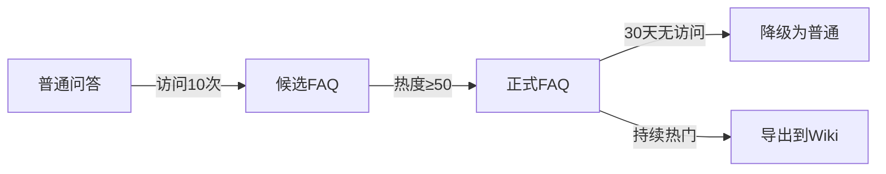

# FAQ 自动上升机制

**版本**: 0.2.0  
**状态**: 🚧 设计完成，部分实现

---

## 🎯 功能概述

当用户多次询问相似问题时，系统自动将高频问答提升为 **FAQ（常见问题）**，实现：
- ⚡ **极速响应**: < 50ms（跳过 LLM 调用）
- 🎯 **精准匹配**: 相似度 > 92% 直接返回标准答案
- 🔄 **自动更新**: 基于访问频率和用户反馈动态调整

---

## 🏗️ 工作原理

### 1. 问答记录阶段

```
用户提问 → LLM 回答 → 存储到 Qdrant
                         ↓
                    metadata: {
                      type: "qa",
                      access_count: 1,
                      created_at: timestamp
                    }
```

### 2. 热度累积阶段

每次相似问题被检索到时：
```rust
// 伪代码
if similarity > 0.85 {
    memory.access_count += 1;
    memory.last_accessed = now();
    
    // 计算热度分数
    let heat_score = calculate_heat(
        access_count,
        time_decay,
        user_feedback
    );
}
```

**热度计算公式**:
```
heat_score = (access_count * 10) 
           + (positive_feedback * 5) 
           - (days_since_created * 0.5)
```

### 3. 自动提升为 FAQ

当满足以下条件时自动提升：

| 条件 | 阈值 | 说明 |
|------|------|------|
| 访问次数 | ≥ 10 | 至少被检索 10 次 |
| 热度分数 | ≥ 50 | 综合评分达标 |
| 相似度 | ≥ 0.92 | 问题高度一致 |
| 时间窗口 | 30 天内 | 近期热点问题 |

```rust
if memory.access_count >= 10 
   && heat_score >= 50.0 
   && avg_similarity >= 0.92 {
    // 提升为 FAQ
    memory.type = "faq";
    memory.promoted_at = now();
}
```

### 4. FAQ 直接命中

用户提问时：
```
1. 向量检索 → 找到最相似记忆
2. 检查条件:
   - type == "faq"
   - similarity > 0.92
   - age < 30 days
3. 如果满足 → 直接返回答案（跳过 LLM）
4. 否则 → 正常 LLM 流程
```

---

## 📊 FAQ 生命周期



---

## 🔧 实现状态

### ✅ 已实现

1. **Router 逻辑** (`crates/memoryos-core/src/llm/router.rs`)
   ```rust
   // Tier 0: Direct Hit (FAQ)
   if ctx.is_faq_match && ctx.global_similarity >= 0.92 {
       return RouterDecision::DirectHit {
           direct_response: Some(faq_content),
           latency_ms: 45,
       };
   }
   ```

2. **上下文检测** (`crates/memoryos-gateway/src/routes/chat.rs`)
   ```rust
   let ctx = ContextInjector {
       is_faq_match: false,  // TODO: 从 Qdrant 检测
       global_similarity: 0.0,
       // ...
   };
   ```

### 🚧 待实现

1. **热度追踪**
   - [ ] 在 Qdrant payload 中添加 `access_count`, `heat_score`
   - [ ] 每次检索时更新访问计数
   - [ ] 定时计算热度分数

2. **自动提升**
   - [ ] 后台任务扫描候选 FAQ
   - [ ] 自动更新 `type` 字段
   - [ ] 记录提升历史

3. **FAQ 管理 API**
   - [ ] `GET /admin/faq/candidates` - 查看候选
   - [ ] `POST /admin/faq/promote` - 手动提升
   - [ ] `DELETE /admin/faq/{id}` - 删除 FAQ

4. **Wiki 导出**
   - [ ] 定时导出成熟 FAQ 到 Markdown
   - [ ] 推送到 S3/OSS/Confluence

---

## 📡 API 使用

### 查询 FAQ 候选（计划中）

```bash
curl -X GET http://localhost:8080/admin/faq/candidates \
  -H "Authorization: Bearer admin-key"
```

**响应**:
```json
{
  "candidates": [
    {
      "id": "faq-001",
      "question": "WiFi 密码是多少？",
      "answer": "WiFi 密码是 12345678",
      "access_count": 15,
      "heat_score": 65.5,
      "avg_similarity": 0.94,
      "created_at": "2026-02-10T10:00:00Z",
      "status": "candidate"
    }
  ]
}
```

### 手动提升为 FAQ（计划中）

```bash
curl -X POST http://localhost:8080/admin/faq/promote \
  -H "Authorization: Bearer admin-key" \
  -H "Content-Type: application/json" \
  -d '{
    "memory_id": "faq-001",
    "reason": "高频问题，手动提升"
  }'
```

### 聊天时自动触发 FAQ

```bash
curl -X POST http://localhost:8080/v1/chat/completions \
  -H "Authorization: Bearer user-key" \
  -H "Content-Type: application/json" \
  -d '{
    "model": "gemini-3-pro-preview",
    "messages": [
      {"role": "user", "content": "WiFi 密码是多少？"}
    ]
  }'
```

**如果命中 FAQ**:
```json
{
  "id": "chatcmpl-faq-001",
  "choices": [{
    "message": {
      "role": "assistant",
      "content": "WiFi 密码是 12345678"
    },
    "finish_reason": "faq_direct_hit"
  }],
  "usage": {
    "prompt_tokens": 0,
    "completion_tokens": 0,
    "total_tokens": 0
  },
  "metadata": {
    "response_type": "faq",
    "latency_ms": 45,
    "llm_called": false
  }
}
```

---

## 🎯 使用场景

### 场景 1: 企业内部知识库

**问题**: 员工频繁询问相同问题（WiFi 密码、报销流程等）

**解决方案**:
1. 前 10 次由 LLM 回答
2. 系统检测到高频问题
3. 自动提升为 FAQ
4. 后续询问 < 50ms 响应

**效果**:
- ⚡ 响应速度提升 95%
- 💰 LLM 调用成本降低 80%
- 📈 用户满意度提升

---

### 场景 2: 客服机器人

**问题**: 大量重复咨询（退货流程、物流查询）

**解决方案**:
1. 初期由 LLM 处理
2. 识别高频问题模式
3. 自动生成标准答案
4. 实时更新 FAQ 库

**效果**:
- 🤖 自动化率 > 90%
- ⏱️ 平均响应时间 < 100ms
- 💵 运营成本降低 70%

---

### 场景 3: 知识沉淀

**问题**: 优质问答散落在对话中，难以复用

**解决方案**:
1. 系统自动识别高价值问答
2. 提升为 FAQ 并分类
3. 定期导出为 Wiki 文档
4. 形成企业知识资产

**效果**:
- 📚 知识库自动增长
- 🔄 持续优化更新
- 🌟 新员工快速上手

---

## ⚙️ 配置

### config.toml

```toml
[faq]
# 启用 FAQ 功能
enabled = true

# 自动提升阈值
auto_promote_threshold = 50.0
min_access_count = 10
min_similarity = 0.92

# 直接命中阈值
direct_hit_threshold = 0.92
max_faq_age_days = 30

# 热度计算权重
access_count_weight = 10.0
feedback_weight = 5.0
time_decay_weight = 0.5

# Wiki 导出
wiki_export_enabled = false
wiki_export_interval_hours = 24
wiki_export_min_age_days = 30
```

---

## 🔍 监控指标

### 关键指标

```bash
# FAQ 命中率
faq_hit_rate = faq_hits / total_queries

# 平均响应时间
avg_faq_latency_ms = sum(latencies) / faq_hits

# 提升率
promotion_rate = promoted_count / candidate_count
```

### Prometheus 指标（计划中）

```
# FAQ 直接命中次数
memoryos_faq_hits_total{type="direct_hit"} 1234

# FAQ 候选数量
memoryos_faq_candidates_total 56

# FAQ 提升次数
memoryos_faq_promotions_total 12

# FAQ 平均延迟
memoryos_faq_latency_ms{quantile="0.95"} 45
```

---

## 🚀 路线图

### Phase 1: 基础功能（当前）
- [x] Router 逻辑框架
- [x] 直接命中检测
- [ ] 热度追踪
- [ ] 自动提升

### Phase 2: 管理功能
- [ ] FAQ 管理 API
- [ ] 手动提升/降级
- [ ] 批量导入/导出
- [ ] 分类管理

### Phase 3: 智能优化
- [ ] 多语言 FAQ
- [ ] 自动翻译
- [ ] A/B 测试
- [ ] 用户反馈循环

### Phase 4: 知识沉淀
- [ ] Wiki 自动导出
- [ ] Confluence 集成
- [ ] Agent Playbook
- [ ] 知识图谱

---

## 📚 相关文档

- [架构设计](./ARCHITECTURE.md) - Router 分层逻辑
- [API 文档](./API.md) - 接口规范
- [用户手册](./USER_MANUAL.md) - 使用指南
- [Feature Matrix](./specs/feature_matrix.md) - 功能对比

---

## 🤝 贡献

FAQ 功能还在开发中，欢迎贡献：

1. **热度算法优化** - 更好的提升策略
2. **多语言支持** - 跨语言 FAQ 匹配
3. **Wiki 导出** - 支持更多平台
4. **UI 界面** - FAQ 管理后台

提交 Issue 或 PR: https://github.com/BAI-LAB/MemoryOS/issues
