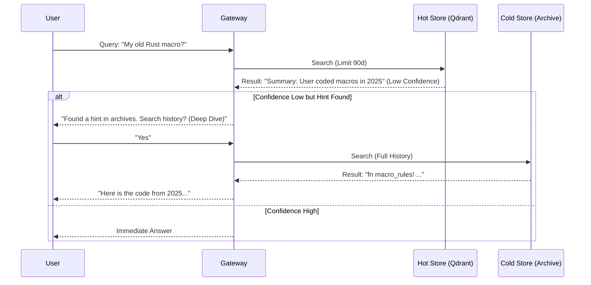

# Architecture Design: Separation of Compute & Storage

## 1. Overview (High-Level)

To support **100,000+ concurrent users** and **100+ Pods**, MemoryOS-Rust adopts a **Separation of Concerns** architecture. The system is split into two distinct roles:

1.  **Gateway Service (The "Frontend")**: Handles user traffic, authentication, fast memory retrieval, and LLM proxying. **Latency-sensitive**.
2.  **Worker Service (The "Backend")**: Handles slow, asynchronous memory maintenance tasks (summarization, knowledge extraction, vector embedding). **Throughput-sensitive**.

## 2. Component Roles & Responsibilities

### 2.1 Gateway Service (Stateless)
*   **Protocol**: HTTP / WebSocket / SSE.
*   **Responsibility**:
    1.  **Auth**: Build unified principal context from API Key or JWT. Enforce RBAC with Redis/DB-backed revocation checks.
    2.  **Fast Retrieval**: Fetch STM (Short-Term Memory) from Redis + MTM (Mid-Term) from Qdrant (Hot Store).
    3.  **Context Injection**: Construct the final prompt with retrieved memory.
        *   **Private**: User-specific context (e.g., "User prefers Rust").
        *   **Global**: Company-wide context (e.g., "The official login portal is SSO").

    4.  **Security Policy Layer (Defense-in-Depth)**
        *   **Global Rate Limiter (Token Bucket)**:
            *   Redis-backed counter: `llm_tokens:{provider}:{minute}`.
            *   Limit: 90% of Upstream Quota.
            *   Action: If exceeded -> Return 429 (Prevent upstream ban).
        *   **PII Check**: Scrub API keys, Emails, Phone numbers.
        *   **Compliance Check (Optional)**: If `enable_compliance = true` AND Query contains "Confidential" -> Force **Local Route**.
        *   **Injection Check**: Detect "Ignore Previous Instructions" -> Block Request.

    5.  **Model Router (Intelligent Tiering Algorithm)**
        *   **Objective**: Dynamically route queries based on Confidence and Complexity.
        
        *   **Algorithm: Complexity Scoring**:
            ```rust
            score = (token_count / 1000 * 0.3) 
                  + (has_code_block * 0.2) 
                  + (is_reasoning_task * 0.5);
            ```
        
        *   **Algorithm: Heat Calculation (Improved)**:
            ```rust
            heat = (recent_access_30d * 0.6) + (total_access * 0.2) + (like_ratio * 0.2);
            if age_days > 180 { heat *= 0.5; } // Time Decay
            if is_deprecated { heat = 0.0; }   // Manual Override
            ```

        *   **Tier 0: Direct Hit (FAQ Mode)**:
            *   **Condition**: 
                *   Top 1 result has `score > 0.92` AND `type == "faq"`.
                *   **Freshness**: `last_verified_at > (now - 30 days)`.
                *   **Quality**: `dislike_ratio < 0.2`.
            *   **Action**: Return stored text **immediately**. Skip LLM entirely.
            *   **Use Case**: Wifi password, Tax ID, Office Address. Zero latency, Zero hallucination.
        *   **Tier 1: Local Llama (Hot/Simple)**:
            *   **Condition**: `Global Confidence > 0.85` OR `Complexity Score < 0.3`.
            *   **Action**: Route to Local Llama Pool.
        *   **Tier 2: Cloud Upstream (Cold/Complex)**:
            *   **Condition**: Default fallback.
            *   **Action**: Route to OpenAI/Gemini.

        *   **Resilience (Circuit Breaker)**:
            *   If Redis is down and Qdrant is up: Keep vector retrieval path (mid/long-term), STM is bypassed (degraded mode).
            *   If Qdrant is down and Redis is up: Keep STM path, vector retrieval is bypassed (degraded mode).
            *   If both Redis and Qdrant are down: Fallback to `NoopMemoryManager` and keep proxy path alive (degraded mode).
            *   Health state is refreshed periodically; memory manager capability hot-switches with dependency health changes.
            *   For any degraded path, user receives `X-MemoryOS-Status: degraded` header.
        *   **Cold Start (Admin Import)**:
            *   Before Day 1, Admin runs `memoryos-rust import --file faq.csv`.
        
    6.  **Knowledge Evolution (Gamification & Audit)**
        *   **Feedback Loop**: Users rate answers (Like/Dislike).
        *   **Auto-Promotion**: If a Local Answer gets > 5 Likes from unique users -> Promote to **Tier 0 (FAQ)** candidate.
        *   **Confidence Gating**:
            *   LLM Extraction output must have `confidence > 0.9` to be auto-written to LTM.
            *   If `0.7 < confidence < 0.9`, mark as `needs_verification`.

    7.  **Upstream Proxy**: Forward request to Selected Backend (Local or Cloud) and stream response back to user.
    8.  **Event Emission**: Push the completed conversation (User Query + AI Response) to the **Message Queue (NATS/Kafka)**.
*   **Scaling**: Horizontally scalable (Deployment). CPU-bound (if doing local embedding) or Network-bound.

### 2.2 Worker Service (Stateful Logic)
*   **Protocol**: Message Queue Consumer (NATS JetStream / Kafka).
*   **Priority Queues (QoS)**:
    1.  **P0 (Critical)**: `memory.update` (User Chat). SLA: < 5s.
    2.  **P1 (Normal)**: `memory.summarize` (Optimization). SLA: < 1m.
    3.  **P2 (Batch)**: `wiki.export`, `analytics.mining`. SLA: < 1h.
*   **Responsibility**:
    1.  **Memory Consolidation**: Consume conversation logs.
    2.  **STM Update**: Append new turn to Redis List; trim if > Capacity.
    3.  **MTM Update**: If STM is full -> Call LLM to summarize -> Generate Embedding -> Upsert to Qdrant.
    4.  **LTM Extraction**: If MTM segment is "Hot" -> Call LLM to extract Profile/Facts -> Update Qdrant.
    5.  **Cross-User Analytics (Admin Task)**: Periodically scan Qdrant vectors to identify common problem clusters across users.
    6.  **Lifecycle Manager (The Reaper)**: 
        *   **Hot -> Cold Migration (Safe)**:
            1. Write to Cold Store.
            2. Mark Hot as `migrated`.
            3. Delete Hot after 7 days.
        *   **Decay**: Applies time-decay factors.
        *   **Pruning**: Deletes MTM segments with `heat < 0.1`.
*   **Scaling**: Horizontally scalable based on Queue Lag. Heavy LLM API usage.

### 2.3 Shared Storage Layer
*   **Redis Cluster**:
    *   **Hot Data**: User Sessions, STM Cache, Rate Limit Counters, **Token Blacklist**.
    *   **Queue**: Intermediate buffer for Worker tasks.
*   **Vector Architecture (Hot/Cold Dual Store)**:
    *   **Hot Store (Qdrant - RAM Optimized)**:
        *   **Content**: Recent 90 days.
        *   **Encryption**: AES-256-GCM for Private scope.
    *   **Cold Store (Qdrant/LanceDB - Disk Optimized)**:
        *   **Content**: >90 days (Archive).
*   **SQL DB (PostgreSQL/MySQL)**:
    *   **Metadata**: User Profiles, Billing Info, API Keys.

## 3. Data Flow (Sequence)



## 4. Key Design Decisions

1.  **Asynchronous by Default**: The Gateway *never* waits for memory updates.
2.  **Event-Driven**: All memory logic is triggered by events.
3.  **Embedder Placement**: Calculated in Gateway for retrieval.

## 5. Technical Implementation Details (工程避坑指南)

### 5.1 Tokenizer Adapter
*   **Solution**: `TokenizerFactory` (Tiktoken/HuggingFace) per model.

### 5.2 Poison Pill Protection (Worker)
*   **Schema Validation**: Strict JSON schema check before processing.
*   **Fast Fail**: If message fails parsing 3 times -> Move to DLQ immediately.
*   **Timeout**: Hard timeout (30s) per task.

### 5.3 Database Performance (UUIDv7)
*   **Solution**: Force **UUIDv7** (Time-ordered).

### 5.4 Reliability (Dead Letter Queue)
*   **Solution**: Exponential backoff + DLQ.

### 5.5 Runtime Isolation (CPU vs IO)
*   **Solution**: Dedicated ThreadPool for Embedding.

### 5.6 Configuration Safety
*   **Solution**: Use `ArcSwap` for atomic config reads.
