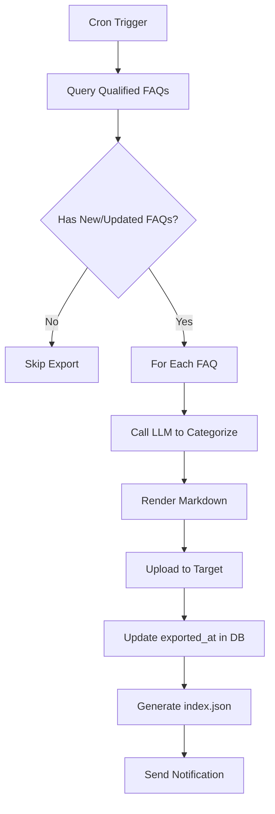

# Wiki Export Specification (Knowledge Asset Precipitation)

> **Status**: Approved
> **Priority**: P1 (Phase 5+)
> **Objective**: Automatically convert mature FAQ memories into structured Wiki documentation.

## 1. Feature Overview

**Problem**: High-quality FAQ knowledge accumulated in MemoryOS remains locked in the vector database, inaccessible to traditional Wiki/Documentation systems.

**Solution**: Periodically export FAQ memories that meet maturity criteria into Markdown files, then push to Object Storage (S3/OSS) or Wiki platforms (Confluence/GitBook).

**Value**:
- **Knowledge Precipitation**: Convert implicit knowledge (conversations) into explicit assets (documents).
- **Cross-System Integration**: Make MemoryOS knowledge searchable in existing Wiki systems.
- **Compliance & Audit**: Exportable documentation serves as auditable company knowledge base.
- **Reduce Redundancy**: New employees can directly search Wiki instead of re-asking questions.

---

## 2. Export Trigger Conditions

A FAQ memory qualifies for export if it meets **ALL** of the following criteria:

| Field | Condition | Rationale |
| :--- | :--- | :--- |
| `type` | `== "faq"` | Only FAQ-type memories (not casual chat). |
| `scope` | `== "global"` | Must be company-wide knowledge (not private). |
| `age` | `> 30 days` | Proven stability (not ephemeral info). |
| `access_count` | `>= 10` | Validated usefulness (frequently accessed). |
| `like_count` | `>= 5` | Community-approved quality. |
| `is_deprecated` | `== false` | Still valid (not marked as outdated). |
| `exported_at` | `IS NULL OR < last_updated` | Not yet exported, or needs re-export due to updates. |

---

## 3. Directory Structure & Naming Convention

### 3.1 Hierarchical Categorization

```
wiki/
├── IT/                          # Level 1: Department/Domain
│   ├── network/                 # Level 2: Sub-domain
│   │   ├── wifi-password.md
│   │   └── vpn-setup.md
│   └── security/
│       └── 2fa-guide.md
├── HR/
│   ├── onboarding/
│   │   └── first-day-checklist.md
│   └── benefits/
│       └── health-insurance.md
└── Finance/
    └── expense-reimbursement.md
```

### 3.2 File Naming Rules

**Pattern**: `{slug}.md`
- **Slug Generation**: Convert FAQ title to lowercase, replace spaces with `-`, remove special chars.
- **Example**: "如何连接公司 WiFi？" → `how-to-connect-company-wifi.md`
- **Collision Handling**: If file exists, append `-v2`, `-v3`, etc.

---

## 4. Markdown Template

### 4.1 Frontmatter (YAML)

```yaml
---
title: "How to Connect Company WiFi"
category: IT/network
tags: [wifi, network, onboarding]
created_at: 2026-01-15T10:00:00Z
last_updated: 2026-02-17T03:00:00Z
access_count: 156
like_count: 12
confidence_score: 0.95
source: memoryos_faq
export_version: 2
---
```

### 4.2 Body Structure

```markdown
# {Title}

## Question
{Original user query that triggered this FAQ}

## Answer
{Consolidated answer from multiple interactions}

---

**Metadata**
- First Recorded: {created_at}
- Last Verified: {last_updated}
- Helped Users: {access_count}
- Data Source: Extracted from employee conversations
```

---

## 5. Auto-Categorization (LLM-Powered)

### 5.1 Categorizer Prompt

```
You are a knowledge management assistant. Classify the following FAQ into ONE category.

Available Categories:
- IT/network
- IT/security
- IT/software
- HR/onboarding
- HR/benefits
- HR/policies
- Finance/expense
- Finance/payroll
- General/office
- General/facilities

FAQ Title: "{title}"
FAQ Content: "{content}"

Output ONLY the category path (e.g., "IT/network"). No explanation.
```

### 5.2 Fallback Logic

If LLM categorization fails or returns invalid category:
1. Check if FAQ has `access_groups` metadata → Map to department (e.g., `["hr"]` → `HR/general`).
2. If still unknown → Default to `General/uncategorized`.

---

## 6. Export Targets (Adapters)

### 6.1 S3 / Object Storage (Primary)

**Endpoint**: `s3://{bucket}/{prefix}/{category}/{filename}`

**Example**:
```
s3://company-wiki/memoryos-export/2026-02/IT-network-wifi-password.md
```

**Index File** (`index.json`):
```json
{
  "export_date": "2026-02-17T00:00:00Z",
  "total_files": 42,
  "files": [
    {
      "path": "IT/network/wifi-password.md",
      "title": "How to Connect Company WiFi",
      "category": "IT/network",
      "url": "s3://company-wiki/memoryos-export/2026-02/IT-network-wifi-password.md"
    }
  ]
}
```

### 6.2 Confluence (Enterprise Wiki)

**API**: `POST /rest/api/content`

**Mapping**:
- Category `IT/network` → Confluence Space `IT`, Parent Page `Network`
- Markdown → Convert to Confluence Storage Format (XHTML-like)

**Update Strategy**:
- Search for existing page by title.
- If exists: Update content + increment version.
- If not: Create new page.

### 6.3 GitBook

**API**: `POST /v1/spaces/{space_id}/content`

**Mapping**:
- Category → GitBook Collection
- Markdown → Direct upload (GitBook supports Markdown natively)

### 6.4 Custom Webhook (Fallback)

**Payload**:
```json
{
  "event": "wiki_export",
  "faq_id": "faq_wifi_001",
  "title": "How to Connect WiFi",
  "category": "IT/network",
  "markdown": "# How to...",
  "metadata": { ... }
}
```

---

## 6.5 Concurrency Control (Export Lock)

### Lock Mechanism
- Key: `lock:export:{faq_id}`
- TTL: 300s (5 minutes)
- Logic:
  1. Try `SET NX EX`.
  2. If fail -> Skip (Another worker is exporting).
  3. If success -> Export -> Upload -> Release Lock.

### Version Check (S3)
- **Pre-upload**: `HEAD` object to get `x-amz-meta-version`.
- **Logic**: If `S3.version >= Local.version` -> Skip upload.

## 6.6 PII Sanitization (Export-Time)

**Requirement**: No sensitive data in public Wiki.

### Pre-Export Scan
- **Regex**: Scan for Emails, Phone Numbers, Credit Cards.
- **Action**: Replace with `[REDACTED_EMAIL]`, `[REDACTED_PHONE]`.
- **Strict Mode**: If `wiki_export.strict_pii = true`, any match fails the export.

## 6.7 Deletion Propagation (GDPR Linkage)

When user deletion or legal takedown is triggered, external wiki targets MUST be updated.

### Required Actions
1. S3/OSS: Delete object and write tombstone record (`wiki_deletion_log`).
2. Confluence/GitBook: Delete page or replace content with legal redaction notice.
3. Webhook target: Send `wiki_delete` event with `faq_id`, `reason`, `requested_at`.

### Reliability Requirements
*   Persist deletion jobs to `deletion_jobs` with retry status.
*   Retry with exponential backoff up to max attempts.
*   All actions must be auditable with actor, timestamp, and external resource id.

---

## 7. Execution Flow (Scheduler)

### 7.1 Cron Schedule

**Default**: Every Sunday at 2:00 AM (Low traffic period)

```toml
[wiki_export]
schedule = "0 2 * * 0"  # Cron syntax
```

### 7.2 Step-by-Step Process



### 7.3 Error Handling

| Error Type | Action | Retry Strategy |
| :--- | :--- | :--- |
| LLM Categorization Timeout | Use fallback category | No retry (use default) |
| S3 Upload Failure | Log error, skip file | Retry next run |
| Confluence API 429 (Rate Limit) | Pause 60s, retry | Max 3 retries |
| Invalid Markdown Syntax | Log warning, export raw | Manual review queue |

---

## 8. Configuration (config.toml)

```toml
[wiki_export]
# Enable automatic export
enable = true

# Trigger conditions
min_age_days = 30
min_access_count = 10
min_like_count = 5

# Cron schedule (Sunday 2 AM)
schedule = "0 2 * * 0"

# Export target: "s3", "confluence", "gitbook", "webhook"
target = "s3"

# S3 Configuration
[wiki_export.s3]
bucket = "company-wiki"
region = "us-west-2"
prefix = "memoryos-export/"
access_key = "${AWS_ACCESS_KEY}"
secret_key = "${AWS_SECRET_KEY}"

# Confluence Configuration (Optional)
[wiki_export.confluence]
base_url = "https://company.atlassian.net/wiki"
space_key = "MEMORYOS"
parent_page_id = "123456"
api_token = "${CONFLUENCE_TOKEN}"
# Convert Markdown to Confluence format
enable_markdown_conversion = true

# GitBook Configuration (Optional)
[wiki_export.gitbook]
api_url = "https://api.gitbook.com"
space_id = "abc123"
api_key = "${GITBOOK_API_KEY}"

# Custom Webhook (Optional)
[wiki_export.webhook]
url = "https://internal-wiki.company.com/api/import"
auth_header = "Bearer ${WIKI_TOKEN}"

# Categorizer (LLM)
[wiki_export.categorizer]
llm_model = "gpt-4o-mini"
categories = [
    "IT/network",
    "IT/security",
    "IT/software",
    "HR/onboarding",
    "HR/benefits",
    "HR/policies",
    "Finance/expense",
    "Finance/payroll",
    "General/office",
    "General/facilities"
]
```

---

## 9. Admin CLI Commands

```bash
# List exportable FAQs (dry-run)
memoryos-rust admin wiki list-exportable

# Manual export (all qualified FAQs)
memoryos-rust admin wiki export --target s3

# Export specific FAQ by ID
memoryos-rust admin wiki export --id faq_wifi_001 --force

# Re-export all (ignore exported_at check)
memoryos-rust admin wiki export --all --force

# Test categorization
memoryos-rust admin wiki categorize --id faq_wifi_001
```

---

## 10. Database Schema Extension

### 10.1 Qdrant Payload (New Fields)

```json
{
  "id": "faq_wifi_001",
  "type": "faq",
  "scope": "global",
  "category": "IT/network",           // Auto-assigned by categorizer
  "exported_at": "2026-02-17T02:00:00Z",  // Last export timestamp
  "export_version": 2,                // Incremented on each export
  "wiki_url": "s3://company-wiki/memoryos-export/2026-02/IT-network-wifi-password.md"
}
```

---

## 11. Monitoring & Metrics

### 11.1 Prometheus Metrics

```
# Total FAQs exported
wiki_export_total{target="s3", status="success"} 42

# Export duration
wiki_export_duration_seconds_bucket{target="s3"} 

# Categorization accuracy (manual review)
wiki_categorization_accuracy_ratio 0.95
```

### 11.2 Logs

```json
{
  "level": "INFO",
  "event": "wiki_export_complete",
  "exported_count": 42,
  "target": "s3",
  "duration_ms": 12340,
  "index_url": "s3://company-wiki/memoryos-export/2026-02/index.json"
}
```

---

## 12. Future Enhancements (Phase 6+)

- **Versioning**: Track FAQ changes over time (Git-like diff).
- **Multi-Language**: Export same FAQ in multiple languages.
- **Rich Media**: Support images/videos in exported Markdown.
- **Approval Workflow**: Require HR/Admin approval before export.
