# Wiki Generation System Specification

> **Status**: Approved (Design Phase)
> **Priority**: P1
> **Crate**: `memoryos-wiki-gen`
> **Objective**: Multi-language code parsing + LLM documentation generation, producing structured Markdown Wiki from source code and FAQ memory data.

---

## 1. System Overview

### 1.1 Problem

1. Source code documentation is manual, quickly outdated, and scattered across READMEs, inline comments, and external wikis.
2. FAQ knowledge accumulated in MemoryOS remains locked in the vector database, inaccessible to traditional documentation systems.
3. No unified pipeline exists to automatically produce architecture diagrams, API docs, and knowledge base articles from a single codebase.

### 1.2 Solution

A **Tree-sitter + LLM hybrid pipeline** that:
- Parses multi-language codebases (V1: Rust, Python, Java, Vue) into a unified Intermediate Representation (IR)
- Builds a layered Code Graph (File / Symbol / Runtime)
- Uses LLM to generate human-readable documentation with source evidence
- Renders Markdown pages with Mermaid diagrams
- Merges FAQ wiki export into the same output pipeline
- Exports via CLI tool and HTTP API (dual-path)

### 1.3 Design Principles

| Principle | Description |
|-----------|-------------|
| **Symbol-centric IR** | Symbols are first-class citizens; files are containers |
| **Stable IDs** | SymbolId = file_path + span + kind (not just name) |
| **Graceful degradation** | Parse failures produce low-fidelity output, never crash the pipeline |
| **Incremental by default** | Content hashing at file/symbol/prompt level; only regenerate what changed |
| **Evidence-backed** | Every generated doc paragraph links back to source file + line range |
| **80% rule for inference** | Auth/middleware detection outputs signals, not conclusions |

---

## 2. High-Level Architecture

### 2.1 Pipeline Overview

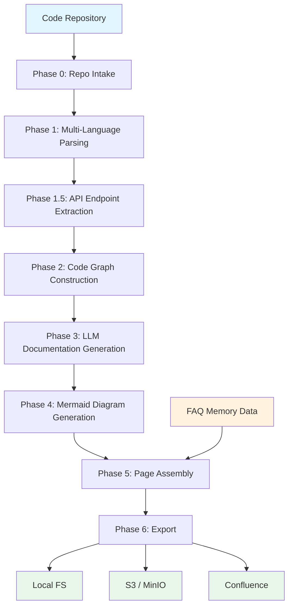

### 2.2 Crate Position in Workspace

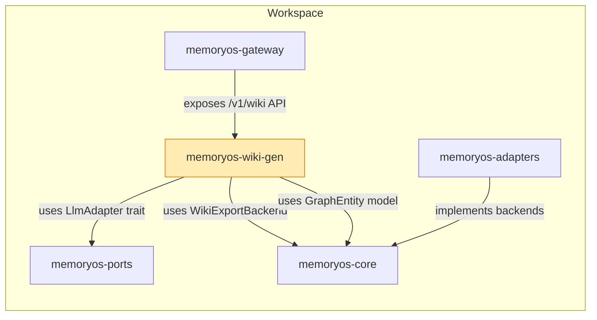

### 2.3 Dual-Path Access

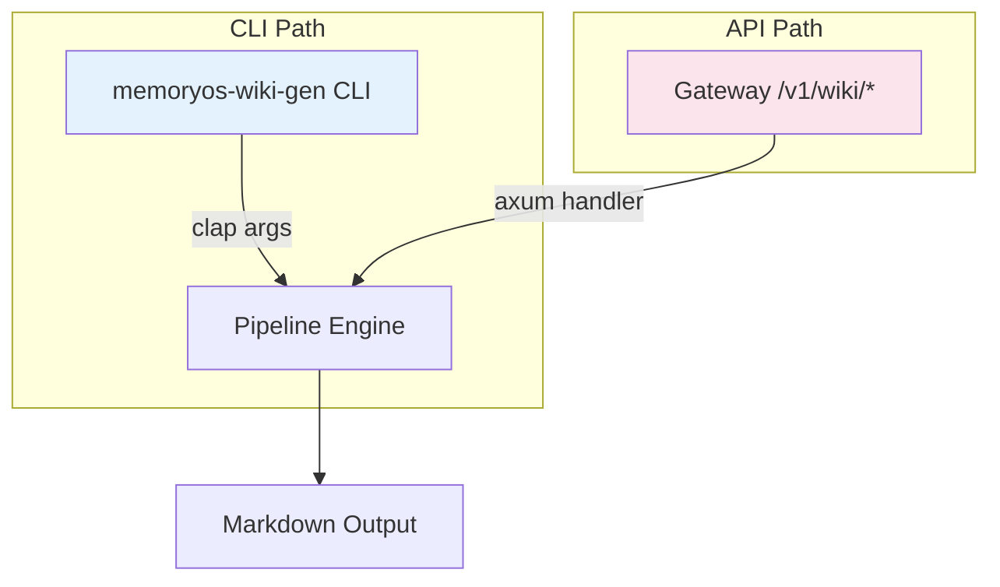

---

## 3. Phase 0: Repo Intake & Runtime Control

### 3.1 Responsibilities

| Component | Tool | Purpose |
|-----------|------|---------|
| File Discovery | `ignore::WalkBuilder` | .gitignore-aware traversal |
| Language Detection | Extension map + fallback | Route files to correct parser |
| Parallel Parse | `rayon` | File-level parallelism for tree-sitter |
| CLI Progress | `indicatif` | MultiProgress bar (discover / parse / graph / llm / render) |
| LLM Throttle | `tokio::sync::Semaphore` | Limit concurrent LLM calls (default: 5) |
| Cache Layer | SHA256 content hash | Skip unchanged files/symbols/prompts |

### 3.2 File Discovery Strategy

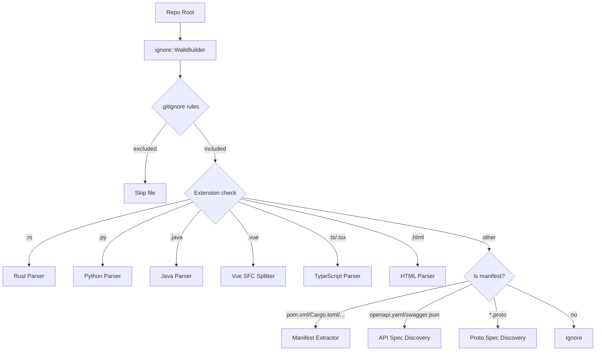

### 3.3 CLI Override Rules

| Flag | Behavior |
|------|----------|
| `--no-ignore` | Disable .gitignore filtering |
| `--include-dot-github` | Parse `.github/workflows/*.yml` |
| `--include <path>` | Force-include a path even if ignored |
| `--exclude <glob>` | Additional exclusion pattern |
| `--lang <lang>` | Only parse specified languages |

### 3.4 Configuration File (`wiki-gen.toml`)

```toml
[repo]
root = "."
include_patterns = []
exclude_patterns = ["**/generated/**", "**/vendor/**"]

[parse]
languages = ["rust", "python", "java", "vue"]
max_file_size_kb = 512

[llm]
adapter = "openai"
model = "gpt-4o"
max_concurrent = 5
retry_max = 3
retry_backoff_ms = 1000

[cache]
enabled = true
cache_dir = ".wiki-cache"

[output]
format = "markdown"
output_dir = "wiki-output"
include_faq = true

[export]
target = "local"
# target = "s3"
# target = "confluence"
```

---

## 4. Phase 1: Multi-Language Parsing

### 4.1 Parser Architecture

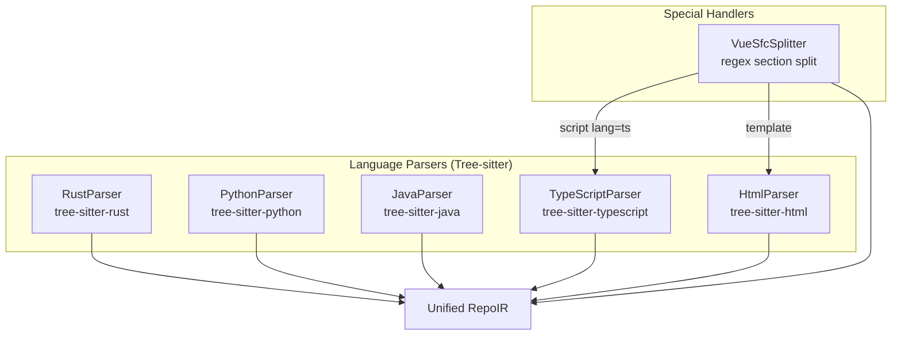

### 4.2 Unified Intermediate Representation (IR)

The IR is **Symbol-centric**, not file-centric. Files are containers; symbols are first-class citizens.

```
RepoIR
  repo_root: PathBuf
  files: Vec<FileIR>
  symbols: Vec<Symbol>
  references: Vec<Reference>
  endpoints: Vec<Endpoint>         // Phase 1.5 output
  diagnostics: Vec<Diagnostic>     // Parse failures, degradation markers
  manifests: Vec<ManifestInfo>     // Dependency metadata
  specs: Vec<ApiSpec>              // OpenAPI/Proto specs (Phase 1.5)
```

#### FileIR

```
FileIR
  path: PathBuf                    // Relative to repo root
  language: Language               // Rust | Python | Java | TypeScript | Vue | Html
  content_hash: String             // SHA256 of file content
  parse_status: ParseStatus        // Success | PartialSuccess | Failed
  byte_count: usize
```

#### Symbol

```
Symbol
  id: SymbolId                     // Globally unique, stable
  kind: SymbolKind                 // Function | Struct | Trait | Class | Interface |
                                   // Method | Module | Enum | Constant | TypeAlias |
                                   // Component (Vue)
  qualified_name: String           // Human-readable: "memoryos_core::memory::GraphManager"
  visibility: Visibility           // Public | Private | Protected | Internal
  file: PathBuf
  span: Span { start_byte, end_byte, start_line, end_line }
  signature: Option<String>        // fn foo(x: i32) -> String
  doc: Option<Doc>                 // Parsed documentation
  parent: Option<SymbolId>         // Containing module/class/impl
  children: Vec<SymbolId>          // Contained symbols
  annotations: Vec<Annotation>     // Java @Override, Python @decorator, Rust #[derive]
  type_params: Vec<String>         // Generics
```

#### SymbolId (Stable, Cross-Language)

```
SymbolId
  repo_root: String                // Anchor to repo
  file_path: String                // Relative path
  start_byte: usize                // AST node start
  end_byte: usize                  // AST node end
  kind: SymbolKind                 // Disambiguate overlapping spans
  _qualified_name: String          // Cached readable name (not used for equality)
```

Equality: `file_path + start_byte + end_byte + kind`

#### Reference

```
Reference
  source: SymbolId                 // Where the reference originates
  target: ReferenceTarget          // Resolved SymbolId or unresolved name
  kind: ReferenceKind              // Import | Call | Extends | Implements |
                                   // UsesType | FieldType | AnnotationUsage
  span: Span                       // Location of the reference
```

#### Doc

```
Doc
  raw: String                      // Original text
  format: DocFormat                // Markdown | JavaDoc | ReST | JSDoc | RustDoc
  summary: Option<String>          // First sentence / @brief (local rule extraction)
```

#### Diagnostic

```
Diagnostic
  file: PathBuf
  severity: DiagSeverity           // Error | Warning | Info
  message: String
  span: Option<Span>
  fallback_data: Option<FallbackData>  // Low-fidelity import lines from token scan
```

### 4.3 Tree-sitter Query Strategy

**Minimum viable queries per language (V1):**

| Language | Declarations | Imports | Doc Comments |
|----------|-------------|---------|-------------|
| Rust | `fn`, `struct`, `enum`, `trait`, `impl`, `mod`, `const`, `type` | `use`, `extern crate` | `///`, `//!`, `#[doc = ""]` |
| Python | `def`, `class`, `async def` | `import`, `from...import` | `"""docstring"""` |
| Java | `class`, `interface`, `enum`, `method`, `constructor` | `import` | `/** JavaDoc */` |
| TypeScript | `function`, `class`, `interface`, `type`, `const`, `export` | `import` | `/** JSDoc */` |
| Vue | Virtual `Component` symbol per `.vue` file | `import` in `<script>` | `<script>` top-level JSDoc |

**Not in V1** (deferred to V2):
- Call graph (`fn_a()` calls `fn_b()`) — high noise, low accuracy
- Data flow analysis
- Macro expansion (Rust `macro_rules!`, Java annotation processors)

### 4.4 Vue SFC Handling

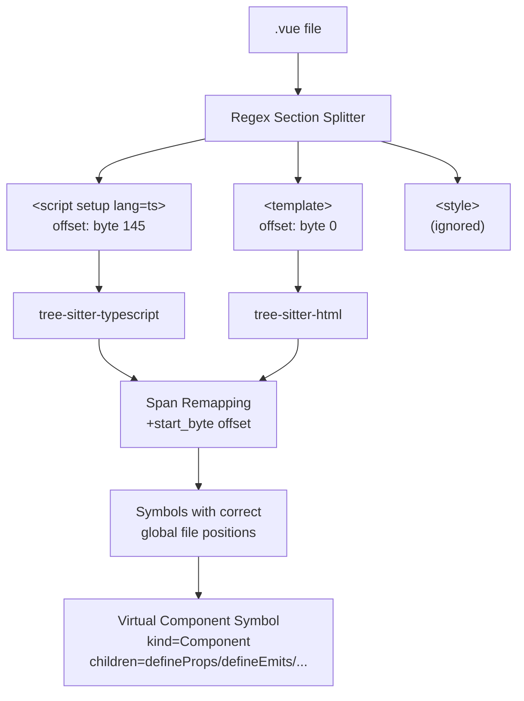

**Key implementation details:**
- Record `section_start_byte` before parsing each section
- All tree-sitter spans += `section_start_byte` for global file offset
- `<script setup>` creates a virtual `Component` symbol with `qualified_name = path::filename.vue`
- `defineProps`, `defineEmits`, `withDefaults` detected as child symbols

### 4.5 Degradation Strategy

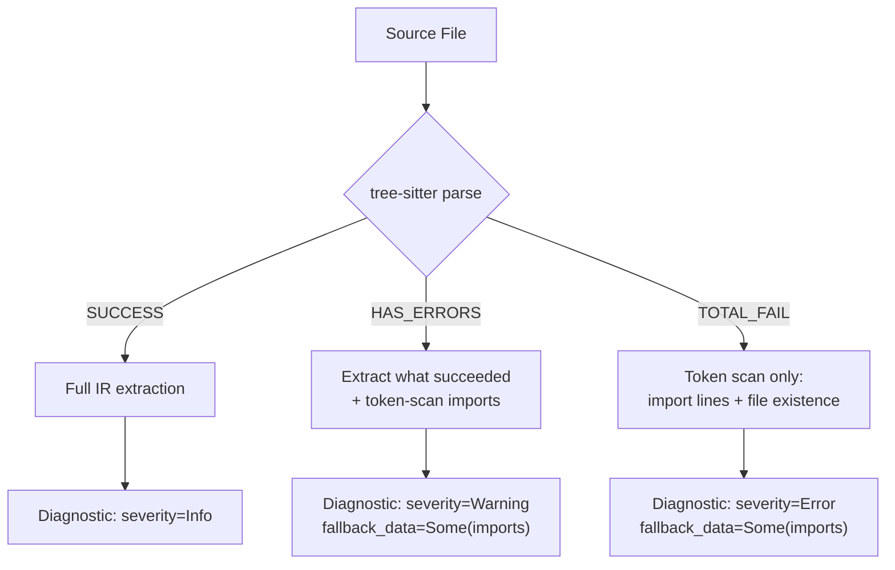

---

## 5. Phase 1.5: API Endpoint Extraction

### 5.1 API Spec Discovery (Priority Source)

Before code-level extraction, discover authoritative spec files:

| File Pattern | Format | Priority |
|-------------|--------|----------|
| `openapi.yaml`, `openapi.yml`, `openapi.json` | OpenAPI 3.x | Highest |
| `swagger.json`, `swagger.yaml` | Swagger 2.0 | Highest |
| `*.proto` | gRPC / Protocol Buffers | Highest |

When a spec file exists:
1. Parse it into `Vec<Endpoint>` with `source = Spec(OpenAPI)` or `Spec(Proto)`
2. Code-level extraction runs in **alignment mode**: same path+method deduplicates, spec wins for schema/description, code adds handler mapping + middleware signals

### 5.2 Framework Route Extraction

| Framework | Language | Detection Pattern |
|-----------|----------|------------------|
| Axum | Rust | `Router::new().route("/path", get(handler))`, `.layer(...)` |
| Actix-web | Rust | `#[get("/path")]`, `web::resource(...)` |
| FastAPI | Python | `@app.get("/path")`, `@router.post(...)`, `Depends(...)` |
| Flask | Python | `@app.route("/path", methods=[...])` |
| Spring MVC | Java | `@GetMapping`, `@PostMapping`, `@RequestMapping` |
| Express | TypeScript | `app.get("/path", handler)`, `router.use(...)` |

### 5.3 Endpoint IR

```
Endpoint
  method: HttpMethod               // GET | POST | PUT | DELETE | PATCH | ALL
  path: String                     // Normalized: /users/{id} (unified param style)
  handler: Option<SymbolId>        // Resolved handler function
  source: EndpointSource           // CodeExtraction(framework) | Spec(OpenAPI) | Spec(Proto)
  file: PathBuf
  span: Span
  request_type: Option<TypeRef>    // Request body type (SymbolId or string name)
  response_type: Option<TypeRef>   // Response type
  auth: AuthInfo                   // See below
  tags: Vec<String>                // Controller/module grouping
  doc: Option<Doc>                 // From doc comment or spec description
```

### 5.4 Auth Signal Extraction (80% Rule)

```
AuthInfo
  signals: Vec<String>             // Raw evidence strings
  classification: AuthClassification  // Required | Optional | Unknown
```

| Framework | Signal Patterns |
|-----------|----------------|
| Axum | `.layer(middleware::from_fn(auth_check))`, `.route_layer(...)` |
| Spring | `@PreAuthorize("...")`, `@Secured("ROLE_ADMIN")`, `@RolesAllowed(...)` |
| FastAPI | `Depends(get_current_user)`, router-level dependencies |
| Express | `app.use(authMiddleware)`, route middleware array |

Output: **raw signals** + optional classification. LLM uses signals to write docs; no premature conclusion.

### 5.5 Path Normalization

All extracted paths are normalized to a canonical format internally:

| Input | Normalized |
|-------|-----------|
| `/users/:id` (Express) | `/users/{id}` |
| `/users/<id>` (Flask) | `/users/{id}` |
| `/users/{id}` (OpenAPI) | `/users/{id}` |

---

## 6. Manifest Extractors (Dependency Analysis)

### 6.1 Unified Interface

```
trait ManifestExtractor {
  fn detect(&self, repo: &RepoContext) -> bool;
  fn extract(&self, repo: &RepoContext) -> Vec<Dependency>;
}
```

### 6.2 Implementations

| Extractor | File | Parser |
|-----------|------|--------|
| `CargoExtractor` | `Cargo.toml` + `cargo_metadata` | `cargo_metadata` crate |
| `MavenExtractor` | `pom.xml` | `quick-xml` |
| `GradleExtractor` | `build.gradle` / `build.gradle.kts` | Regex (V1) |
| `PythonExtractor` | `pyproject.toml` / `requirements.txt` | `toml` / line parse |
| `NodeExtractor` | `package.json` | `serde_json` |

### 6.3 Dependency Model

```
Dependency
  name: String
  version_req: Option<String>
  scope: DependencyScope           // Runtime | Dev | Build | Optional
  source_file: PathBuf
  ecosystem: Ecosystem             // Cargo | Maven | Npm | Pip | Gradle
```

---

## 7. Phase 2: Code Graph Construction

### 7.1 Three-Layer Graph Design

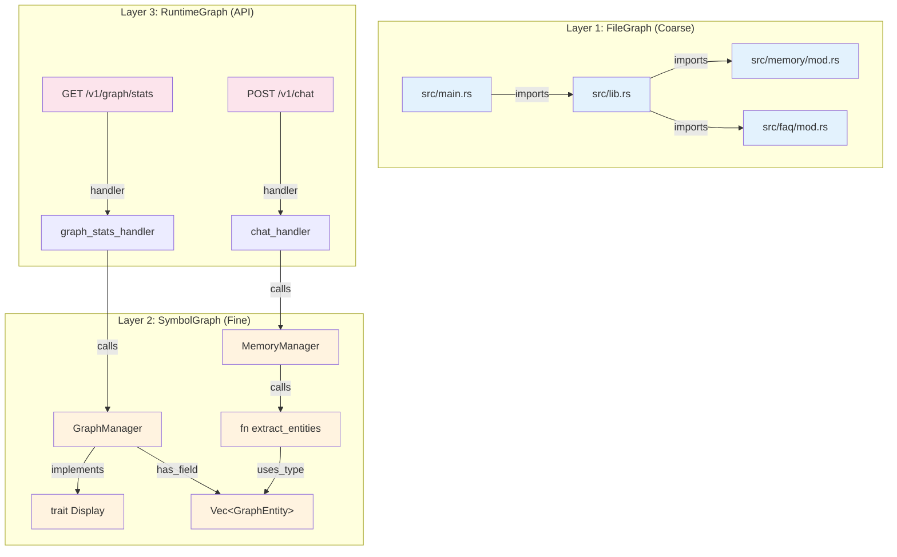

### 7.2 Graph Storage

All three layers live in a single `petgraph::DiGraph` with typed nodes and edges:

```
CodeGraphNode
  | FileNode(FileIR)
  | SymbolNode(Symbol)
  | EndpointNode(Endpoint)
  | ExternalDep(Dependency)
```

```
CodeGraphEdge
  kind: EdgeKind
  // FileGraph edges
  | FileImports            // file A imports from file B
  // SymbolGraph edges
  | Contains               // module/class contains symbol
  | Implements             // impl/class implements trait/interface
  | Extends                // class extends parent
  | UsesType               // field type, return type, parameter type
  | FieldType              // struct field references another type
  // RuntimeGraph edges
  | HandledBy              // endpoint -> handler function
  | MiddlewareApplied      // endpoint -> middleware symbol
```

### 7.3 Graph Queries (for downstream phases)

| Query | Purpose | Used By |
|-------|---------|---------|
| `neighbors(node, direction)` | Get related nodes | LLM context building |
| `subgraph(root, depth)` | Extract local neighborhood | Mermaid diagram scoping |
| `topo_sort()` | Dependency order | Page generation order |
| `modules_at_depth(n)` | Get modules at a nesting level | Architecture diagram |
| `endpoints_by_tag()` | Group endpoints | API doc generation |

---

## 8. Phase 3: LLM Documentation Generation

### 8.1 Generation Strategy

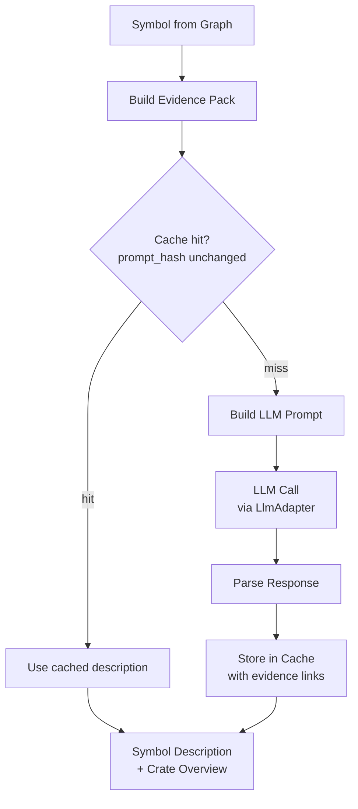

### 8.2 Evidence Pack (per Symbol)

Each LLM call receives a structured **Evidence Pack**:

```
EvidencePack
  symbol: SymbolSummary            // kind, qualified_name, signature, visibility
  doc: Option<String>              // Existing doc comment
  source_snippet: String           // Key source lines (truncated to ~200 lines)
  graph_context: GraphContext      // Neighbors: implements, used_by, contains, calls
  file_context: String             // File-level imports and module path
```

### 8.3 LLM Output Schema

```
LlmDocResult
  summary: String                  // 1-2 sentence description
  detailed: String                 // Multi-paragraph explanation
  usage_example: Option<String>    // Code example if applicable
  sources: Vec<EvidenceRef>        // [{file, start_line, end_line}]
```

### 8.4 Batching Strategy

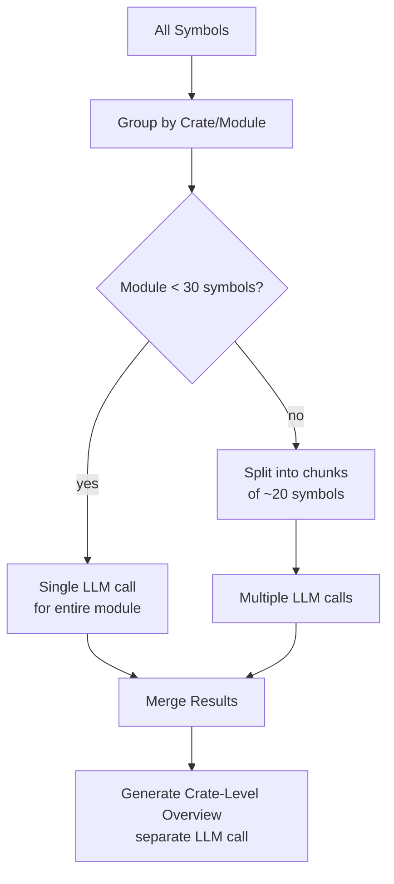

### 8.5 Concurrency & Cost Control

| Control | Mechanism | Default |
|---------|-----------|---------|
| Concurrent LLM calls | `tokio::sync::Semaphore` | 5 |
| Dedup cache | `prompt_hash` (SHA256 of evidence pack) | Enabled |
| Retry | Exponential backoff + jitter | 3 attempts |
| Token budget | Truncate source snippets to fit context | ~4000 tokens input |
| Rate limit (optional) | Per-minute token counter | Disabled (V1) |

### 8.6 Incremental Update

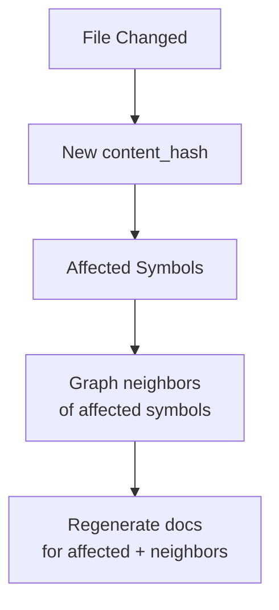

Cache structure (`.wiki-cache/cache.json`):
```json
{
  "version": 1,
  "entries": {
    "<symbol_id_hash>": {
      "prompt_hash": "sha256...",
      "content_hash": "sha256...",
      "result": { "summary": "...", "detailed": "...", "sources": [...] },
      "generated_at": "2026-02-20T10:00:00Z"
    }
  }
}
```

---

## 9. Phase 4: Mermaid Diagram Generation

### 9.1 Diagram Types

| Diagram | Source | Scope |
|---------|--------|-------|
| Module Dependency | FileGraph (aggregated to module level) | `architecture.md` |
| API Router Flow | RuntimeGraph (endpoints -> handlers -> services) | `api.md` |
| Class / Trait Relationship | SymbolGraph (struct/trait/impl edges) | Per-module pages |
| Crate Dependency | ManifestExtractor output | `index.md` |

### 9.2 Module Dependency Diagram

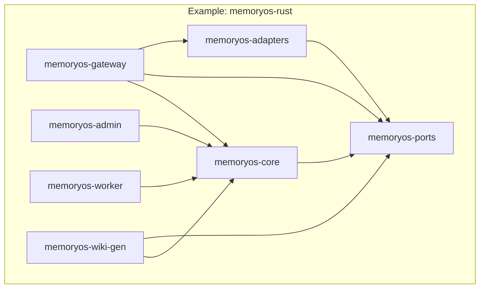

### 9.3 API Router Flow Diagram

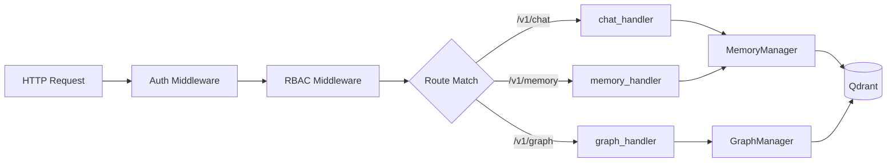

### 9.4 Generation Rules

- **Max nodes per diagram**: 30 (beyond this, aggregate into clusters)
- **Directory aggregation**: If a directory has > 10 files, collapse into one node
- **Edge filtering**: Only show direct dependencies (depth=1) unless explicitly requested
- **Layout hint**: Use `graph TD` for architecture, `graph LR` for request flows

---

## 10. Phase 5: Page Assembly

### 10.1 Template Engine

**Engine**: `tera` (Jinja2-style)

Templates stored in `crates/memoryos-wiki-gen/templates/`:

```
templates/
  index.md.tera
  architecture.md.tera
  api.md.tera
  module.md.tera
  symbol.md.tera        (optional, for key public APIs)
  faq_category.md.tera
```

### 10.2 Output Information Architecture

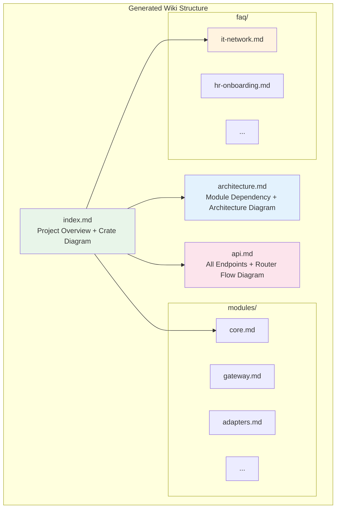

### 10.3 Page Content Sources

| Page | Data Source | Diagrams |
|------|-----------|----------|
| `index.md` | Repo metadata + Crate-level LLM overviews | Crate dependency diagram |
| `architecture.md` | FileGraph + SymbolGraph (traits/impls) | Module dependency diagram + Class diagram |
| `api.md` | Endpoint IR + handler docs | API router flow diagram |
| `modules/<name>.md` | SymbolGraph subgraph + LLM descriptions | Per-module class/trait diagram |
| `faq/<category>.md` | FAQ WikiExporter output (LlmClassifier) | None |

### 10.4 Frontmatter (YAML)

Every generated page includes:

```yaml
---
title: "Module: memoryos-core"
generated_at: "2026-02-20T10:00:00Z"
generator: "memoryos-wiki-gen v0.1.0"
source_repo: "TelivANT/memoryos-rust"
source_commit: "abc1234"
---
```

### 10.5 FAQ Integration

The FAQ pipeline remains largely unchanged but routes through the same Page Builder:

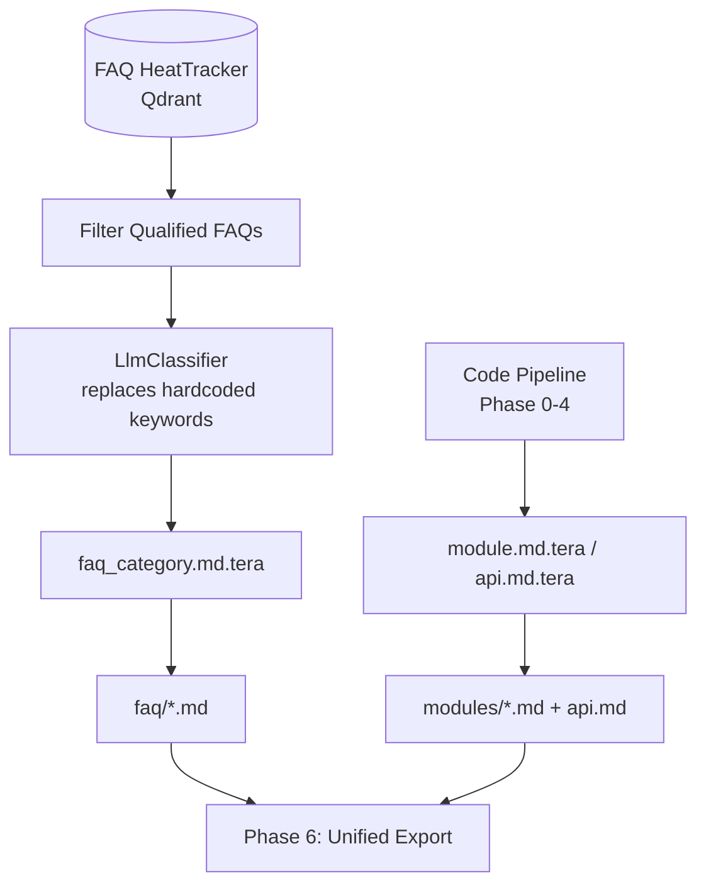

---

## 11. Phase 6: Export

### 11.1 Unified Export via WikiExportBackend

Reuse existing `WikiExportBackend` trait from `memoryos-core`:

```
trait WikiExportBackend {
    async fn write_content(&self, path: &str, content: &[u8]) -> Result<()>;
}
```

Implementations (existing):
- `LocalFsBackend` — write to directory
- `S3ExportBackend` — OpenDAL S3/MinIO
- `ConfluenceExportBackend` — REST API

V2 planned:
- `GitHubWikiBackend` — `git clone wiki.git` + push

### 11.2 Incremental Export

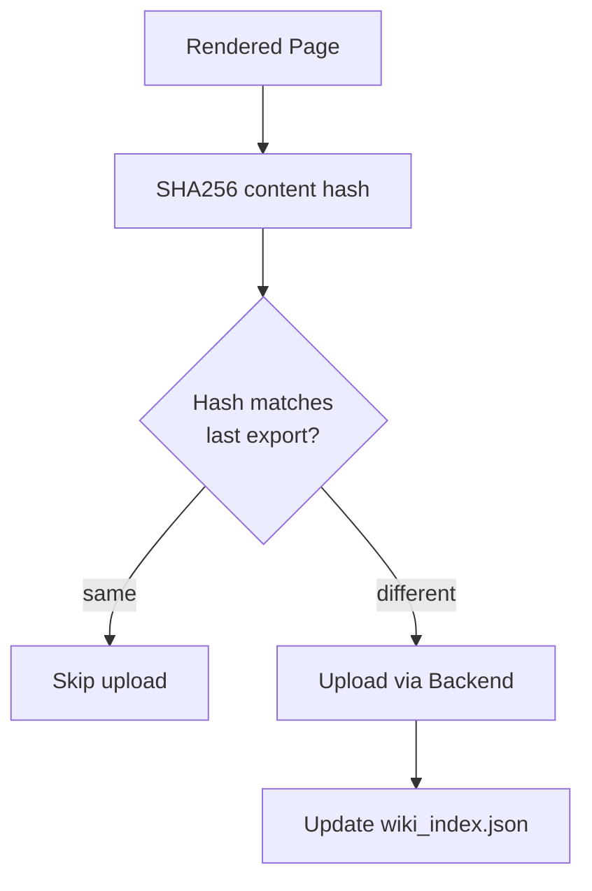

### 11.3 Evidence Index (`wiki_index.json`)

Stored alongside exported pages:

```json
{
  "version": 1,
  "generated_at": "2026-02-20T10:00:00Z",
  "source_commit": "abc1234",
  "pages": [
    {
      "path": "modules/core.md",
      "content_hash": "sha256...",
      "symbols_referenced": ["memoryos_core::memory::GraphManager", "..."],
      "evidence": [
        {"file": "crates/memoryos-core/src/memory/graph.rs", "lines": "71-96"}
      ]
    }
  ]
}
```

Use cases:
- "Click doc paragraph → jump to source" (future IDE integration)
- "Doc outdated?" detection (compare symbol hashes)
- Audit trail for generated content

---

## 12. Data Model Summary (Entity-Relationship)

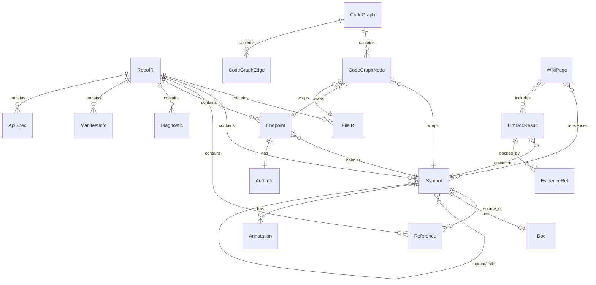

---

## 13. Technology Stack (Final)

### 13.1 New Dependencies

| Category | Crate | Purpose |
|----------|-------|---------|
| Parsing | `tree-sitter` | Core AST parsing engine |
| Parsing | `tree-sitter-rust` | Rust grammar |
| Parsing | `tree-sitter-python` | Python grammar |
| Parsing | `tree-sitter-java` | Java grammar |
| Parsing | `tree-sitter-typescript` | TS/JS grammar (Vue script) |
| Parsing | `tree-sitter-html` | HTML grammar (Vue template) |
| Parsing | `cargo_metadata` | Rust workspace dependency graph |
| Parsing | `quick-xml` | Maven pom.xml parsing |
| Graph | `petgraph` | In-memory directed graph |
| Template | `tera` | Jinja2-style Markdown generation |
| CLI | `clap` | Command-line argument parsing |
| CLI | `indicatif` | Progress bars |
| File | `ignore` | .gitignore-aware file walking |
| Parallel | `rayon` | CPU-parallel tree-sitter parsing |
| Hash | `sha2` | Content hashing for incremental cache |

### 13.2 Reused from Workspace

| Crate | Usage |
|-------|-------|
| `serde` / `serde_json` | Serialization |
| `tokio` | Async runtime |
| `tracing` | Structured logging |
| `reqwest` | HTTP client (LLM API) |
| `LlmAdapter` trait + 10 adapters | LLM calls |
| `WikiExportBackend` trait | Export backends |
| `GraphEntity` / `GraphRelation` model | Graph data model reference |

---

## 14. Crate Structure

```
crates/memoryos-wiki-gen/
  Cargo.toml
  src/
    lib.rs                         # Public API: WikiGenerator
    cli.rs                         # clap CLI entry point (bin target)

    # Phase 0
    config.rs                      # WikiGenConfig, wiki-gen.toml parsing
    discovery.rs                   # File discovery (ignore::WalkBuilder)
    lang.rs                        # Language detection

    # Phase 1
    ir.rs                          # RepoIR, Symbol, Reference, FileIR, etc.
    parser/
      mod.rs                       # LanguageParser trait
      rust.rs                      # RustParser (tree-sitter-rust)
      python.rs                    # PythonParser (tree-sitter-python)
      java.rs                      # JavaParser (tree-sitter-java)
      typescript.rs                # TypeScriptParser (tree-sitter-typescript)
      vue.rs                       # VueSfcSplitter + delegation

    # Phase 1.5
    endpoint/
      mod.rs                       # Endpoint IR, extraction trait
      spec_discovery.rs            # OpenAPI / Proto / Swagger detection
      axum.rs                      # Axum route extractor
      fastapi.rs                   # FastAPI route extractor
      spring.rs                    # Spring MVC route extractor
      express.rs                   # Express.js route extractor

    # Phase 1 (Manifests)
    manifest/
      mod.rs                       # ManifestExtractor trait
      cargo.rs                     # CargoExtractor
      maven.rs                     # MavenExtractor
      python.rs                    # PythonExtractor (pip/poetry)
      node.rs                      # NodeExtractor (npm/yarn)

    # Phase 2
    graph.rs                       # CodeGraph (petgraph), 3-layer, queries

    # Phase 3
    llm_gen.rs                     # LLM documentation generation
    evidence.rs                    # EvidencePack builder
    cache.rs                       # Incremental cache (SHA256)

    # Phase 4
    diagram.rs                     # Mermaid diagram generators

    # Phase 5
    page_builder.rs                # Tera template rendering
    faq_integration.rs             # FAQ WikiExporter bridge

    # Phase 6
    export.rs                      # Export orchestration
    wiki_index.rs                  # wiki_index.json builder

  templates/
    index.md.tera
    architecture.md.tera
    api.md.tera
    module.md.tera
    symbol.md.tera
    faq_category.md.tera
```

---

## 15. CLI Interface

### 15.1 Commands

```bash
# Full generation
memoryos-wiki-gen generate \
  --repo /path/to/repo \
  --output ./wiki-output \
  --config wiki-gen.toml

# Incremental update (only changed files)
memoryos-wiki-gen generate \
  --repo /path/to/repo \
  --incremental

# Parse only (no LLM, no render — for debugging)
memoryos-wiki-gen parse \
  --repo /path/to/repo \
  --output-ir repo_ir.json

# Diagram only (generate Mermaid from existing IR)
memoryos-wiki-gen diagram \
  --ir repo_ir.json \
  --type module-dependency

# Export to remote target
memoryos-wiki-gen export \
  --source ./wiki-output \
  --target s3 \
  --config wiki-gen.toml
```

### 15.2 API Endpoints (Gateway Integration)

| Method | Path | Description |
|--------|------|-------------|
| `POST` | `/v1/wiki/generate` | Trigger full wiki generation |
| `POST` | `/v1/wiki/generate/incremental` | Incremental update |
| `GET` | `/v1/wiki/status` | Generation job status |
| `GET` | `/v1/wiki/pages` | List generated pages |
| `GET` | `/v1/wiki/pages/{path}` | Get specific page content |

---

## 16. Old Wiki System Cleanup

### 16.1 Files to Delete (System A)

| File | Reason |
|------|--------|
| `crates/memoryos-ports/src/wiki.rs` | `WikiAdapter` trait — replaced by `WikiExportBackend` |
| `crates/memoryos-adapters/src/wiki/exporter.rs` | Old exporter with mock data |
| `crates/memoryos-adapters/src/wiki/s3.rs` | Old S3 adapter without SigV4 |

### 16.2 Files to Keep (System B)

| File | Reason |
|------|--------|
| `crates/memoryos-core/src/faq/wiki_exporter.rs` | `WikiExportBackend` trait + `WikiExporter` pipeline |
| `crates/memoryos-adapters/src/wiki/confluence_backend.rs` | Working Confluence backend |
| `crates/memoryos-adapters/src/wiki/s3_backend.rs` | Working S3 backend via OpenDAL |

### 16.3 Modifications to Keep (System B)

| Change | Location |
|--------|----------|
| Replace `extract_category()` hardcoded keywords with `LlmClassifier` | `wiki_exporter.rs` |
| Remove `WikiAdapter` re-export from ports `lib.rs` | `memoryos-ports/src/lib.rs` |

---

## 17. Implementation Plan

### 17.1 Phase Breakdown

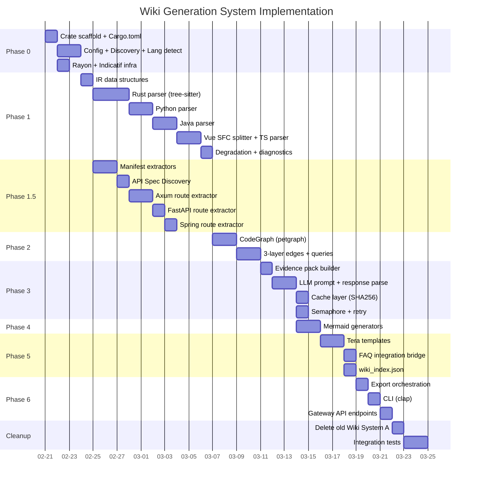

### 17.2 MVP Scope (Week 1-2)

**Goal**: Rust + Python end-to-end, one framework (Axum), generate browsable Markdown wiki.

| Task | Deliverable |
|------|------------|
| Phase 0 scaffold | `memoryos-wiki-gen` crate compiles |
| Phase 1 Rust parser | `RepoIR` with Rust symbols + references + docs |
| Phase 1 Python parser | Python symbols in same `RepoIR` |
| Phase 2 Graph | Module dependency Mermaid diagram |
| Phase 3 LLM (1 call) | Crate-level overview |
| Phase 5 Page builder | `index.md` + `architecture.md` + `modules/*.md` |
| Phase 6 Local export | Files written to disk |
| CLI | `memoryos-wiki-gen generate --repo . --output wiki-out` |

### 17.3 V1 Complete Scope (Week 3-4)

| Task | Deliverable |
|------|------------|
| Phase 1 Java + Vue parsers | All 4 languages parsing |
| Phase 1.5 Endpoint extraction | Axum + FastAPI route extraction |
| Phase 1.5 API Spec Discovery | OpenAPI/Swagger/Proto detection |
| Phase 3 Full LLM generation | All symbol descriptions |
| Phase 4 All diagram types | Module dep + API flow + class diagrams |
| Phase 5 All templates | Complete wiki page set |
| Phase 5 FAQ integration | `faq/*.md` pages |
| Phase 6 S3/Confluence export | Remote export working |
| Gateway API | `/v1/wiki/*` endpoints |
| Cleanup | Old Wiki System A deleted |

---

## 18. Risk Analysis

| Risk | Likelihood | Impact | Mitigation |
|------|-----------|--------|-----------|
| Tree-sitter grammar version mismatch | Medium | Parser crashes | Pin grammar versions; degradation output on failure |
| LLM hallucination in docs | High | Incorrect documentation | Evidence pack + source links; human review flag |
| Large repo performance (>10k files) | Medium | Slow generation | Rayon parallelism + incremental cache + file size limit |
| Vue SFC edge cases (scoped CSS, JSX) | Low | Parse failures | Graceful degradation; only parse script/template |
| Token cost explosion | Medium | High API bills | Prompt hash dedup + batching + token budget per symbol |
| Cross-language symbol resolution | High | Broken references | V1: best-effort name matching; V2: full resolution |

---

## 19. Future Enhancements (V2+)

| Feature | Description |
|---------|------------|
| Call graph analysis | `fn_a()` calls `fn_b()` via tree-sitter + LLM hybrid |
| GitHub Wiki backend | `git clone wiki.git` + push |
| IDE integration | "Click doc → jump to source" via wiki_index.json |
| Doc freshness alerts | Compare symbol_hash vs last generation, flag stale docs |
| Multi-repo support | Aggregate graphs across repositories |
| Additional languages | Go, C/C++, PHP, Kotlin, Swift |
| Interactive diagrams | Mermaid → clickable SVG with source links |
| CI integration | GitHub Action: auto-generate wiki on PR merge |
